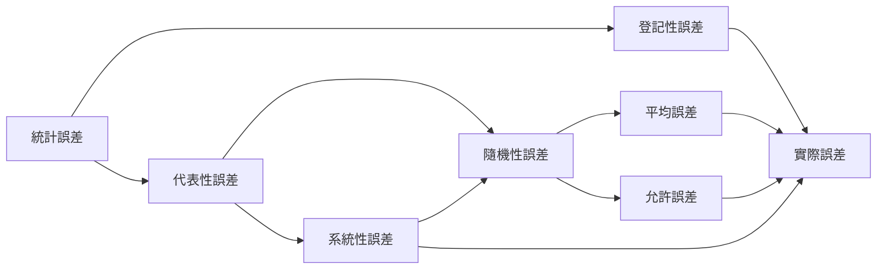

- [統計調查](#統計調查)
- [調查類型](#調查類型)
  - [數據來源](#數據來源)
  - [按調查種類](#按調查種類)
  - [按研究總體范圍](#按研究總體范圍)
  - [按搜集資料的方法](#按搜集資料的方法)
  - [按工作時間周期](#按工作時間周期)
- [抽樣調查與普查](#抽樣調查與普查)
  - [抽樣調查](#抽樣調查)
  - [普查](#普查)
- [資料收集與整理](#資料收集與整理)
  - [資料依其性質](#資料依其性質)
  - [圖](#圖)

# 統計調查

- [REF 1](https://www.bilibili.com/video/BV1K64y1U7tF?spm_id_from=333.337.search-card.all.click)
- 統計調查
  - 是根據統計設計規定的統計調查對象、統計指標、分類標準和調查方法，有組織地向調查對象蒐集原始數據的過程它的任務是取得原始數據，然後對這些原始數據進行數據整理和統計加工，形成規範的統計資料。
  - 要求：準確性、及時性、系統性和全面性。
- 統計分析
  - 是運用統計方法，通過對統計數據和有關情況的系統整理和研究，從數量方面來說明經濟社會現象的變化，揭示其本質和規律性，預測未來發展趨勢
- 政府常用的調查方法
  - 週期性普查，全面調查，抽樣調查，重點調查，行政記錄
- 方案設計
  - 確定調查目的
  - 確定調查對象和調查單位
  - 擬訂調查項目
  - 選擇調查方法
  - 確定調查時間和地點
  - 設計調查組織實施計劃

- 調查誤差
  - 登記誤差:由於計量不准確、記錄出錯、計算過程和結果錯誤, 有意弄虛作假等造成誤差
    - 制定周密的統計調查方案:調查方案時盡可能使方案周密、完善, 不給調查工作出現誤差留有漏洞
    - 認真組織實施統計調查工作:培訓調查人員
  - 代表性誤差:用部分單位推斷總體單位時, 部分單位特徵分佈不足以代表總體特征分布引起的誤差
    - 抽樣過程中嚴格遵守遵循隨機原則
    - 改變抽樣方法和抽樣組織形式
    - 調整樣本容量，確定抽樣數目
  - 實際誤差:統計調查活動取得調查資料計算的指標與調查總體對應的實際指標真值之間的誤差
  - 系統性誤差:抽樣過程違反隨機性原則使樣本特徵上分布不一致產生的誤差
  - 隨機性誤差:抽樣過程遵循本特徵推斷總體待徵固有的誤差
  - 平均誤差:抽樣調查中各種可能被抽中的樣本配合數的綜合指標同總體相應綜合指標的平均離差,表明樣本指標與總體指標可能相差的范圍

# 調查類型

- [web link](http://www.xnjdcbs.com/upfile/file/201705/14960508785536.pdf)
- [local link](https://drive.google.com/file/d/11_ZdTICdxH9R2hYqXoeZH3ADbSGnWwHb/view?usp=sharing)
  
## 數據來源

- 間接來源(二手)
   - 要求：真實性,及時性,同質性,完整性,經濟性,針對性。

   - 優點：成本低，容易獲得，省時
   - 缺點：局限性，相關性不夠，計算口徑不一致，數據不準確，過時，可靠性低。

  - 內部：內部以其他目的而搜集的數據
    - 會計帳目
    - 銷售記錄
    - 其他各類報告
  - 外部
    - 政府
    - 普通商業
    - 辛迪加:信息供應商把信息賣給多個信息需要者
      - 優點-分攤成本；
      - 主要用途-測量消費者態度及進行民意調查，確定不同的細分市場，進行長期的市場跟踪

- 直接來源
  - 優點：針對性強，及時，可信，便於保密。

  - 調查或觀察：統計調查是運用科學的調查方法，有計劃，有組織地收集數據信息資料的統計工作過程。
    - 調查通常是對社會現象而言
  - 實驗
    - 自身對照:對照對象為本身
    - 空白對照:對照對象為沒有經常處理
    - 條件對照對照對象為經過特別條件處理
    - 例如："動物激素飼喂小動物"實驗
      - 空白對照：不喂葯劑
      - 自身對照：沒喂葯劑前的本身
      - 條件對照：喂甲狀腺抑制劑
      - 實驗組：喂甲狀腺激素

## 按調查種類
- 統計報表
  - 來源可靠：有較完整的規范和完善，周密的統計信息系統,，保證資料的統一性。
  - 回收率：因要求嚴格時間和程序上報，具相對穩性，可以完整累積形成時間序列資料。
  - 方式靈活：越級或逐級滙總。

- 專門調查
  - 了解特定某種情況和問題而專門組織的統計調查，包括抽樣調查、普查、重點調查和典型調查這幾種方法。

## 按研究總體范圍

- 全面調查
  -  缺點
     - 只能反映事物的一般狀況，不利深入細致的調查
     - 需人力、物力、時間都較多
     - 不夠靈活
     - 局限性，有些調查只適合全面調查

## 按搜集資料的方法
- 觀察與實驗
 - 觀察法：感觀和輔助工具直接觀察
   - 科學的觀察具有目的性、計劃性、系統性和可重複性。
   - 沒有調查人員強行介入，受訪者無需任何反應，可在不察覺的情況下獲得信息資料。

- 實驗法：依據是自然和社會中現象和現象之間相當普遍存在著的一種相關關係(因果關係)
 - 例如，新產品的市場實驗，企業對一種新產品，讓消費者免費使用，以得到消費者對新產品看法的資料

- 詢問調查法
  - 訪問調查
    - 優點：
      - 訪問程序是標準化和具體的.
      - 訪問具有較好的靈活性。面對面交流，時間可不受限，委婉地表達爭議性較大的問題。
      - 可以在訪問過程中使用圖解材料，直觀明了。
      - 調查資料的質量較好。調查者觀察使回答質量受到控制，進而准確性和真實性提高

    - 缺點：
      - 成本是所有調查法中最高的。包括調查者的培訓費、交通費、工資以及問卷及調查提綱的製作費等。
      - 對調查者的要求較高。 
      - 匿名性差。 
      - 訪問調查週期較長。 因而在大規模市場調查中，這種收集方式較少見。
      -  拒訪率較高，為 5%～30%。

  - 問卷調查
    - 紙質：
        缺點：分析與統計結果比較麻煩，成本比較高
    - 電腦網絡：
        優點：無地域限制，成本相對低廉
        缺點：是答卷質量無法保證
    - 電話：
      - 優點：範圍廣，費用低，回答率高，誤差小；在電話中回答問題一般較坦率，適用於不習慣面談的人，
      - 缺點：調查時間短，答案簡單，難以深入，受電話設備的限制。電話調查的問題數量不宜過多。

  - 座談會：要求主持人功力深厚。
      - 互動親和力
      - 會議過程控制能力
      - 提問和傾聽能力
  - 個別深訪:
      - 深度訪問是一種一次只有一名受訪者參加的特殊定性研究
      - 它是一種無結構的個人訪問，調查人員運用大量的追問技巧，盡可能讓受訪者自由發揮，表達他的想法和感受。 這一方法最宜用於研究隱蔽的問題，如個人隱私問題，或敏感問題，如政治性問題。 
      - 對於一些因人的不同造成的觀點差異大的問題，用小組討論只能把問題搞糟，這時就可採用深度訪問法。

  - 憑證調查
    - 它是以各種原始和核算憑證為調查資料來源，依照統一的表格形式和要求，按照隸屬關係，逐級向有關部門提供資料的方法。

| 比較項目      |  優點     |    缺點   |
| --- | --- | --- |
|  面對面訪問     | 1. 較高回應率 2. 經由雙向、當面確認答案，減少誤解題意 3. 應付臨時狀況,靈活度高 4. 提供大較大量且深入的資 5.提供較為可靠的資料 6. 減少漏答的可能性     | (1)成本較高 (2)時間較長 (3)品質監控較為困難 (4)受訪者的被壓迫感較大 (5)訪員臨場表現影響受訪者的反應 (6)訪員的素質要求較高 (7)動員大量訪員   (8) 匿名性差   |
|  電話訪問     | (1)訪問與資料處理具有時效性 (2)集中作業，可利用督導監督訪問品質 (3)可確保受訪者做出適當的回應 (4)可蒐集大量樣本  (5)範圍廣     | (1)拒訪的比例較高 (2)訪問時間不能太長 (3)調查題目不能太複雜 (4)抽樣清冊的涵蓋率影響樣本代表性      |
|  網絡調查     |   (1)可以蒐集大量樣本 (2)受訪者有充裕時間思考問題 (3)受訪者可自由選擇作答時間 (4)可避免訪員的干擾與誤導 (5)採匿名方式，真實回應機會增加 (6)較少的資料處理程序，減少錯誤機會 (7)需要較少的人力，成本較低    |  (1)無法確認填答者 (2)回應率太低 (3)低教育程度者回答可能有困難 (4)無法即時幫受訪者解疑釋惑 (5)需要受訪者的詳細地址 (6)題目漏答的比例較高 (7)無法利用訪員的訪問技巧追問答案 (8)非標準化的作答流程     |

## 按工作時間周期
- 經常性調查
  - 結合日常登記和核實資料，通過定期報表而進行的一種經常的，連續不斷的調查。
  - 應用性非常廣，內容豐富，如職工人數、工資總額、婚育狀況。
  - 優點：
    - 便於積累資料
    - 節省了人力、物力和開支，因為沿用了原有機構的。
  - 缺點：
    - 只提供最基本的數字資料，不能提供多樣的概貌
    - 對調查項目理解不一致，產生登記性錯誤
    - 表格形式相對固定，難適應新情況
    - 需有一支經訓練基層統計工作人員隊伍

- 一次性調查
  - 它是間隔一定時間而進行的調查，一般間隔時間相當長，如一年以上。
  - 一次性調查的主要目的在於獲得事物在某一時間點上的水平、狀態的資料，例如人口普查。

# 抽樣調查與普查

## 抽樣調查 
- 它是根據隨機原則從總體中抽取部分實際數據進行調查，並運用概率估計方法，
- 根據樣本數據推算總體相應的數量指標的一種統計分析方法。

- 優點：
  1. 經濟性好，節省人力、物力、金錢和時間
  2. 時效性強。准備、調查、數據處理時間大大縮減。可頻繁進行，也可以彌補普查之間的數據。
  3. 適用面廣。如產品檢驗，醫葯的臨床實驗等。
  4. 准確性高。調查工作小，所以可在各環節做得更細致。

- 特點：
  1. 不能進行全面調查的事物，如樓房的抗震試驗，燈泡的耐用測驗
  2. 理論上能全面調查，但實際上不能
  3. 可用於工業生產的質量控制

- 概率抽樣
  1. 按一定的概率以隨機原則抽取樣本
  2. 每個抽樣單位被抽中的概率是已知，或能計算
  3. 樣本對總體進行估計，不但樣本的觀測值有關，也跟樣本單位抽中的機率有關
  4. 樣本量越大，抽樣誤差就越小，但會受經濟環境影響

  - 簡單抽樣：等概率抽樣

  - 分層抽樣
    - 總體各單位按主要標志加以分層，然後在各層中按隨機的原則抽取若干樣本單位，是不等概率抽樣。
    - 各層內應該同質
    - 各層間差異盡可能大
    - 適用於母體複雜、個體之間差異較大、數量較多的情況
      - 優點：分層能提高樣本代表性、總體估計值的精度和抽樣方案
      - 缺點：抽樣框較複雜、費用較高、誤差分析也較為複雜

  - 系統抽樣
    - 將總體的全部單位按某一標志排隊，然後按照事先規定好的規則確定其他樣本單位。

    - 等距抽樣：將總體的全部單位按某一標志排隊，然後按固定的順序和相等間隔在總體中抽取若干樣本單位。

    - 優點：簡便易行，若對總體結構一定了解時，充份利用已有信息對總體單位進行排隊後再抽樣，可提高抽樣效率和估計精度。
    - 缺點:系統抽樣的缺點是對估計量方差的估計比較困難

  - 整群抽樣

    - 是將總體各單位劃分為若干群，然後以群為單元，從總體中隨機抽取一部分群，對被抽中的群內所有單位進行全面調查。
    - 必需滿足
        1. 群與群不重叠
        2. 全部單位無遺漏

- 非概率抽樣
  - 方便抽樣
    - 調查人員本著方便原則去選擇樣本的抽樣方式. 最常見的方便抽樣是偶遇抽樣
    - 最簡單的方法，省時省錢，
    - 但樣本代表性因受偶然因素的影響太大而得不到保證. 一般在調查總體中每一個體都是同質

  - 判斷抽樣
    - 樣本中選擇那些被判斷為最能代表總體的單位作樣本的抽樣方法

  - 重點抽樣
    - 專門組織的選中的重點單位進行的非全面調查方式
    - 重點單位是指所在調查的數量特徵上佔有較大比重的單位
    - 重點調查的關鍵是選擇好重點單位

  - 典型抽樣
    - 在對被研究總體作全面分析後，有意識地從中選擇若干具有代表性的單位進行調查的一種非全面調查方式，借以認識事物發展規律。
    - 深入細緻的調查，既可用數字，也可搜集不能用數字反映的實際情況
    - 取決於調查者的主觀判斷和決策

  - 自愿抽樣
    - 自願參加，成為樣本中的一分子，向調查人員提供信息
    - 樣本的組成往往集中在某一特定的人群，尤其集中在對該調查活動感興趣的人群，因此樣本是有偏的

  - 滾雪樣抽樣
    - 是指先隨機選擇一些被訪者並對其實施訪問，再請他們提供另外一些屬
    - 於所研究目標總體的調查對象，根據所形成的線索選擇此後的調查對象

  - 配額抽樣
    - 是指先隨機選擇一些被訪者並對其實施訪問，再請他們提供另外一些屬於所研究目標總體的調查對象，根據所形成的線索選擇此後的調查對象
    - 它與分層抽樣的區別：分層抽樣是按隨機原則在層內抽選樣本，而配額抽樣則是由調查人員在配額內主觀判斷選定樣本

## 普查
- 普查是為了某種特定的目的而專門組織的一次性的全面調查. 普查一般是調查屬於一定時點上的社會經濟現象的總量，但也可以調查某些時期現象的總量，乃至調查一些並非量的指標.
- 普查涉及面廣，指標多，工作量大，時間性強. 為了取得準確的統計資料，普查對集中領導和統一行動的要求最高

- 普查通常是一次性的或週期性的
  - 由於普查涉及面廣，調查單位多，需要耗費大量的人力、物力和財力
  - 通常需要間隔較長的時間，一般每隔幾年進行一次
  - 今後，我國的普查將規範化、制度化，即每逢末尾數字為“0”的年份進行人口普查，每逢“3”的年份進行第三產業普查等

- 規定統一的標準時點
  - 標準時點是指對被調查對象登記時所依據的統一時點
  - 一般定為調查對象比較集中，相對變動較小的時間上 
  - 調查資料必須反映調查對象在這一時點上的狀況，以避免調查時因情況變動而產生重複登記或遺漏現象. 
  - 就是要反映這一時點上我國人口的實際狀況
      * 我國人口普查的標準時點為普查年的 11 月 1 日 0 時
      * 農業普查的標準時點定為普查年份的 1 月 1 日 0 時

- 規定統一的普查期限
  - 保證資料的準確性和時效性：在普查範圍內各調查單位或調查點儘可能地同時進行登記，並在最短的期限內完成，以便在方法和步調上保持一致，.

- 規定普查的項目和指標
  - 普查時必須按照統一規定的項目和指標進行登記，不准任意改變或增減，以免影響彙總和綜合，降低資料質量 
  - 同一種普查，每次調查的項目和指標應力求一致，以便於歷次調查資料的對比分析和社會經濟現象發展變化情況的觀察

- 普查的數據一般比較準確，規範化程度也較高，因此它可以為抽樣調查或其他調查提供基本依據.

- 普查的使用範圍比較窄，只能調查一些最基本及特定的現象. 

- 人口普查
  - 為政府服務
      - 政府確實是人口普查最大的用戶。政府根據人口普查的數據確定行政區劃，包括現在的城鄉劃分
      - 國家社會經濟發展的中長期規劃需要人口普查數據。有一些特殊的政策，比如說國家對於教育、衛生、三農工作等政策，都要以人口信息為依據.
  - 為科學研究服務. 普查可以為研究人口的一些社會經濟問題提供豐富的資料.
  - 為工商企業界服務. 
      - 比如說，企業要建廠、開商店，或者是銷售一些特定的消費品，必須有一個目標人群. 他必須知道目標人群在哪裡，才能更好地規劃在哪裡建廠、開店，在哪裡銷售他的產品. 所以說工商界對人口普查數據的
      需要，也是非常大的
      - 再比如，金融保險行業就非常看重通過人口普查數據計算人的期望平均壽命，進而確定各項商業人壽保險的保金. 隨著社會的不斷發展，社會各階層對人口普查的需求會越來越高，越來越多，人口狀況與社會發展的聯繫也越來越緊密，如果這方面的信息掌握不准的話，影響是很大的.

# 資料收集與整理

## 資料依其性質
- 屬量(quantitative)：呈現事物的數量結果
   1. 考試成績、家庭人口數、家戶所得、經濟成長率等
- 屬質(qualitative):標示事物的特徵、屬性、或類別
   1. 性別、種族、教育程度、某項物品之所有權等

## 圖
- 直方圖:橫坐標是連續數字,並直方圖是會連在一起
- 長條圖:橫坐標是分類,並長條圖是會有間隙
- 肩形圖:是累積相對次數(cumulative relative frequency)的圖形表示
- 餅圖:百分比
- 次數多邊圖:次數多邊圖是利用閉合的折線構成多邊形以反映次數變化情況的一種圖示方法,即是直方圖的折線版
- 莖葉圖： 提供原始數值及其取得條件(?)肩形圖

