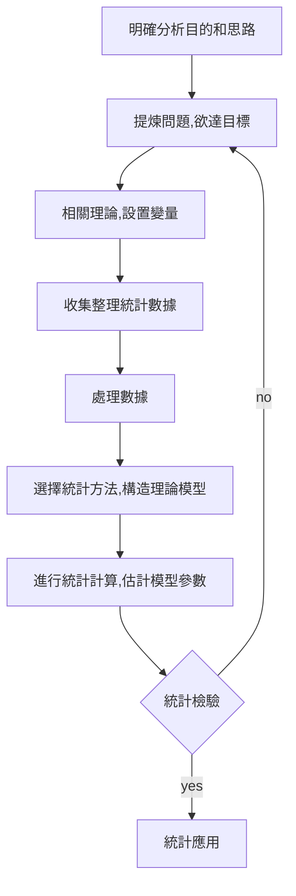

統計方法有哪些？
 1. 分類分析方法

 2. 結構簡化方法

 3. 相關分析方法

 4. 預測決策方法

統計分析方法步驟和流程

1. 提煉具體問題，確定欲達的目標
2. 確定定性理論，設置指標變量
	- 確定相關學科理論。如氣象學的理論
	- 確定各因素之間的因果關係
	- 確定內生變量(被解釋變量Y)
	- 確定外生變量(解釋變量X)
	- 選擇變量時需注意
    	- 變量之間的相關性
    	- 實際統計數據的局限性
    	- 不是涉及解釋變量越多越好
    	- 需經過反複試算，找尋適合的變量
3. 收集整理統計數據
   - 收集注意
     - 時間序列數據
       - 數據可比性
       - 統計口徑
       - 隨機誤差項的序列相關問題
     - 橫截面數據
       - 異方差性問題
     - 樣本容量問題

   - 統計數據整理
     - 折算
     - 差分
     - 對數化
     - 標準化
     - 剔除
     - 插值法

4. 選擇統計方法，構造理論模型
   - 繪製變量的樣本散點圖
   - 統計模型的建立
   - 采用不同模式進行計算機模擬

5. 進行統計計算，估計模型參數
   - 選擇合適的統計計算
     - 均值
     - 方法
     - 相關矩陣
     - 距離距陣
     - 特徵值
     - 特徵向量
   - 根據數據樣本估計模型參數
     - 最小二乘法
     - 極大似然法
     - 特徵根估計
     - 主成份估計

6. 模型的檢驗與修改
   - 統計檢驗
     - 回歸方程和回歸係數顯著性檢驗和擬合度檢驗
     - 隨機誤差項的序列相關檢驗和異方法性驗檢
     - 解釋變量的多重共線性檢驗
   - 模型實際意義檢驗
   - 對模型進行修改

7. 統計模型的應用
   - 分類研究
   - 簡化數據結構
   - 變量的相關分析
   - 進行經濟預測

 8. Ref
- [web link](https://wenku.baidu.com/view/908c908f998fcc22bdd10d16.html)
- [web link2](http://www.reea.agri.cn/sttzgg/201608/P020160831597768501898.pdf)
- [web link3](https://blog.csdn.net/nxcjh321/article/details/89095564)
- [web link4](http://epaper.gotop.com.tw/PDFSample/AEM002100.pdf)

