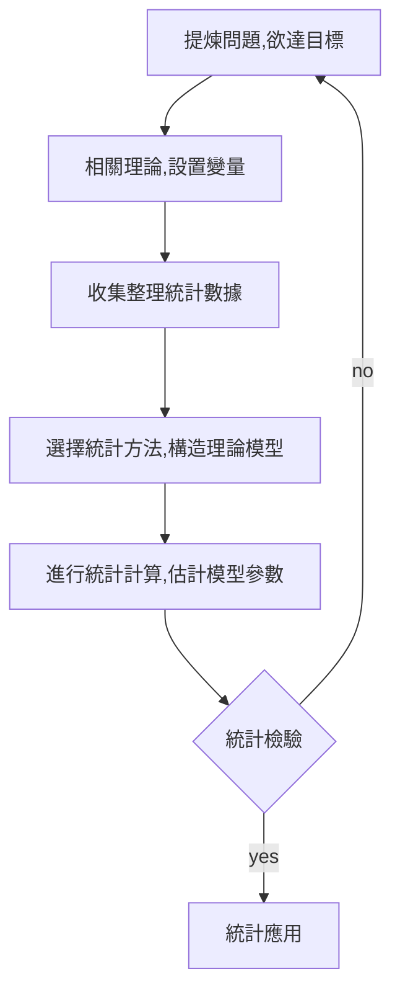

<!-- @import "[TOC]" {cmd="toc" depthFrom=1 depthTo=6 orderedList=false} -->

<!-- code_chunk_output -->

* [統計方法有哪些？](#統計方法有哪些)
	* [1. 分類分析方法](#1-分類分析方法)
	* [2. 結構簡化方法](#2-結構簡化方法)
	* [3. 相關分析方法](#3-相關分析方法)
	* [4. 預測決策方法](#4-預測決策方法)
* [統計分析方法步驟和流程](#統計分析方法步驟和流程)
	* [1. 提煉具體問題，確定欲達的目標](#1-提煉具體問題確定欲達的目標)
	* [2. 確定定性理論，設置指標變量](#2-確定定性理論設置指標變量)
			* [a. 確定相關學科理論。如氣象學的理論](#a-確定相關學科理論-如氣象學的理論)
			* [b. 確定各因素之間的因果關係](#b-確定各因素之間的因果關係)
			* [c. 確定內生變量(被解釋變量Y)](#c-確定內生變量被解釋變量y)
			* [d. 確定外生變量(解釋變量X)](#d-確定外生變量解釋變量x)
			* [e. 選擇變量時需注意](#e-選擇變量時需注意)
	* [3. 收集整理統計數據](#3-收集整理統計數據)
			* [a.收集注意](#a收集注意)
				* [i. 時間序列數據](#i-時間序列數據)
				* [ii. 橫截面數據](#ii-橫截面數據)
				* [iii. 樣本容量問題](#iii-樣本容量問題)
			* [b. 統計數據整理](#b-統計數據整理)
	* [4. 選擇統計方法，構造理論模型](#4-選擇統計方法構造理論模型)
			* [a. 繪製變量的樣本散點圖](#a-繪製變量的樣本散點圖)
			* [b. 統計模型的建立](#b-統計模型的建立)
			* [c. 采用不同模式進行計算機模擬](#c-采用不同模式進行計算機模擬)
	* [5. 進行統計計算，估計模型參數](#5-進行統計計算估計模型參數)
			* [a. 選擇合適的統計計算](#a-選擇合適的統計計算)
			* [b. 根據數據樣本估計模型參數](#b-根據數據樣本估計模型參數)
	* [6. 模型的檢驗與修改](#6-模型的檢驗與修改)
			* [a. 統計檢驗](#a-統計檢驗)
			* [b. 模型實際意義檢驗](#b-模型實際意義檢驗)
			* [c. 對模型進行修改](#c-對模型進行修改)
	* [7. 統計模型的應用](#7-統計模型的應用)
			* [a. 分類研究](#a-分類研究)
			* [b. 簡化數據結構](#b-簡化數據結構)
			* [c. 變量的相關分析](#c-變量的相關分析)
			* [d. 進行經濟預測](#d-進行經濟預測)
	* [8. Ref](#8-ref)

<!-- /code_chunk_output -->

# 統計方法有哪些？
## 1. 分類分析方法

## 2. 結構簡化方法

## 3. 相關分析方法

## 4. 預測決策方法

# 統計分析方法步驟和流程

## 1. 提煉具體問題，確定欲達的目標
## 2. 確定定性理論，設置指標變量
#### a. 確定相關學科理論。如氣象學的理論
#### b. 確定各因素之間的因果關係
#### c. 確定內生變量(被解釋變量Y)
#### d. 確定外生變量(解釋變量X)
#### e. 選擇變量時需注意
- 變量之間的相關性
- 實際統計數據的局限性
- 不是涉及解釋變量越多越好
- 需經過反複試算，找尋適合的變量

## 3. 收集整理統計數據
#### a.收集注意
##### i. 時間序列數據
- 數據可比性
- 統計口徑
- 隨機誤差項的序列相關問題

##### ii. 橫截面數據
- 異方差性問題

##### iii. 樣本容量問題

#### b. 統計數據整理
- 折算
- 差分
- 對數化
- 標準化
- 剔除
- 插值法

## 4. 選擇統計方法，構造理論模型
#### a. 繪製變量的樣本散點圖
#### b. 統計模型的建立
#### c. 采用不同模式進行計算機模擬

## 5. 進行統計計算，估計模型參數
#### a. 選擇合適的統計計算
- 均值
- 方法
- 相關矩陣
- 距離距陣
- 特徵值
- 特徵向量
#### b. 根據數據樣本估計模型參數
- 最小二乘法
- 極大似然法
- 特徵根估計
- 主成份估計

## 6. 模型的檢驗與修改

#### a. 統計檢驗
- 回歸方程和回歸係數顯著性檢驗和擬合度檢驗
- 隨機誤差項的序列相關檢驗和異方法性驗檢
- 解釋變量的多重共線性檢驗

#### b. 模型實際意義檢驗
#### c. 對模型進行修改

## 7. 統計模型的應用

#### a. 分類研究
#### b. 簡化數據結構
#### c. 變量的相關分析
#### d. 進行經濟預測

## 8. Ref
- [web link](https://wenku.baidu.com/view/908c908f998fcc22bdd10d16.html)

