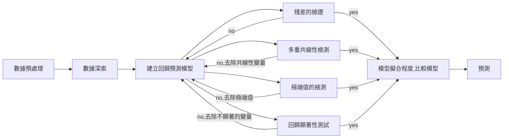

- [一元簡單線性迴歸](#一元簡單線性迴歸)
- [多元線性迴歸](#多元線性迴歸)
  - [最小二乘法](#最小二乘法)
  - [$\beta$的估計](#beta的估計)
  - [$\hat \sigma$ 的估計](#hat-sigma-的估計)
  - [殘差](#殘差)
  - [殘差檢定](#殘差檢定)
  - [離群值檢定](#離群值檢定)
  - [回歸方程的顯著性檢驗](#回歸方程的顯著性檢驗)
  - [額外平方和](#額外平方和)
  - [判定係數](#判定係數)
  - [修定判定係數](#修定判定係數)
  - [標準化後的$\beta$](#標準化後的beta)
  - [方差膨脹因子](#方差膨脹因子)
  - [共線性問題](#共線性問題)
  - [偏判定係數](#偏判定係數)
  - [回歸系數的顯著性檢驗](#回歸系數的顯著性檢驗)
- [回歸分析的步驟](#回歸分析的步驟)
  - [過程](#過程)
  
# 一元簡單線性迴歸
令 

$$
\hat y_i=\beta_0+\beta_i x_i
$$

最小二法是選出$\beta_0,\beta_1$使得$Q$最小。

$$
Q=\sum_{i=1}^n (y_i -\hat y_i)^2=\sum_{i=1}^n (y_i -\beta_0-\beta_i x_i)^2
$$

通常采用偏微$ \frac{\partial Q}{\partial \beta_0},\frac{\partial Q}{\partial \beta_1}=0$ 計算出$\beta_0,\beta_1$，

$$
\left\{
    \begin{array}{lr}
    \hat \beta_1=\frac{l_{xy}}{l_{xx}}
    \\
    \hat \beta_0=\bar y - \hat \beta_1 \bar x 
    \end{array} 
\right.
$$

其中，

$$
\begin{aligned}
l_{xy} &=\sum(x_i -\bar x)(y_i-\bar y) = \sum x_iy_i- n \bar x \bar y =\sum x_iy_i- \frac{1}{n} \sum x_i \sum y_i \\
l_{xx} &=\sum(x_i -\bar x)^2 =\sum x_i^2 -n\bar x^2 =\sum x_i^2- \frac{1}{n} \left(\sum x_i \right) ^2
\\
l_{yy} &=\sum(y_i -\bar y)^2 =\sum y_i^2 -n\bar y^2 =\sum x_i^2- \frac{1}{n} \left(\sum y_i \right) ^2
\end{aligned}
$$

其中改寫$\beta_0,\beta_1$

$$
\begin{aligned}
\hat \beta_1 &=\sum \left( \frac{x_i-\bar x}{l_{xx}}\right)y_i \\
\hat \beta_0 &=\bar y -\hat \beta_i \bar x=\sum \left[\frac{1}{n} -\frac{(x_i-\bar x)\bar x}{l_{xx}}\right]y_i
\end{aligned}
$$

而進行簡單的計算得出：
- $E(\hat \beta_0)$
- $E(\hat \beta_1)$
- $\text{Var}( \hat \beta_0)$
- $\text{Var}(\hat \beta_1)$
- $\text{Cov}(\hat \beta_0,\hat \beta_1)$

# 多元線性迴歸

$$
C = 
\begin{bmatrix} 
1 & x_{11} & x_{12}  &\cdots & x_{1m}\\
1 & x_{21} & x_{22}  &\cdots & x_{2m} \\
\vdots & \vdots & \vdots &\cdots & \vdots\\
1 & x_{n1} & x_{n2}  &\cdots & x_{nm}
\end{bmatrix}
$$

$$
y =
\begin{bmatrix} 
y_1 \\
y_2 \\
\vdots \\
y_n
\end{bmatrix},
\beta =
\begin{bmatrix} 
\beta_0 \\
\beta_1 \\
\vdots \\
\beta_m
\end{bmatrix},
\varepsilon =
\begin{bmatrix} 
\varepsilon_0 \\
\varepsilon_1 \\
\vdots \\
\varepsilon_n
\end{bmatrix}
$$

$$Y=C\beta+\varepsilon $$

## 最小二乘法
## $\beta$的估計

$$
Q(\beta)=\sum_{t=1}^n \varepsilon_t^2=\sum_{t=1}^n( y_t - \hat y_t)^2=\sum_{t=1}^n[ y_t - (\beta_0+\beta_1 x_{t1}+\cdots+\beta_mx_{tm})]^2
$$

**最小二乘法是**取$\beta_i$使得$Q$達到最小。
從這個方法可得出以下結果

$$
\begin{aligned}
\widehat{\beta} &=(C'C)^{-1}C'Y \\
\hat Y &=C\widehat{\beta}=C(C'C)^{-1}C'Y \\
\hat \varepsilon &=Y-\hat Y \\
Q(\hat \beta) &= \hat \varepsilon' \varepsilon
\end{aligned}
$$

## $\hat \sigma$ 的估計
利用最大似然原理，仍可得出$\beta$最大似然估計仍為$\hat \beta$,$\sigma$的估計是

$$\hat \sigma^2=\frac{1}{n}\sum_{t=1}^n[ y_t - (\beta_0+\beta_1 x_{t1}+\cdots+\beta_mx_{tm})]^2=\frac{1}{n}Q(\beta)$$

但因$\hat \sigma$不是無偏估計量，通常取

$$
s^2=\frac{1}{n-m-1}Q(\beta)
$$

## 殘差

$$
\begin{aligned}
Q &=(Y-\hat Y)'(Y-\hat Y)=\sum(y_i-\hat y_i)^2 \\
U &=(\bar Y-\hat Y)'(\bar Y-\hat Y)=\sum(\hat y_i-\bar y_i)^2 \\
E(y) &= (Y-\bar Y)'(Y-\bar Y)=\sum( y_i-\bar y_i)^2=U+Q
\end{aligned}
$$

其中
- $U$為所建立迴歸式的$X$所引起
- $Q$為隨機誤差所引起

## 殘差檢定

1. 常態分配
2. 獨立性
3. 變異數同質性

這個請參閱另一篇[BLOG](https://chchoiw.github.io/posts/2019/06/normal_independ_cvar/)
## 離群值檢定
- 標準化殘差

## 回歸方程的顯著性檢驗

已知：

$$
\begin{aligned}
\hat \beta &\sim \beta N_{m+1}(\beta,\sigma^2(C'C)^{-1})\\
\frac{1}{\sigma^2} Q &\sim \chi_{n-m-1}^2
\end{aligned}
$$

$$H_0 :\beta_1=\beta_2=\cdots=\beta_n=0$$

在已知$H_0$下，

$$
\frac{1}{\sigma^2} U \sim \chi_{m}^2
$$

所以，

$$
F=\frac{U/m}{Q/n-m-1}
$$

如果

$$
F >F_\alpha \text{ or } p <\alpha，
$$

則否定$H_0$。

## 額外平方和
> 這是台灣考題中經常出現，未必有需要，但對厘清概念是非常好的。

假設$Q_i,U_i$表示去掉自變量$x_i$後的各自定義的殘差平方和。
$P_i=U-U(i)=Q(i)-Q$

在台灣的定義中，
$\text{SSR}=U,\quad \text{SSE}=Q$

$$
\begin{aligned}
\text{SSR}(x_1| x_2,x_3) 
&=\text{SSR}(x_1 ,x_2,x_3)-\text{SSR}(x_1,x_2) \\
&=\text{SSE}(x_1,x_2)-\text{SSE}(x_1 ,x_2,x_3)
\\
\text{SSR}(x_1, x_2|x_3) 
&=\text{SSR}(x_1 ,x_2,x_3)-\text{SSR}(x_3) \\
&=\text{SSE}(x_3)-\text{SSE}(x_1 ,x_2,x_3)
\end{aligned}
$$

有關更詳細的資料，請參閱 [link](http://web.ncyu.edu.tw/~lanjc/lesson/C7/class/ch07-AN.pdf)。

## 判定係數

$$R^2=1-\frac{Q}{U+Q}=\frac{U}{T}$$

這裏 $T=U+Q=\sum(y_i-\bar y_i)^2$ 是總偏差平方和。
- 判定係數$R$的分子$U$為所建立迴歸式的$X$所引起
- $R$越大，即$X$能解釋$Y$的能力越強

## 修定判定係數

$$R^2_{\text{adj}}=1-\frac{Q/\text{df}Q}{T/\text{df}T}$$

這裏 $\text{df}Q,\text{df}T$分別是$Q$和$T$的自由度。

這主要是修正因樣本量太小而變大的$R$。

## 標準化後的$\beta$
>受到不同尺度衡量的影響，由標準化的自變數所計算而得到的迴歸係數，我們稱為$\beta$係數 (beta 係數)，擁有$\beta$係數愈高的自變數($x_n$)，對依變數(Y)的影響力愈大。

 ref:[link](http://www.gotop.com.tw/epaper/e0719/AEM000900n.pdf)

## 方差膨脹因子
- 容忍度：$1-R_i=\frac{Q}{T}$表示以其它自變數來預測第$i$個自變數之決定係數。
- 當容忍度愈小時表示$R_i$愈大 ，即其他$$\left\{ x_j \vert j\neq i \right\} $$能解釋$x_i$的能力愈大。
- 方差膨脹因子$\text{VIF}=\frac{1}{1-R_i}$，與$R_i$成正比。$\text{VIF}>10$時，為顯著共線性。

## 共線性問題
- 檢查方法
1. 檢查看相關係數，超過 0.8 就已經太高了，可能有共線性問題
2. 查看容忍值(tolerance)，容忍值( 0~1 之間)，愈大愈好，容忍值愈大，代表共線性問題愈小
3. 變異數膨脹因素(VIF)，VIF 的值愈小愈好，代表愈没有共線性問題。

- 消除共線性的方法：
1. 從彼此相關係數較高的自變數中只取一個重要的變項
2. 使用脊迴歸（ridge regression）分析
3. 用主成份迴歸

## 偏判定係數
在已知$x_1,x_2$的情況下，引入$x_3$，其判定係數的定義是

$$R^2_{x_3|x_1,x_2}=\frac{\text{SSR}(x_3|x_1,x_2)}{\text{SSE}(x_1,x_2)} $$

分子可以想像為因為引入$x_3$而造成殘差增加量，分母就是只有$x_1,x_2$的殘差。
這個比就是增加量和原本相比，它增加的幅度。

## 回歸系數的顯著性檢驗

$$H^{(i)}_0:\beta_i=0 \quad (i=1,2,\cdots,m)$$

在$H_0$下，

$$\begin{align}
F_i &=\frac{P_i}{Q/n-m-1} \sim F(1,n-m-1), \\
T_i &=\frac{ \sqrt{P_i} }{\sqrt{Q/(n-m-1)}} \sim t(n-m-1)
\end{align}$$

如果 $
F >F_\alpha \quad \text{ or } \quad p=\{F>F_\alpha\} <\alpha
$，則否定$H_0$。

# 回歸分析的步驟
- [REF 1](https://blog.csdn.net/Noob_daniel/article/details/76087829)
- [REF 2](https://mengte.online/archives/1899)
- [REF 3](https://pro.arcgis.com/zh-cn/pro-app/2.8/tool-reference/spatial-statistics/regression-analysis-basics.htm)
- [REF 4](http://www.360doc.com/content/20/0619/07/67596171_919293926.shtml)

- 線性回歸的假設理論
  - 線性關係
    - 觀察自因變量的圖，看是否呈直線關係 
  - 獨立性假設, 即各變量之間是相互獨立的；
    - VIF<3，無多重線性，VIF>10有多重線性
  - 殘差：
    - 正態性假設：即所研究的變量均服從正態分布；
      - Q-Q圖或一些正態檢驗
      - [圖](https://pro.arcgis.com/zh-cn/pro-app/2.8/tool-reference/spatial-statistics/h-transformation.htm)
      - 若不是正態，正偏態（峰值偏左），對數轉換
      - 若不是正態，負偏態（峰值偏右），指數轉換
    - 等方差假設：即各變量總體的方差是相等的；
      - 觀察殘差分佈圖，若殘差規律有除X軸變大或變小，就有異方差性問題
      - 若方差不齊，使用加權最小二乘法估計回歸系數
    - 殘差項無自相關性，即誤差項之間互不相關，Cov(ei,ej)=0
      - DW檢測：0<DW<2為正常，不然會有自相關問題

- 回歸顯著性問題
  - 回歸系數的檢驗（t檢驗）
  - 回歸方程的檢驗（F檢驗）：ANOVA方差分析
- 異常值檢測：因為異常值為大為影響回歸的結果
  - Cook's Distance： CD>0.5為異常點

## 過程
- [VEDIO](https://www.bilibili.com/video/BV1zW411C72A?p=6)

- 數據預處理
- 數據深索
  - 確定Y變量是正態：Q-Q圖或P-P圖
  - X可以不是正態，但不能是散得太厲害 
  - 散點圖，看是否呈直線關係
  - 相關系數，$X_i,y$,看與$y$是否有顯著相關
- 建立回歸預測模型,根據公式計算出線性的系數
- 殘差的檢證
  - 正態
  - 獨立
  - 等方差
- 多重共線性檢測:VIF>2,有共線性，共線性會成對出現
- 極端值的檢測：
  - Cook's Distance:衡量第I個觀測刪除後，回歸系數估計的影響度$\text{Cook's Distance}>\frac{4}{\text{number of obs}}$是強影響點
  - STUDNET residual：即殘差除以標準誤,-2到2之間是合理
  - RSTUDENT residual:不含該觀測的模型的學生化殘差，RSTUDENT residual>3是強影響點
  - DIFFITS:對應預測值的標準化影響度，$\text{DIFFITS}>2\sqrt{\frac{ \text{number of params} }{\text{number of obs} } }$是強影響點
- 回歸顯著性測試
- 模型擬合程度：$R^2$，比較不同模型，取殘差平方和最小，也即$R^2$最大
  - 變量越多，$R^2$越大
  - 為校正自變量個數的影響，一般采用後面的Adjusted $R^2$(調整$R^2$)
- 預測