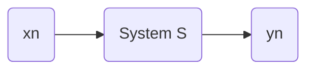
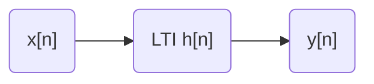

# LTI Systems
- A LTI system is a linear time-invaiant system, that is 

1. Linear:

1. Time-invaiant:

## convolution sum 

\begin{equation}\label{convolution}
y[n]=\sum\limits_{k=-\infty}^{\infty}x[k]h[n-k]
\end{equation}

## unit pluse signal $\delta[n]$

$$
\delta[n]=\Bigg\{
\begin{aligned}
   &1 &\text{when} \quad &n=0 \\
   &0 &\text{when} \quad &n\neq 0   
\end{aligned}
$$

\begin{equation}\label{convolution identity}
x[n]=\sum\limits_{k=-\infty}^{\infty}x[k]\delta[n-k]
\end{equation}

## LTI system and convolution sum

Let $h[n]=y[n], x[n]=\delta[n]$, then $y[n]$ can be written as a convolution sum:

$$
y[n]=\sum\limits_{k=-\infty}^{\infty}h[k]x[n-k]
$$

