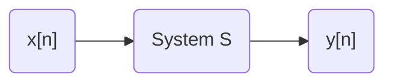
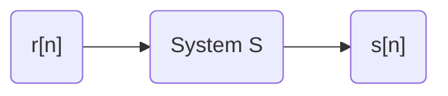
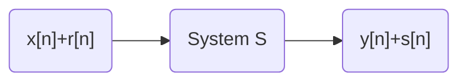
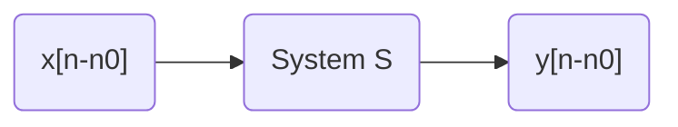
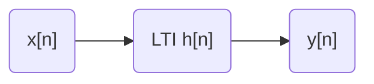

# LTI Systems
- An LTI system is a linear time-invaiant system, that is 

1. Linear:

2. Time-invaiant:

## convolution sum 

\begin{equation}\label{convolution}
y[n]=\sum\limits_{k=-\infty}^{\infty}x[k]h[n-k]\triangleq (h*x)[n]
\end{equation}

## unit pluse signal $\delta[n]$

$$
\delta[n]=\Bigg\{
\begin{aligned}
   &1 &\text{when} \quad &n=0 \\
   &0 &\text{when} \quad &n\neq 0   
\end{aligned}
$$

\begin{equation}\label{convolution identity}
x[n]=\sum\limits_{k=-\infty}^{\infty}x[k]\delta[n-k]
\end{equation}

## LTI system and convolution sum

Let $h[n]=y[n], x[n]=\delta[n]$, then $y[n]$ can be written as a convolution sum:

$$
y[n]=\sum\limits_{k=-\infty}^{\infty}h[k]x[n-k]
$$

We will represent this LTI system as following digram:

## properties of convolution sum
- Commutativity

$$
(x*h)[n]=(h*n)[n]
$$

- Associativity

$$
(x*(h_1*h_2))[n]=((x*h_1)*h_2)[n]
$$

- Distributivity

$$
(x*(h_1+h_2))[n]=(x*h_1)[n]+(x*h_2)[n]
$$

- Shift property
let $\hat x [n]=x[n-n_0]$

$$
(\hat x * h)[n]=(x*h)[n-n_0]
$$

- Identity

$$
(x*\delta)[n]=x[n]
$$

# Causal System
- Def: An LTI shstem is causal iff 
  
  $$
  h[n]=0 \quad \text{if } \quad n<0
  $$

