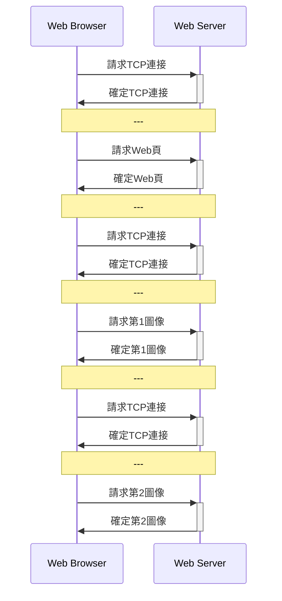
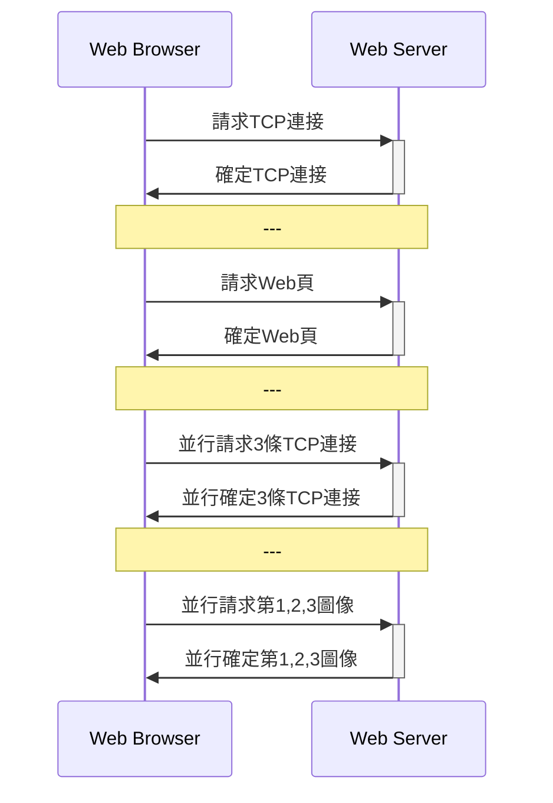
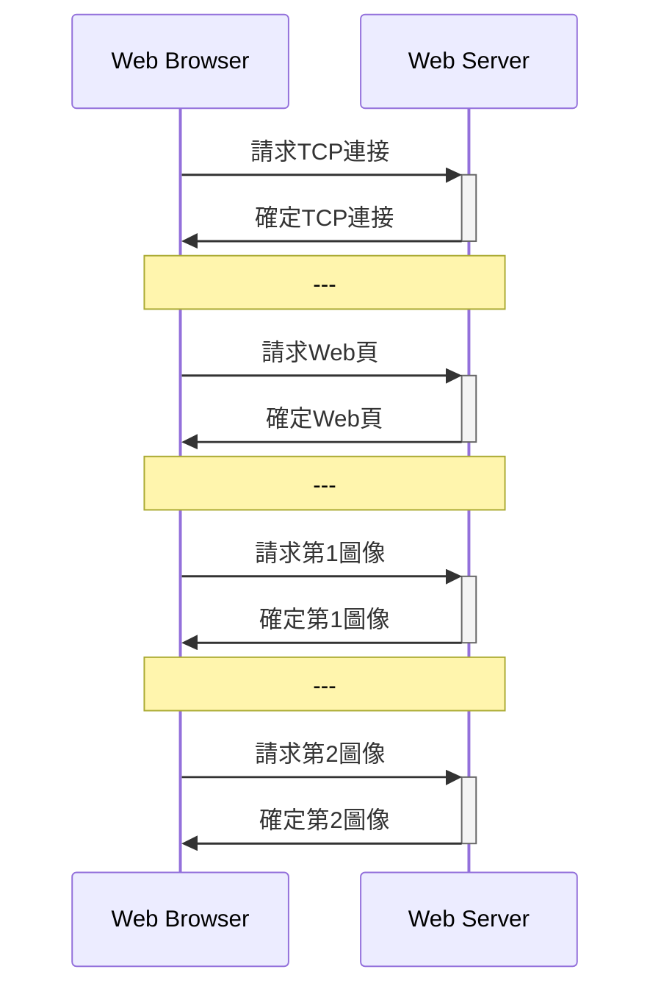
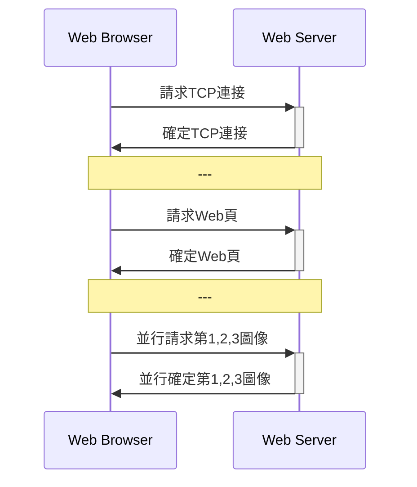

# OSI 7層模型
1. 應用層
2. 表示層
3. 會話層:用戶與用戶連接，通過兩台計算機間建立、管理和終止通信來完成對話。
4. 傳輸層:一個端到端的層次，進程的層次
5. 網絡層:如何將分組通交換網絡傳至目的主機
6. 數據鏈路層:相鄰結點之間數據可靠而有效的傳輸。數據在物理介質傳輸過程，保證沒有錯誤發生
7. 物理層

# 應用層

## DNS

- 域名
  1. 國家頂級域名 nTLD
  2. 通用頂級域名 gTLD
  3. 基礎結構域名

- 域名服務器
  1. 本地域名服務器
  2. 根域名服務器
  3. 頂級域名服務器
  4. 權威域名服務器

- 递歸解析和迭代解析
  - 递歸:本地域名服務器->根域名服務器-> 頂級域名服務器-> 權威域名服務器
  - 迭代:本地域名服務器->根域名服務器、頂級域名服務器和權威域名服務器

## HTTP

- 非持久連接

- 非持久並行連接

- 持久連接

- 持久並行連接

- 請求報文:<方法><URL><協議版本>
- 响應報文:<協議版本><狀態碼><短語>(短語是對狀態碼的進一步文本解釋)

## PORT口
- SMTP:25
- HTTP:80
- FTP:20
- POP:110
- DNS:53

## 郵件
— SMTP
    — 客戶端首先請求與服務端的25號端口建立TCP連接
    — 有三個階段：握手階段、郵件階段和關閉階段
    — 14條命令和１種應答信息
- POP和IMAP
  - POP: 110
  - POP: 郵件下載到本地主機
  - IMAP:能同步查詢、閱讀和刪除等動作。但POP單純下載郵件到本地。

## FTP 
- 並行的TCP連接：控制連接（保持打開、持久）和數據連接
— 帶外控制（FTP）和帶內控制（HTTP）

## P2P應用
- $u_s$ Server 上行帶寬
- $u_i$ 其他上行帶寬
- $d_i$ 下行帶寬
- $d_{\min}$ 最小的 $d_i$
- $F$是文件

則下載時間

$$
D_{\text{CS}}=\max\{ \frac{nF}{u_s},\frac{F}{d_{min}}\}
$$

和

$$
D_{\text{P2P}}=\max\{ \frac{F}{u_s},\frac{F}{d_{min}}, \frac{nF}{u_s+\sum u_i}\}
$$

## Socket編程

	

- UDP

	

# 傳輸層
- 傳輸層為網絡應用進程之間提供了端到端的報文傳輸服務。
- 傳輸層尋址、報文分段和重組、報文差錯檢測、實現進程間端到端可靠傳輸、面向應用層實現复用和分解
 
## 傳輸層尋址
- IP地址和端口是唯一標識一個通信端口
  
## 傳輸層复用和分解
- 分解:標識套接字, 通過它，交付給正確的套接字
- 复用: 不同套接字收集應用進程，為它們封裝上首部信息，傳給網絡層

#  網絡層

## IPV4和IPV6

- IPV4: 32位;表達形式 $d_10.d_10.d_10.d_10$
- IPV6: 128位;表達形式 $d_16(\cross 4):d_16(\cross 4):d_16(\cross 4):d_16(\cross 4):d_16(\cross 4):d_16(\cross 4):d_16(\cross 4):d_16(\cross 4)$

# 物理層

$$
C=2B\log_2 M
$$

$C$是信道容量，$B$是信帶帶寬和$M$是進位數

$$
C=Blog-2\Big(1+\frac{S}{N} \Big)
$$

$\frac{S}{N}$是信噪比，無單位的。

$$\frac{S}{N}_{db}=10 log_10 \Big(\frac{S}{N}\Big)$$

# 網絡安全

## 對稱加密
- DES
- 三重DES
- AES
- IDEA

## HASH

- p.277
- 快速計算
- 多對一均能產生定長輸出
- 無法預知其值
- 不同報文不同值
- MD5:512bit
- SHA-1:160bit

## 防火牆

- 無狀態分組過濾器
- 有狀態分組過濾器
- 應用網關 

-- to be continuous