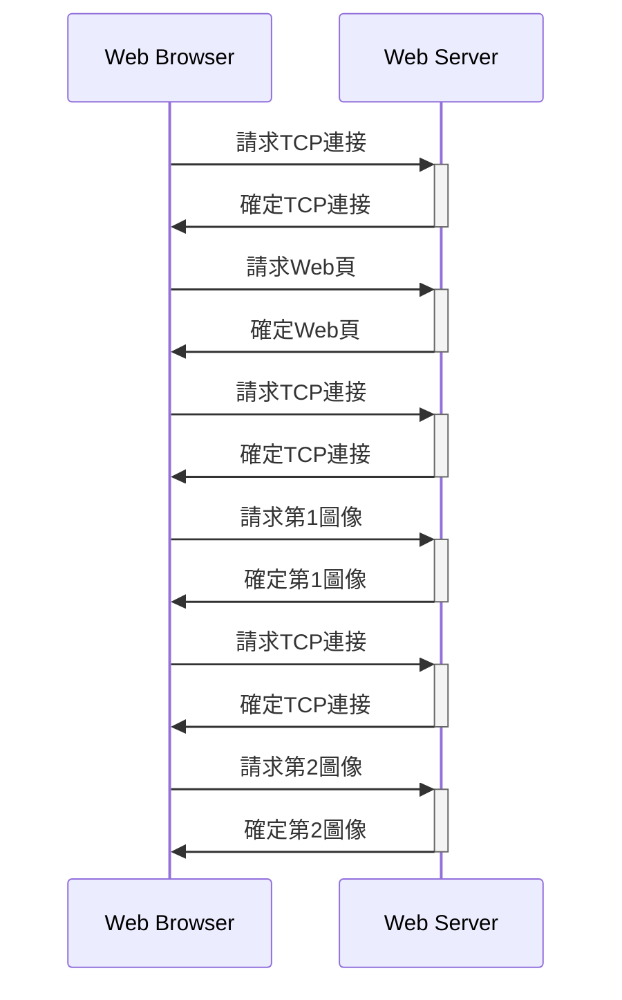
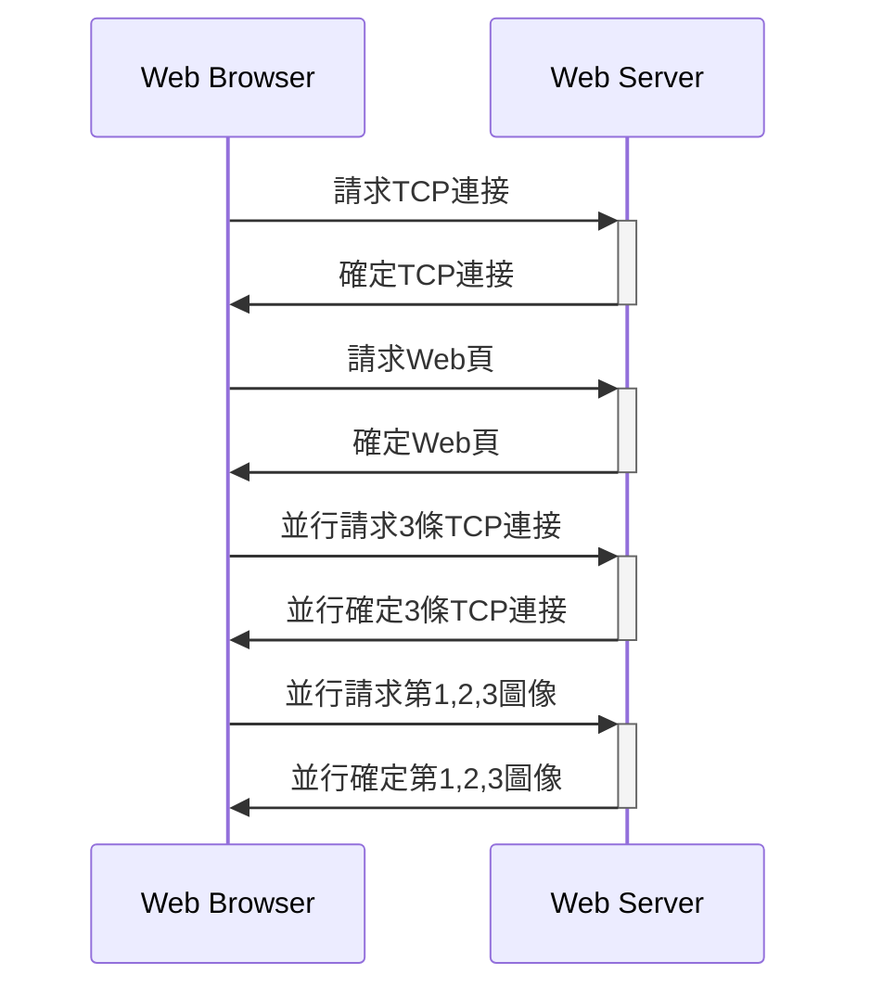

# OSI 7層模型
1. 應用層
2. 表示層
3. 會話層:用戶與用戶連接，通過兩台計算機間建立、管理和終止通信來完成對話。
4. 傳輸層:一個端到端的層次，進程的層次
5. 網絡層:如何將分組通交換網絡傳至目的主機
6. 數據鏈路層:相鄰結點之間數據可靠而有效的傳輸。數據在物理介質傳輸過程，保證沒有錯誤發生
7. 物理層

# 應用層

## DNS

- 域名
  1. 國家頂級域名 nTLD
  2. 通用頂級域名 gTLD
  3. 基礎結構域名

- 域名服務器
  1. 本地域名服務器
  2. 根域名服務器
  3. 頂級域名服務器
  4. 權威域名服務器

- 递歸解析和迭代解析
  - 递歸:本地域名服務器->根域名服務器-> 頂級域名服務器-> 權威域名服務器
  - 迭代:本地域名服務器->根域名服務器、頂級域名服務器和權威域名服務器

## HTTP

- 非持久連接

- 非持久並行連接

- 持久連接