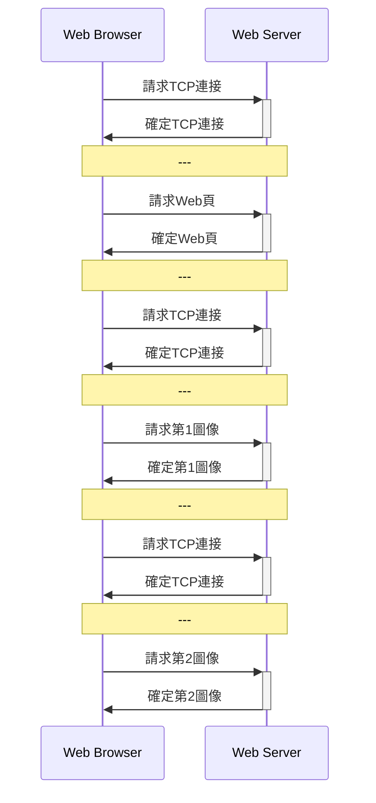
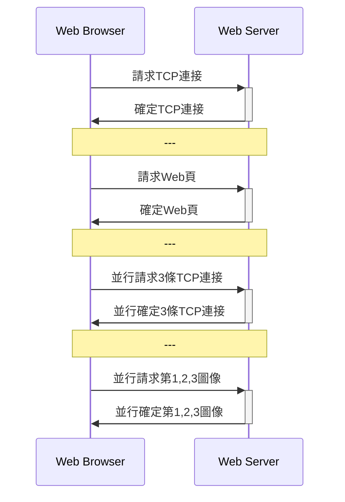
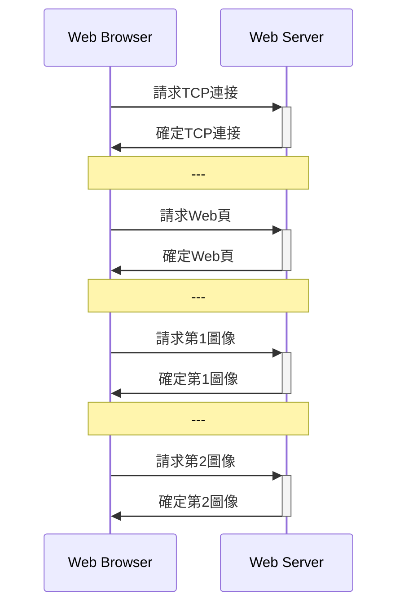
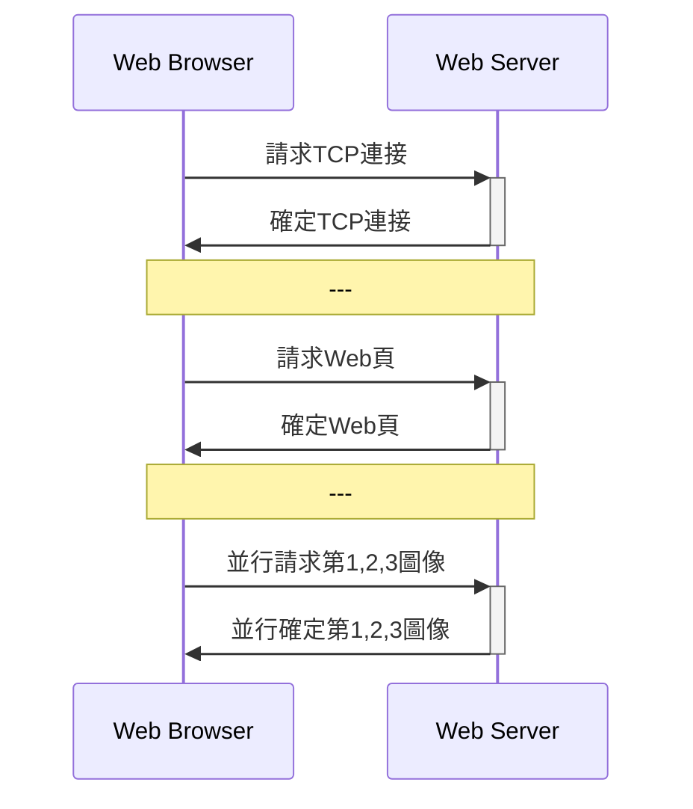

- [應用層](#應用層)
  - [DNS](#dns)
  - [HTTP](#http)
  - [PORT口](#port口)
  - [郵件](#郵件)
  - [FTP](#ftp)
  - [P2P應用](#p2p應用)
  - [Socket編程](#socket編程)
- [傳輸層](#傳輸層)
  - [傳輸層尋址](#傳輸層尋址)
  - [傳輸層复用和分解](#傳輸層复用和分解)
- [網絡層](#網絡層)
  - [網絡層功能](#網絡層功能)
  - [數據報網絡與虛電路網絡](#數據報網絡與虛電路網絡)
  - [TCP](#tcp)
  - [IPV4和IPV6](#ipv4和ipv6)
  - [**網絡拥塞控制和流量控制**](#網絡拥塞控制和流量控制)
  - [鏈路狀態路由算法和最短](#鏈路狀態路由算法和最短)
- [數據鏈路層](#數據鏈路層)
  - [以太網](#以太網)
  - [局域網](#局域網)
  - [MAC協議](#mac協議)
  - [HDLC](#hdlc)
- [物理層](#物理層)
- [無線](#無線)
  - [MAC 協議](#mac-協議)
  - [IEEE 802.11](#ieee-80211)
- [網絡安全](#網絡安全)
  - [對稱加密](#對稱加密)
- [公開密鑰](#公開密鑰)
  - [HASH](#hash)
  - [數字簽名](#數字簽名)
  - [防火牆](#防火牆)

## 計算機網絡概述
- [計算機網絡概述複習視頻](https://www.bilibili.com/video/BV1fZ4y1g7ab?from=search&seid=5927259418480569879)

## OSI 7層模型

1. 應用層
2. 表示層:交換數據的語法
3. 會話層:用戶與用戶連接，通過兩台計算機間建立、管理和終止通信來完成對話。
4. 傳輸層:一個端到端的層次，進程的層次
5. 網絡層:如何將分組通交換網絡傳至目的主機
6. 數據鏈路層:相鄰結點之間數據可靠而有效的傳輸。數據在物理介質傳輸過程，保證沒有錯誤發生
7. 物理層

- 在層的實體之間傳送的比特組稱為**數據單元**
- 對等層之間傳送數據單元是按照層協議進行, 這叫**協議數據單元(PDU)**
  -  物理:位流/比特流
  -  數據鏈路:幀
  -  網絡:分組/包
  -  傳輸:數據段/報文段
  -  應用層:報文

## 傳輸時延
-  P.37
- 結點處理時延
- 排隊時延
- 傳輸時延:輸出鏈路發送時，從第一位開始發送到最後一位為止所用的時間

$$d_t=\frac{L}{R}$$

- 傳播時延:關鍵詞，**物理**

$$d_p=\frac{D}{V}$$

- 吞吐量 

$$
\text{Thr}=\min\{R1,R2,R3\}
$$

## 數據交換
- 電路交換
- 報文交換
- 分組交換

### 分組交換
- 優點
  - 交換設備存儲容量要求低
  - 交換速度快
  - 可靠傳輸效率高
  - 更加公平
- 缺點
  - 分組長度和誤碼率是有關係，對誤碼率敏感，必須有差錯控制

# 應用層

## DNS

- 域名
  1. 國家頂級域名 nTLD
  2. 通用頂級域名 gTLD
  3. 基礎結構域名

- 域名服務器
  1. 本地域名服務器
  2. 根域名服務器:a-m
  3. 頂級域名服務器
  4. 權威域名服務器:區為單位

- 递歸解析和迭代解析
  - 递歸:本地域名服務器->根域名服務器-> 頂級域名服務器-> 權威域名服務器
  - 迭代:本地域名服務器->根域名服務器、頂級域名服務器和權威域名服務器

## HTTP

- 非持久連接(HTTP1.0)

- 非持久並行連接

- 持久連接(HTTP1.1)

- 持久並行連接

- 請求報文:<方法><URL><協議版本>
- 响應報文:<協議版本><狀態碼><短語>(短語是對狀態碼的進一步文本解釋)

## PORT口
- SMTP:25
- HTTP:80
- FTP:20
- POP:110
- DNS:53

## 郵件
— SMTP
    — 客戶端首先請求與服務端的25號端口建立TCP連接
    — 有三個階段：握手階段、郵件階段和關閉階段
    — 14條命令和１種應答信息
- POP和IMAP
  - POP: 110
  - POP: 郵件下載到本地主機
  - IMAP:能同步查詢、閱讀和刪除等動作。但POP單純下載郵件到本地。

## FTP 
- 並行的TCP連接：控制連接（保持打開、持久）和數據連接
— 帶外控制（FTP）和帶內控制（HTTP）

## P2P應用
- $u_s$ Server 上行帶寬
- $u_i$ 其他上行帶寬
- $d_i$ 下行帶寬
- $d_{\min}$ 最小的 $d_i$
- $F$是文件

則下載時間

$$
D_{\text{CS}}=\max\{ \frac{nF}{u_s},\frac{F}{d_{min}}\}
$$

和

$$
D_{\text{P2P}}=\max\{ \frac{F}{u_s},\frac{F}{d_{min}}, \frac{nF}{u_s+\sum u_i}\}
$$

## Socket編程

	

- UDP

	

# 傳輸層
- 傳輸層為網絡應用進程之間提供了端到端的報文傳輸服務。
- 傳輸層尋址
- 報文分段和重組
- 報文差錯檢測
- 實現進程間端到端可靠傳輸
- 面向應用層實現复用和分解
 
## 傳輸層尋址
- IP地址和端口是唯一標識一個通信端口
  
## 傳輸層复用和分解
- 分解:標識套接字, 通過它，交付給正確的套接字
- 复用: 不同套接字收集應用進程，為它們封裝上首部信息，傳給網絡層

#  網絡層

- [網絡層複習視頻](https://www.bilibili.com/video/BV1254y147wy)

## 網絡層功能
- **分組轉發**和**路由選擇**

## 數據報網絡與虛電路網絡
- 數據報網絡：
  - P.132
  - 無連接業務
  - 每個分組作為一個數據報獨立傳送
  - 有源地址和目的地址
- 虛電路網絡
  - P.133
  - 有連接業務
  - 網絡會為電路分配獨享資源
  - 源主機和目的主機之間一條路徑
  - 該路上的每條路各有一個虛電路標識(VCID)
  - 每台分組交換機的轉發表中記錄虛電路標識的接續關係
- 分別:
  - 虛: 順序控制、差錯控制和流等功能由網絡完成，端系統簡單
  - 數: 網絡簡單，端系統完成順序控制、差錯控制和流等功能由網絡

## TCP
- 首部長度是4(最大是15)時,即TCP字段的首部長度是16(最大是60)字節。

## IPV4和IPV6

- IPV4: 
  - 32位;
  - 表達形式 $d_{10}.d_{10}.d_{10}.d_{10}$
  - 最大封裝數據65515
- IPV6: 
  - P.159
  - 128位;
  - 表達形式 $d_{16}(\times 4):d_{16}(\times 4):d_{16}(\times 4):d_{16}(\times 4):d_{16}(\times 4):d_{16}(\times 4):d_{16}(\times 4):d_{16}(\times 4)$
  - 單播(源和目地)、組播(目的地址)和任播(目的地址)

## **網絡拥塞控制和流量控制**

- **拥塞控制**：
  - 定義：端系女統或網絡結點，通過采取某些措施來避免拥塞的發生，或者對己發生的拥塞做出反應
  - 網絡通過能力或網絡拥擠程度，來調整數據速率和數據量
  - 任務：確保網絡能夠承載所達到的流量
- **拥塞控制預防和消除**
  - 預防
    - 流量感知路由
    - 准入控制-虛電路
  - 消除
    - 流量調節
      - 抑制分組
      - 背壓：從源到目的地都限制
    - 負載脫落

  
- **流量控制**：
  - 定義：發送方根據接收方的接收數據能力，包括接收緩存、處理速度等，調整數據發送率和數據量

## 鏈路狀態路由算法和最短

- **鏈路狀態路由算法**
  1. 獲取網絡拓扑結構
  2. 直接相鄰的長度
  3. 廣播
  4. 接收廣播
  5. 存數據庫
  6. 構建拓扑結構
  7. 求最短路徑

# 數據鏈路層

## 以太網
- MAC協議采用CSMA/CD
- IEEE802.3

- 分組交換設備是**交換器材**和**網橋**
- PPP

## 局域網
- 網絡拓撲
- 介質訪問控制MAC子層
- 邏輯鏈路控制(LLC)子層
- 地址解析協議(ARP):網絡層地址(IP)與鏈路層地址映射
- MAC: 6字節;00-2A-E1-76-8C-39或00:2A:E1:76:8C:39

## MAC協議

## HDLC
- **信息幀**、**管理幀**和**無序幀**

# 物理層

- 物理層的主要功能是實現比特流的透明傳輸,為數據鏈路層提供數據傳輸服務
- 物理層協議規定的特性包括機械特性、電氣特性、功能特性和規程特性

$$
C=2B\log_2 M
$$

$C$是信道容量，$B$是信帶帶寬和$M$是進位數

$$
C=B\log_2\Big(1+\frac{S}{N} \Big)
$$

$\frac{S}{N}$是信噪比，無單位的。

$$\Big(\frac{S}{N}\Big)_{db}=10 \log_{10} \Big(\frac{S}{N}\Big)$$

# 無線

## MAC 協議
- DIFS: 分布式幀間間隔
- RTS:請求發送
- SIFS:短幀間間隔
- CTS:允許發送
- NAV: 網絡分配向量
  

## IEEE 802.11
- P.253
- IEEE 802.11:數據幀、控制幀和管理幀
- MAC首部30字節
- 主體不超過2312字節,通常不超1500字節
- 尾部是幀檢列FCS,共4字節 

# 網絡安全

## 對稱加密
- DES
- 三重DES
- AES
- IDEA

# 公開密鑰
- P.276
- Diffie-Hellman
- RSA
## HASH

- p.277
- 快速計算
- 多對一均能產生定長輸出
- 無法預知其值
- 不同報文不同值
- MD5:512bit
- SHA-1:160bit

## 數字簽名
- P.279
- 消息認證:驗證發送方以及所發消息內容是否被修改
- 但當有利害沖突時，消息認識不夠，所以有數字驗證
- 數字簽名
  - 接收方能夠確認發送方的簽名，但不能偽造
  - 給接收方後，就不能再否認他所簽發的消息
  - 已收到的簽名消息不能否認,即有收報認證
  - 第三者可以確認收發雙方之間的消息傳送，但不能偽造這一過程

## 防火牆

- 無狀態分組過濾器:內網與網絡邊緣路由器
- 有狀態分組過濾器:分組
- 應用網關 :人員識別

-- to be continuous