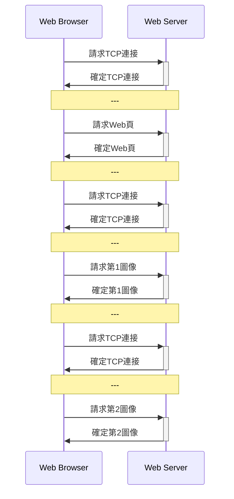
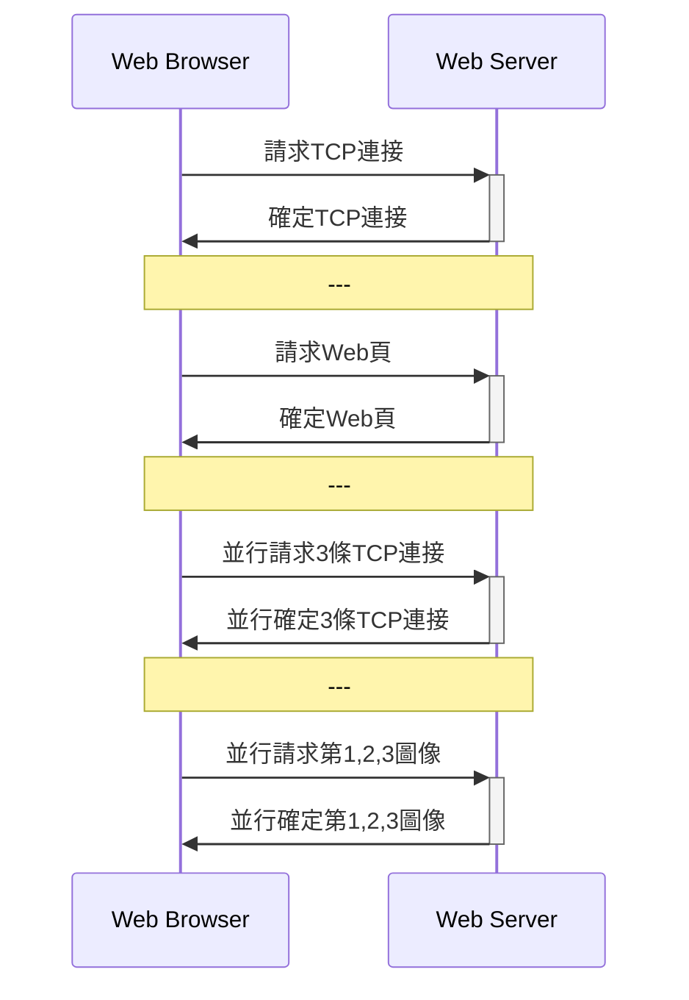
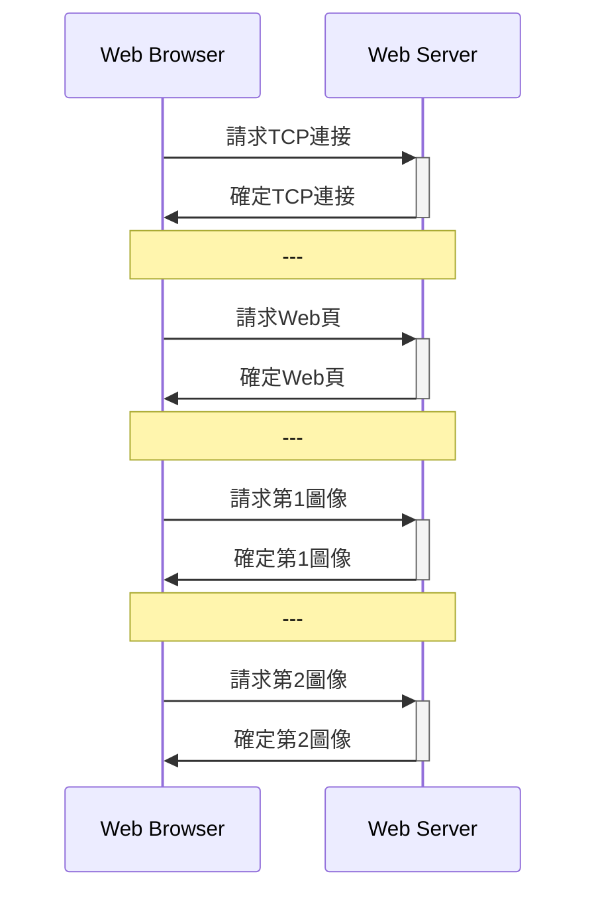
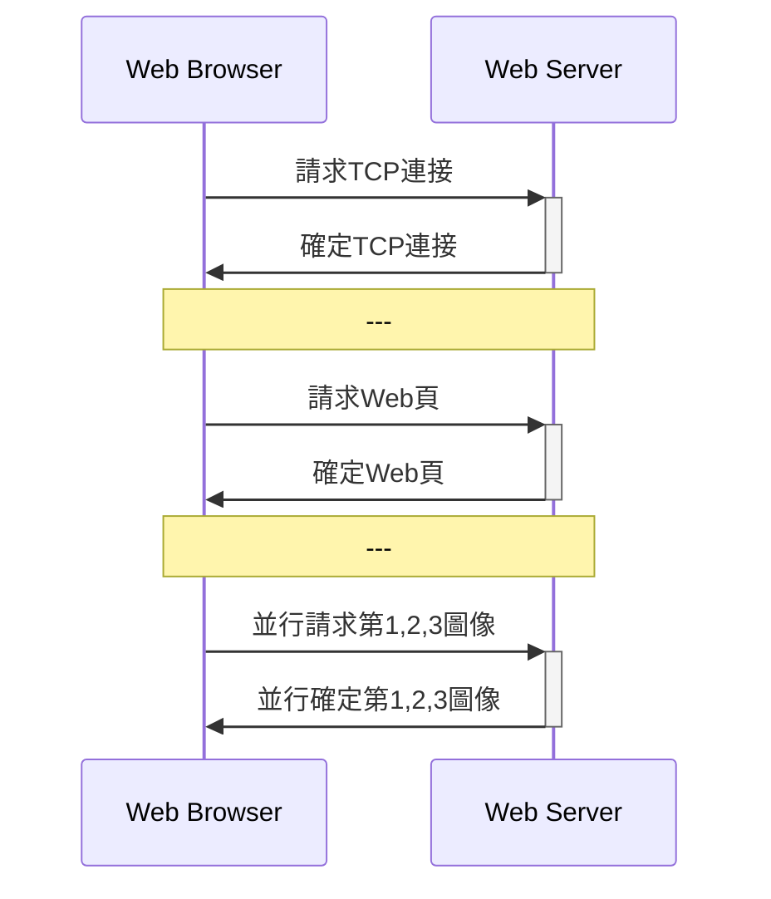

- [簡介](#簡介)
- [計算機網絡概述](#計算機網絡概述)
  - [協議三要素](#協議三要素)
  - [數據交換](#數據交換)
    - [分組交換](#分組交換)
  - [OSI 7層模型](#osi-7層模型)
  - [TCP/IP](#tcpip)
  - [傳輸時延](#傳輸時延)
- [應用層](#應用層)
  - [DNS](#dns)
  - [HTTP](#http)
  - [PORT口](#port口)
  - [郵件](#郵件)
    - [SMTP](#smtp)
    - [POP](#pop)
  - [HTTP郵件](#http郵件)
  - [FTP](#ftp)
  - [P2P應用](#p2p應用)
  - [Socket編程](#socket編程)
- [傳輸層](#傳輸層)
  - [傳輸層功能](#傳輸層功能)
  - [傳輸層尋址](#傳輸層尋址)
  - [傳輸層复用和多用分解](#傳輸層复用和多用分解)
  - [可靠傳輸原理](#可靠傳輸原理)
  - [停—等協議](#停等協議)
  - [滑動窗口協議](#滑動窗口協議)
  - [UDP](#udp)
  - [TCP](#tcp)
- [網絡層](#網絡層)
  - [網絡層功能](#網絡層功能)
  - [數據報網絡與虛電路網絡](#數據報網絡與虛電路網絡)
  - [IPV4和IPV6](#ipv4和ipv6)
  - [**網絡拥塞控制和流量控制**](#網絡拥塞控制和流量控制)
  - [鏈路狀態路由算法和最短](#鏈路狀態路由算法和最短)
- [數據鏈路層](#數據鏈路層)
  - [以太網](#以太網)
  - [局域網](#局域網)
  - [MAC協議](#mac協議)
  - [HDLC](#hdlc)
- [物理層](#物理層)
- [無線](#無線)
  - [MAC 協議](#mac-協議)
  - [IEEE 802.11](#ieee-80211)
- [網絡安全](#網絡安全)
  - [對稱加密](#對稱加密)
- [公開密鑰](#公開密鑰)
  - [HASH](#hash)
  - [數字簽名](#數字簽名)
  - [防火牆](#防火牆)

# 簡介
- 這是我[自考](http://eea.gd.gov.cn/zxks/index.html)計算機科學與應用中計算機網絡原理(04741)的複習要點
- 開始學習是使用[網上教學視頻](https://www.bilibili.com/video/BV1xJ41137Q3?from=search&seid=17902846631982252858)
- [華南理工大學繼續教育學院](https://www.bilibili.com/video/BV1ua411w7Jh?p=1)
- 完成課後習題(各章URL會在下面列舉)
- 完成複習視頻(各章URL會在下面列舉)
- [華南理工複習串講](https://www.bilibili.com/video/BV1b54y1k7G5?from=search&seid=9467031576476448247)
- [完成真題](https://drive.google.com/drive/folders/11Q28HN94vHKmIWU3VQynMXRGqgtvuueW?usp=sharing)

# 計算機網絡概述
- [計算機網絡概述複習視頻](https://www.bilibili.com/video/BV1fZ4y1g7ab?from=search&seid=5927259418480569879)
- [課後答案(計算題)](https://blog.csdn.net/qq_37015327/article/details/114317318)

## 協議三要素

- P.23
- 語法
  - 實體之間交換信息的格式與結構，或者傳輸信號電平
- 語義
  - 數據信息、控制信息、信息具體含義、接收端如何响應不同控制信息和一些特別需要如定義差錯編碼等控制信息
- 時序
  - 交換信息的順多和適應彼此的速度

-  功能
   - 硬件、軟件和信息資源共享
- 分類 
  - 范圍:個域網、局域網、城域網和廣域網
  - 拓扑:星、總、環、網、樹和混合(Internet)  

## 數據交換
- 電路交換
  - 建立端到端的電路。發送方傳送請求信號接收主機，再由接收主機發出應答信號給發送主機，電路才建立。
  - 傳輸數據:獨占物理線路為通訊服務
  - 拆除電路
- 報文交換
  - 發送方要把發送的信息附加上發送/接收主機的地址及其他控制信息。
  - 在網絡結點之間以存儲-轉發的方式傳送 
- 分組交換
  - 發送的信息分割為"信息塊"
  - 有限長度的分組使得每個結點所需的存儲能力降低
  - 優點
    - 交換設備存儲容量要求低
    - 交換速度快
    - 可靠傳輸效率高
    - 更加公平

### 分組交換
- 優點
  - 交換設備存儲容量要求低
  - 交換速度快
  - 可靠傳輸效率高
  - 更加公平
- 缺點
  - 分組長度和誤碼率是有關係，對誤碼率敏感，必須有差錯控制

- ADSL：頻分多路复用
## OSI 7層模型

1. 應用層:提供用戶的網絡服務相關
2. 表示層:交換數據的語法
3. 會話層:用戶與用戶連接，通過兩台計算機間建立、管理和終止通信來完成對話。
4. 傳輸層:一個端到端的層次，進程的層次
5. 網絡層:如何將分組通交換網絡傳至目的主機。數據轉發和路由。
6. 數據鏈路層:相鄰結點之間數據可靠而有效的傳輸。數據在物理介質傳輸過程，保證沒有錯誤發生
7. 物理層:傳輸介質實現無結構比特流傳輸

- 層與層之間的通訊不是實質，稱為虛擬通訊
- 在物理層的兩個端點進行的物理通訊，稱為實通訊

- 在層的實體之間傳送的比特組稱為**數據單元**
- 對等層之間傳送數據單元是按照層協議進行, 這叫**協議數據單元(PDU)**
  -  物理:位流/比特流
  -  數據鏈路:幀
  -  網絡:分組/包
  -  傳輸:數據段/報文段
  -  應用層:報文
- 服務訪問點(SAP)
  - 相鄰層間的服務是通過其接口面上的服務訪問點
- 服務原語
  - 第N層向第N+1提供服務
  - 請求
  - 指示:被告知某件事發生
  - 响應
  - 證實:請求的答复

## TCP/IP
- 應用層
- 傳輸層
- 網網互聯層:核心
- 網絡接口層

## 傳輸時延
-  P.37
- 結點處理時延
- 排隊時延
- 傳輸時延:輸出鏈路發送時，從第一位開始發送到最後一位為止所用的時間

$$d_t=\frac{L}{R}$$

- 傳播時延:關鍵詞，**物理**

$$d_p=\frac{D}{V}$$

- 吞吐量 

$$
\text{Thr}=\min\{R_1,R_2,R_3\}
$$

# 應用層

- [應用層複習視頻](https://www.bilibili.com/video/BV1A5411V7Ud)
- [課後習題](https://www.bilibili.com/read/cv9563808?from=search)
## DNS

- 域名
  1. 國家頂級域名 nTLD
  2. 通用頂級域名 gTLD
  3. 基礎結構域名

- 域名服務器
  1. 本地域名服務器
  2. 根域名服務器:a-m
  3. 頂級域名服務器
  4. 權威域名服務器:區為單位

- 递歸解析和迭代解析
  - 递歸:本地域名服務器->根域名服務器-> 頂級域名服務器-> 權威域名服務器
  - 迭代:本地域名服務器->根域名服務器、頂級域名服務器和權威域名服務器

## HTTP

- 非持久連接(HTTP1.0)

- 非持久並行連接

- 持久連接(HTTP1.1)

- 持久並行連接

- 請求報文:<方法><URL><協議版本>
- 响應報文:<協議版本><狀態碼><短語>(短語是對狀態碼的進一步文本解釋)

## PORT口
- SMTP:25
- HTTP:80
- FTP:20
- POP:110
- DNS:53

## 郵件
### SMTP
— 客戶端首先請求與服務端的25號端口建立TCP連接
— 有三個階段
- 握手階段:
  - C向S寄電郵，S响應，握手
- 郵件階段
  - 客戶發"HELO",發送自己的域名，服務器响應
  - "MAIL FORM"
  - "RCPT TO"
  - "DATA":郵件內容
  - "CRLF.CRLF":結束內容
- 關閉階段
  - "QUIT"
  - 响應結束
- 特點
  — 14條命令和１種應答信息
  - 7 位ACSII，不能使用"CRLF.CRLF"
  - 推動協議
  - TCP建立是持久的
- MIME:將非ASCII轉成ASCII的插件

### POP
- 三個階段：授權、事務處理和更新
- 授權:
  - 用戶名和口令（名文)、鑒別用戶身份和授權用戶訪問郵箱
- 事務處理:
- 發POP命令，讀取郵件和為郵件做／取刪除標記，獲取郵件的統計訊息
- 更新
  - quit命令，刪除已標記的郵件。

- POP和IMAP
  - POP: 110
  - POP: 郵件下載到本地主機
  - IMAP:能同步查詢、閱讀和刪除等動作。但POP單純下載郵件到本地。

## HTTP郵件
— 用戶代理與郵件服務器之間郵件收發都是使用HTTP，但郵件服務器之間是使用SMTP
## FTP 
- 並行的TCP連接：控制連接（保持打開、持久）和數據連接
— 帶外控制（FTP）和帶內控制（HTTP）

## P2P應用
- $u_s$ Server 上行帶寬
- $u_i$ 其他上行帶寬
- $d_i$ 下行帶寬
- $d_{\min}$ 最小的 $d_i$
- $F$是文件

則下載時間

$$
D_{\text{CS}}=\max\{ \frac{nF}{u_s},\frac{F}{d_{min}}\}
$$

和

$$
D_{\text{P2P}}=\max\{ \frac{F}{u_s},\frac{F}{d_{min}}, \frac{nF}{u_s+\sum u_i}\}
$$

## Socket編程

	

- UDP

	

# 傳輸層
- [傳輸層複習視頻](https://www.bilibili.com/video/BV1XV411h7BJ)
- [課後答案(計算題)](https://blog.csdn.net/qq_37015327/article/details/114534416)  

## 傳輸層功能
- 定義：傳輸層為網絡**應用進程**之間提供了**端到端**的**報文傳輸**服務。
- 傳輸層提供的傳輸服務：**面向連接服務**和**無連接**
  - 面向：
    - 建立連接：通過交換控制信息，完成握手，建立全雙工邏輯連接
    - 傳輸數據
    - 拆除連接
  - 無連接：
    - 發送數據前無需任何數據傳送
    - 數據變報文，直接發送

- 傳輸層尋址
- 報文分段和重組
- 報文差錯檢測
- 實現進程間端到端可靠傳輸
- 面向應用層實現复用和分解

- 傳輸單位是報文
- 傳輸的形式是分組
 
## 傳輸層尋址
- IP地址和端口是唯一標識一個通信端口
  
## 傳輸層复用和多用分解
- 分解:標識套接字, 通過它，交付給正確的套接字
- 复用: 不同套接字收集應用進程，為它們封裝上首部信息，傳給網絡層
- 無連接的多用复用和多用分解
  - 數據、源端口號和目的端口號封裝的UDP報文段
  - 然後報文段封裝到一個IP數據報中
  - 傳給目的主機
  - 主機B接收到，提取UDP報文段的目的端口號
  - 交給相應應用進程
- 面向連接的多用复用和多用分解
  - 數據、＜源端口號，目的端口號＞封裝的TCP報文段
  - 然後報文段封裝到一個IP數據報，加入源IP地址和目的IP地址，形成＜源IP地址，源端口號，目的IP地址，目的端口號＞
  - 根據＜源IP地址，源端口號，目的IP地址，目的端口號＞的相同與否形成不同的連接，傳給目的主機
  - 主機B接收到，提取TCP報文段的目的端口號，
  - 交給相應應用進程

## 可靠傳輸原理
- P.98
- 差錯檢測
- 確認
- 重傳
- 序號
- 計時器

## 停—等協議
- 工作過程:
  - 發送方發送經過差錯編碼和編號的報文段，等待接收方的確認；
  - 接收方接正確接收報文段，即差錯檢測無誤且序號正確，則接收報文段，發送ACK
  - 否則丟棄報文段，發送NAK
- 特點每發送一個報文段後就停下來等待對方的確認
- 信道利用率 $U$、往返傳播$RTT$、發送報文段時間$t_\text{seg}$和確認時間$t_\text{ack}$
  
$$
U=\frac{t_\text{seg}}{t_\text{seg}+RTT+t_\text{ack}}
$$

## 滑動窗口協議

- 滑動口協議根據采用的確認、計時以及口大小等機制不同，選擇不同的窗口設計。
- 與停—等比較，優化了
  — 增加分組序號範圍
  - 發送方和接收方可緩可緩存多個分組
- 發送方確保分組按序發送，𢮷收方確保分組按多提交
- 書中兩種滑動窗口
  - P.105
  - GBN
  - SR

- 如果發送窗口$W_s>1$，則信道利用率 $U$可表達為下式

$$
U=\frac{W_s t_\text{seg}}{t_\text{seg}+RTT+t_\text{ack}}
$$

## UDP
- P.110
- 格式：
  - 偽首部：三行
    - 源IP地址
    - 目的IP地址
    - 全０，協議號、UDP長度
  - 首部：二行
    - 源端口號、目的端口號
    - 長度、校驗和
  - 應用數據
- 特點
  - 無連接
  - 無應答
  - 不檢查修改
  - 實時性和效率高
- ８字節的首部

  
## TCP
- P.112
- 特點
  - 面向連接
  - 端到端通信
  - 可靠傳輸
  - 全雙工
  - 字節流形式
  - 緊急數據傳輸能力
- 20字節的首部
- 首部長度是4(最大是15)時,即TCP字段的首部長度是16(最大是60)字節。
- 結構
  - 源端口號(16位)、目的端口號(16位)
  - 序號(32位):封裝應據第一個字節的序號
  - 確認序號(32位)：期望從對方接收數據字節的序號
  - 首部長度(4位):首部長度，以4字節為單位；保留(6位)；URG;ACK;PSH;RST;SYN;FIN;接收窗口(16位)
  - 驗檢和字段(16位)；緊急指針(16位)
  - 選項；填充（使滿足20字節）
  - 數據

#  網絡層

- [網絡層複習視頻](https://www.bilibili.com/video/BV1254y147wy)
- [課後答案(計算題)](https://blog.csdn.net/qq_37015327/article/details/114817816?utm_medium=distribute.pc_relevant.none-task-blog-2%7Edefault%7EOPENSEARCH%7Edefault-11.control&depth_1-utm_source=distribute.pc_relevant.none-task-blog-2%7Edefault%7EOPENSEARCH%7Edefault-11.control)  

## 網絡層功能
- **分組轉發**和**路由選擇**

## 數據報網絡與虛電路網絡
- 數據報網絡：
  - P.132
  - 無連接業務
  - 每個分組作為一個數據報獨立傳送
  - 有源地址和目的地址
- 虛電路網絡
  - P.133
  - 有連接業務
  - 網絡會為電路分配獨享資源
  - 源主機和目的主機之間一條路徑
  - 該路上的每條路各有一個虛電路標識(VCID)
  - 每台分組交換機的轉發表中記錄虛電路標識的接續關係
- 分別:
  - 虛: 順序控制、差錯控制和流等功能由網絡完成，端系統簡單
  - 數: 網絡簡單，端系統完成順序控制、差錯控制和流等功能由網絡

## IPV4和IPV6

- IPV4: 
  - 32位;
  - 表達形式 $d_{10}.d_{10}.d_{10}.d_{10}$
  - 最大封裝數據65515
- IPV6: 
  - P.159
  - 128位;
  - 表達形式 $d_{16}(\times 4):d_{16}(\times 4):d_{16}(\times 4):d_{16}(\times 4):d_{16}(\times 4):d_{16}(\times 4):d_{16}(\times 4):d_{16}(\times 4)$
  - 單播(源和目地)、組播(目的地址)和任播(目的地址)

## **網絡拥塞控制和流量控制**

- **拥塞控制**：
  - 定義：端系統或網絡結點，通過采取某些措施來避免拥塞的發生，或者對己發生的拥塞做出反應
  - 網絡通過能力或網絡拥擠程度，來調整數據速率和數據量
  - 任務：確保網絡能夠承載所達到的流量
- **拥塞控制預防和消除**
  - 預防
    - 流量感知路由:多加鏈路分流
    - 准入控制-虛電路：不會拥塞才加
  - 消除
    - 流量調節
      - 抑制分組：在上一次減慢發送
      - 背壓：從源到目的地都限制
    - 負載脫落

  
- **流量控制**：
  - 定義：發送方根據接收方的接收數據能力，包括接收緩存、處理速度等，調整數據發送率和數據量

## 鏈路狀態路由算法和最短

- **鏈路狀態路由算法**
  1. 獲取網絡拓扑結構
  2. 直接相鄰的長度
  3. 廣播
  4. 接收廣播
  5. 存數據庫
  6. 構建拓扑結構
  7. 求最短路徑

# 數據鏈路層

- [課後答案(計算題)](https://blog.csdn.net/qq_37015327/article/details/114635932?utm_medium=distribute.pc_relevant.none-task-blog-2%7Edefault%7EBlogCommendFromMachineLearnPai2%7Edefault-8.control&depth_1-utm_source=distribute.pc_relevant.none-task-blog-2%7Edefault%7EBlogCommendFromMachineLearnPai2%7Edefault-8.control)  

## 以太網
- MAC協議采用CSMA/CD
- IEEE802.3

- 分組交換設備是**交換器材**和**網橋**
- PPP

## 局域網
- 網絡拓撲
- 介質訪問控制MAC子層
- 邏輯鏈路控制(LLC)子層
- 地址解析協議(ARP):網絡層地址(IP)與鏈路層地址映射
- MAC: 6字節;00-2A-E1-76-8C-39或00:2A:E1:76:8C:39

## MAC協議

## HDLC
- **信息幀**、**管理幀**和**無序幀**

# 物理層

- [課后答案](https://www.bilibili.com/read/cv9573313)
- 物理層的主要功能是實現比特流的透明傳輸,為數據鏈路層提供數據傳輸服務
- 物理層協議規定的特性包括機械特性、電氣特性、功能特性和規程特性

- 四大特性
  - 機械：物理-接口形狀
  - 電氣：電平-電平高低
  - 功能：信號線用途
  - 規程：事件順序

$$
C=2B\log_2 M
$$

$C$是信道容量，$B$是信帶帶寬和$M$是進位數

$$
C=B\log_2\Big(1+\frac{S}{N} \Big)
$$

$\frac{S}{N}$是信噪比，無單位的。

$$\Big(\frac{S}{N}\Big)_{db}=10 \log_{10} \Big(\frac{S}{N}\Big)$$

# 無線

- [課后答案](https://www.bilibili.com/read/cv9573319)
## MAC 協議
- DIFS: 分布式幀間間隔
- RTS:請求發送
- SIFS:短幀間間隔
- CTS:允許發送
- NAV: 網絡分配向量
  

## IEEE 802.11
- P.253
- IEEE 802.11:數據幀、控制幀和管理幀
- MAC首部30字節
- 主體不超過2312字節,通常不超1500字節
- 尾部是幀檢列FCS,共4字節 

# 網絡安全

- [課后答案](https://www.bilibili.com/read/cv9573325)

## 對稱加密
- DES
- 三重DES
- AES
- IDEA

# 公開密鑰
- P.276
- Diffie-Hellman
- RSA

## HASH

- p.277
- 快速計算
- 多對一均能產生定長輸出
- 無法預知其值
- 不同報文不同值
- MD5:512bit
- SHA-1:160bit

## 數字簽名
- P.279
- 消息認證:驗證發送方以及所發消息內容是否被修改
- 但當有利害沖突時，消息認識不夠，所以有數字驗證
- 數字簽名
  - 接收方能夠確認發送方的簽名，但不能偽造
  - 給接收方後，就不能再否認他所簽發的消息
  - 已收到的簽名消息不能否認,即有收報認證
  - 第三者可以確認收發雙方之間的消息傳送，但不能偽造這一過程

## 防火牆

- 無狀態分組過濾器:內網與網絡邊緣路由器
- 有狀態分組過濾器:分組
- 應用網關 :人員識別

-- to be continuous