- [簡介](#簡介)
- [計算機網絡概述](#計算機網絡概述)
  - [協議三要素](#協議三要素)
  - [數據交換](#數據交換)
  - [OSI 7層模型](#osi-7層模型)
  - [TCP/IP](#tcpip)
  - [傳輸時延](#傳輸時延)
- [應用層](#應用層)
  - [DNS](#dns)
  - [HTTP](#http)
  - [PORT口](#port口)
  - [郵件](#郵件)
    - [SMTP](#smtp)
    - [POP](#pop)
  - [HTTP郵件](#http郵件)
  - [FTP](#ftp)
  - [P2P應用](#p2p應用)
  - [Socket編程](#socket編程)
- [傳輸層](#傳輸層)
  - [傳輸層功能](#傳輸層功能)
  - [傳輸層尋址](#傳輸層尋址)
  - [傳輸層複用和多用分解](#傳輸層複用和多用分解)
  - [可靠傳輸原理](#可靠傳輸原理)
  - [停—等協議](#停等協議)
  - [滑動窗口協議](#滑動窗口協議)
  - [UDP](#udp)
  - [TCP](#tcp)
  - [三次握手](#三次握手)
  - [TCP可靠數據傳輸](#tcp可靠數據傳輸)
  - [TCP超時](#tcp超時)
  - [TCP流量控制:](#tcp流量控制)
  - [TCP擁塞控制:](#tcp擁塞控制)
- [網絡層](#網絡層)
  - [網絡層功能](#網絡層功能)
  - [數據報網絡與虛電路網絡](#數據報網絡與虛電路網絡)
  - [網絡互連與其設備](#網絡互連與其設備)
  - [路由器](#路由器)
  - [IPV4和IPV6](#ipv4和ipv6)
  - [**網絡擁塞控制和流量控制**](#網絡擁塞控制和流量控制)
  - [鏈路狀態路由算法](#鏈路狀態路由算法)
  - [距離向量路由選擇算法](#距離向量路由選擇算法)
    - [距離向量算法無窮計數問題](#距離向量算法無窮計數問題)
  - [BGP](#bgp)
- [數據鏈路層](#數據鏈路層)
  - [差錯控制](#差錯控制)
  - [多路訪問控制協議](#多路訪問控制協議)
    - [隨機訪問MAC協議](#隨機訪問mac協議)
    - [受控接入MAC協議](#受控接入mac協議)
  - [局域網](#局域網)
  - [以太網](#以太網)
  - [HDLC](#hdlc)
- [物理層](#物理層)
  - [基帶傳輸](#基帶傳輸)
- [無線網絡](#無線網絡)
  - [移動網絡](#移動網絡)
    - [間接路由選擇](#間接路由選擇)
  - [直接路由選擇](#直接路由選擇)
  - [MAC 協議-CSMA/CA](#mac-協議-csmaca)
  - [IEEE 802.11](#ieee-80211)
  - [蜂窩(移動網絡)](#蜂窩移動網絡)
    - [蜂窩體系](#蜂窩體系)
    - [蜂窩移動性管理](#蜂窩移動性管理)
  - [移動IP](#移動ip)
  - [其他典型⽆線網絡簡介](#其他典型線網絡簡介)
- [網絡安全](#網絡安全)
  - [威脅](#威脅)
  - [對稱加密](#對稱加密)
- [公開密鑰](#公開密鑰)
  - [HASH](#hash)
  - [報文認證](#報文認證)
  - [數字簽名](#數字簽名)
  - [身份認證](#身份認證)
  - [認書認證機構](#認書認證機構)
  - [防火牆](#防火牆)
  - [網絡安全協議](#網絡安全協議)


# 簡介
- 這是我[自考](http://eea.gd.gov.cn/zxks/index.html)計算機科學與應用中計算機網絡原理(04741)的複習要點
- 開始學習是使用[網上教學視頻](https://www.bilibili.com/video/BV1xJ41137Q3?from=search&seid=17902846631982252858)
- [華南理工大學繼續教育學院](https://www.bilibili.com/video/BV1ua411w7Jh?p=1)
- 完成課後習題(各章URL會在下面列舉)
- 完成複習視頻(各章URL會在下面列舉)
- [華南理工複習串講](https://www.bilibili.com/video/BV1b54y1k7G5?from=search&seid=9467031576476448247)
- [完成真題](https://drive.google.com/drive/folders/11Q28HN94vHKmIWU3VQynMXRGqgtvuueW?usp=sharing)


# 計算機網絡概述
- [計算機網絡概述複習視頻](https://www.bilibili.com/video/BV1fZ4y1g7ab?from=search&seid=5927259418480569879)
- [課後答案(計算題)](https://blog.csdn.net/qq_37015327/article/details/114317318)


## 協議三要素

- P.23
- 語法
  - 實體之間交換信息的格式與結構，或者傳輸信號電平
- 語義
  - 數據信息、控制信息、信息具體含義、接收端如何響應不同控制信息和一些特別需要如定義差錯編碼等控制信息
- 時序
  - 交換信息的順多和適應彼此的速度

-  功能
   - 硬件、軟件和信息資源共享
- 分類 
  - 範圍:個域網、局域網、城域網和廣域網
  - 拓撲:星、總、環、網、樹和混合(Internet)  

## 數據交換
- 電路交換
  - 建立端到端的電路。發送方傳送請求信號接收主機，再由接收主機發出應答信號給發送主機，電路才建立。
  - 傳輸數據:獨佔物理線路為通訊服務
  - 拆除電路
- 報文交換
  - 發送方要把發送的信息附加上發送/接收主機的地址及其他控制信息。
  - 在網絡結點之間以存儲-轉發的方式傳送 
- 分組交換
  - 發送的信息分割為"信息塊"
  - 有限長度的分組使得每個結點所需的存儲能力降低
  - 優點
    - 交換設備存儲容量要求低
    - 交換速度快
    - 可靠傳輸效率高
    - 更加公平
- 缺點
  - 分組長度和誤碼率是有關係，對誤碼率敏感，必須有差錯控制


- ADSL：頻分多路複用


## OSI 7層模型

1. 應用層:提供用戶的網絡服務相關
2. 表示層:交換數據的語法
3. 會話層:用戶與用戶連接，通過兩臺計算機間建立、管理和終止通信來完成對話。
4. 傳輸層:一個端到端的層次，進程的層次
5. 網絡層:如何將分組通交換網絡傳至目的主機。數據轉發和路由。
6. 數據鏈路層:相鄰結點之間數據可靠而有效的傳輸。數據在物理介質傳輸過程，保證沒有錯誤發生
7. 物理層:傳輸介質實現無結構比特流傳輸

- 層與層之間的通訊不是實質，稱為虛擬通訊
- 在物理層的兩個端點進行的物理通訊，稱為實通訊

- 在層的實體之間傳送的比特組稱為**數據單元**
- 對等層之間傳送數據單元是按照層協議進行, 這叫**協議數據單元(PDU)**
  -  物理:位流/比特流
  -  數據鏈路:幀
  -  網絡:分組/包
  -  傳輸:數據段/報文段
  -  應用層:報文
- 服務訪問點(SAP)
  - 相鄰層間的服務是通過其接口面上的服務訪問點
- 服務原語
  - 第N層向第N+1提供服務
  - 請求
  - 指示:被告知某件事發生
  - 響應
  - 證實:請求的答覆

## TCP/IP
- 應用層
- 傳輸層
- 網網互聯層:核心
- 網絡接口層

## 傳輸時延
-  P.37
- 結點處理時延
- 排隊時延
- 傳輸時延:輸出鏈路發送時，從第一位開始發送到最後一位為止所用的時間

$$d_t=\frac{L}{R}$$

- 傳播時延:關鍵詞，**物理**, 要等一個數據傳完，排隊的才可以傳

$$d_p=\frac{D}{V}$$

- 吞吐量 
  - 在单位时间内源主机通过网络向目的主机实际送达的数据量

$$
\text{Thr}=\min\{R_1,R_2,R_3\}
$$

例： 若$L,R,D,v$表示，若$A,B$兩點分成$n$個路段，數據$L$分成$m$個數據段，那麽$A\leftarrow B$各時延$T$是

$$
T_{\text{排隊}}=\frac{(m-1)*L}{m*R}
$$

$$
T_{\text{傳輸}}=\frac{L}{m*R}
$$


$$
T_{\text{傳播}}=\frac{D}{n*V}
$$


$$
\begin{aligned}
T_{\text{總}}&=T_{\text{排隊}}+n*(T_{\text{傳播}}+T_{\text{傳輸}}) \\
&=(n+m-1)*\frac{L}{m*R}+ n *\frac{D}{n*V} \\
&=(n+m-1)*\frac{L}{m*R}+ \frac{D}{V}
\end{aligned}
$$

# 應用層

- [應用層複習視頻](https://www.bilibili.com/video/BV1A5411V7Ud)
- [課後習題](https://www.bilibili.com/read/cv9563808?from=search)
## DNS

- 域名
  1. 國家頂級域名 nTLD
  2. 通用頂級域名 gTLD
  3. 基礎結構域名


- 域名服務器
  1. 本地域名服務器
  2. 根域名服務器:a-m
  3. 頂級域名服務器
  4. 權威域名服務器:區為單位

- 遞歸解析和迭代解析
  - 遞歸:本地域名服務器->根域名服務器-> 頂級域名服務器-> 權威域名服務器
  - 迭代:本地域名服務器->根域名服務器、頂級域名服務器和權威域名服務器

## HTTP

- 非持久連接(HTTP1.0)


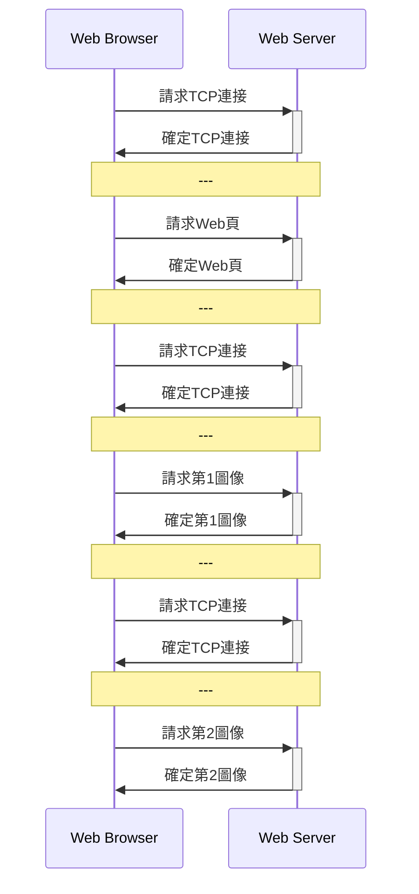

- 非持久並行連接

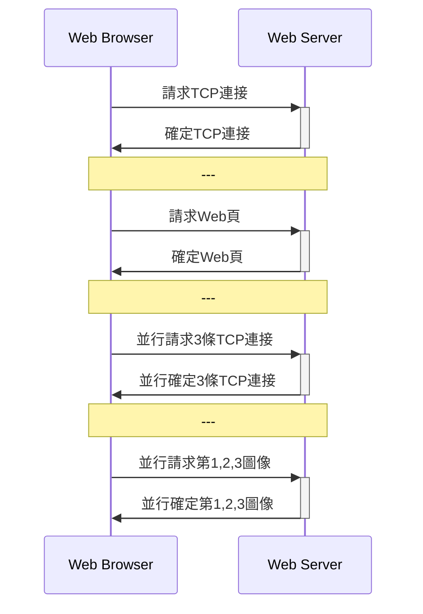

- 持久連接(HTTP1.1)

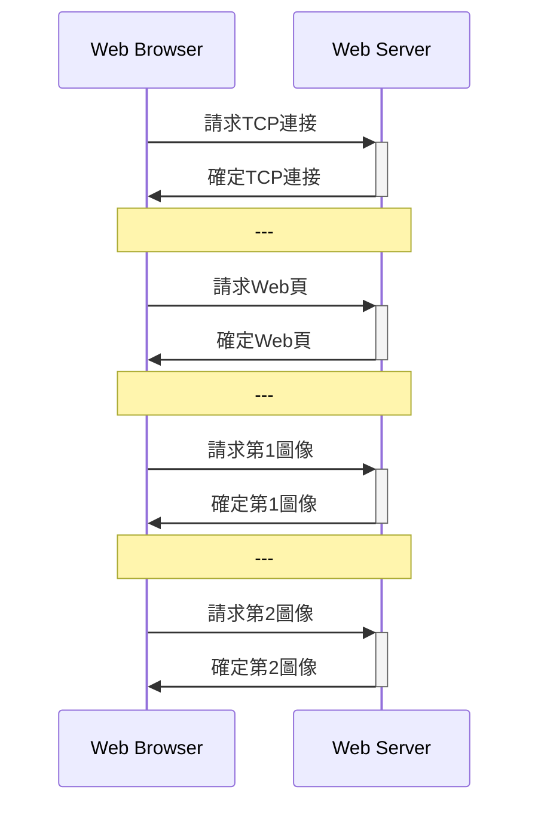

- 持久並行連接


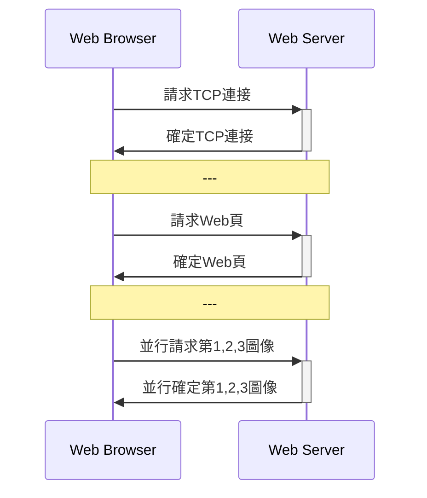

- 請求報文:<方法><URL><協議版本>
- 響應報文:<協議版本><狀態碼><短語>(短語是對狀態碼的進一步文本解釋)

## PORT口
- SMTP:25
- HTTP:80
- FTP:20,21
- Telnet:23
- POP:110
- DNS:53

## 郵件
### SMTP
— 客戶端首先請求與服務端的25號端口建立TCP連接
— 有三個階段
- 握手階段:
  - C向S寄電郵，S響應，握手
- 郵件傳輸階段
  - 客戶發"HELO",發送自己的域名，服務器響應
  - "MAIL FORM"
  - "RCPT TO"
  - "DATA":郵件內容
  - "CRLF.CRLF":結束內容
- 關閉階段
  - "QUIT"
  - 響應結束
- 特點
  — 14條命令和21種應答信息
  - 7 位ACSII，不能使用"CRLF.CRLF"
  - 推動協議
  - TCP建立是持久的
- MIME:將非ASCII轉成ASCII的插件

### POP
- 三個階段：授權、事務處理和更新
- 授權:
  - 用戶名和口令（名文)、鑒別用戶身份和授權用戶訪問郵箱
- 事務處理:
- 發POP命令，讀取郵件和為郵件做／取刪除標記，獲取郵件的統計訊息
- 更新
  - quit命令，刪除已標記的郵件。

- POP和IMAP
  - POP: 110
  - POP: 郵件下載到本地主機
  - IMAP:能同步查詢、閱讀和刪除等動作。但POP單純下載郵件到本地。

## HTTP郵件
— 用戶代理與郵件服務器之間郵件收發都是使用HTTP，但郵件服務器之間是使用SMTP
## FTP 
- 並行的TCP連接：控制連接（保持打開、持久）和數據連接(臨時)
- 帶外控制（FTP）和帶內控制（HTTP）
- 有狀態協，可讀的命令

## P2P應用
- $u_s$ Server 上行帶寬
- $u_i$ 其他上行帶寬
- $d_i$ 下行帶寬
- $d_{\min}$ 最小的 $d_i$
- $F$是文件

則下載時間

$$
D_{\text{CS}}=\max\{ \frac{nF}{u_s},\frac{F}{d_{min}}\}
$$

和

$$
D_{\text{P2P}}=\max\{ \frac{F}{u_s},\frac{F}{d_{min}}, \frac{nF}{u_s+\sum u_i}\}
$$


## Socket編程
<div style="text-align:center;" id="image6"></div>	

- UDP

<div style="text-align:center;" id="image6"></div>	

# 傳輸層
- [傳輸層複習視頻](https://www.bilibili.com/video/BV1XV411h7BJ)
- [課後答案(計算題)](https://blog.csdn.net/qq_37015327/article/details/114534416)  

## 傳輸層功能
- 定義：傳輸層為網絡**應用進程**之間提供了**端到端**的**報文傳輸**服務。
- 傳輸層提供的傳輸服務：**面向連接服務**和**無連接**
  - 面向：
    - 建立連接：通過交換控制信息，完成握手，建立全雙工邏輯連接
    - 傳輸數據
    - 拆除連接
  - 無連接：
    - 發送數據前無需任何數據傳送
    - 數據變報文，直接發送

- 傳輸層尋址
- 報文分段和重組
- 報文差錯檢測
- 實現進程間端到端可靠傳輸
- 面向應用層實現複用和分解


- 傳輸單位是報文
- 傳輸的形式是分組
 
## 傳輸層尋址
- IP地址和端口是唯一標識一個通信端口
  
## 傳輸層複用和多用分解
- 分解:標識套接字, 通過它，交付給正確的套接字
- 複用: 不同套接字收集應用進程，為它們封裝上首部信息，傳給網絡層
- 無連接的多用複用和多用分解
  - 數據、源端口號和目的端口號封裝的UDP報文段
  - 然後報文段封裝到一個IP數據報中
  - 傳給目的主機
  - 主機B接收到，提取UDP報文段的目的端口號
  - 交給相應應用進程
- 面向連接的多用複用和多用分解
  - 數據、＜源端口號，目的端口號＞封裝的TCP報文段
  - 然後報文段封裝到一個IP數據報，加入源IP地址和目的IP地址，形成＜源IP地址，源端口號，目的IP地址，目的端口號＞
  - 根據＜源IP地址，源端口號，目的IP地址，目的端口號＞的相同與否形成不同的連接，傳給目的主機
  - 主機B接收到，提取TCP報文段的目的端口號，
  - 交給相應應用進程


## 可靠傳輸原理
- P.98
- 差錯檢測
- 確認
- 重傳
- 序號
- 計時器

## 停—等協議
- 工作過程:
  - 發送方發送經過差錯編碼和編號的報文段，等待接收方的確認；
  - 接收方接正確接收報文段，即差錯檢測無誤且序號正確，則接收報文段，發送ACK
  - 否則丟棄報文段，發送NAK
- 特點每發送一個報文段後就停下來等待對方的確認
- 信道利用率 $U$、往返傳播$RTT$、發送報文段時間$t_\text{seg}$和確認時間$t_\text{ack}$
  
$$
U=\frac{t_\text{seg}}{t_\text{seg}+RTT+t_\text{ack}}
$$

## 滑動窗口協議

- 滑動口協議根據採用的確認、計時以及窗口大小等機制不同，選擇不同的窗口設計。
- 與停—等比較，優化了
  — 增加分組序號範圍
  - 發送方和接收方可緩可緩存多個分組
- 發送方確保分組按序發送，接收方確保分組按多提交
- 書中兩種滑動窗口
  - P.105
  - GBN
  - SR


- 如果發送窗口$W_s>1$，則信道利用率 $U$可表達為下式

$$
U=\frac{W_s t_\text{seg}}{t_\text{seg}+RTT+t_\text{ack}}
$$

## UDP
- P.110
- 格式：
  - 偽首部：三行
    - 源IP地址
    - 目的IP地址
    - 全０，協議號、UDP長度
  - 首部：二行
    - 源端口號、目的端口號
    - 長度、校驗和
  - 應用數據
- 特點
  - 無連接
  - 無應答
  - 不檢查修改
  - 實時性和效率高
- ８字節的首部

  
## TCP
- P.112
- 特點
  - 面向連接
  - 端到端通信
  - 可靠傳輸
  - 全雙工
  - 字節流形式
  - 緊急數據傳輸能力
- 20字節的首部
- 首部長度是4(最大是15)時,即TCP字段的首部長度是15(最大是60)字節。
- 結構
  - 源端口號(16位)、目的端口號(16位)
  - 序號(32位):封裝應據第一個字節的序號
  - 確認序號(32位)：期望從對方接收數據字節的序號
  - 首部長度(4位):首部長度，以4字節為單位；保留(6位)；URG;ACK;PSH;RST;SYN;FIN;接收窗口(16位)
  - 驗檢和字段(16位)；緊急指針(16位)
  - 選項；填充（使滿足20字節）
  - 數據

## 三次握手
- P.114
- 看書或視頻


## TCP可靠數據傳輸
- 確保無差錯、無缺失、無冗餘和無亂序
- 過程如下
  1. 封裝成TCP段
  2. 發送方設計時器
  3. 接收方從校驗和字段檢測是否有差錯，對的傳送ACK+希望接受到新的段的字節號，否則丟棄，等待重發
  4. 重新排序,給應用層
  5. 把重複丟掉
  6. TCP能控制流量


## TCP超時
- P.121
1. 超時發生
2. 重傳最小序號但未確認的報文段
3. 超時時隔為原來2倍
4. 接收ACK和應用層數據使用公式得到超時時隔


## TCP流量控制:
  - 定義：發送方根據接收方的接收數據能力，包括接收緩存、處理速度等，調整數據發送率和數據量
  - 流量控制:建立連接時分配一定大小的接數緩沖空間，避免發送方傳出超過接收方能容納的數據
  - 基本方法是停-等協議和滑動窗口
  - UDP沒有流量控制


## TCP擁塞控制:
  - P.126
  - 擁塞預防和消除
  - TCP也是採用窗口控制-擁塞窗口ConWin:
    - 未發生擁塞時,窗口加性增長
    - 發生擁塞時,窗口乘性減少:threshold=0.5ConWin
  - 慢啟動
  - 擁塞避免
  - 快速重傳:接收端每收到一個失序的報文段後立即發出重複確認，以便更早通知發送端有丟包情況發生。
  - 快速恢復
    - TCP Reno:新版本
      - 計時機超時:threshold=0.5*ConWin,ConWin=1。快速恢復-慢啟動-擁塞避免
      - 三次重復ACK確認:threshold=0.5*ConWin,ConWin=threshold。
    - TCP Tahoe: 
      - 計時機超時和三次重復ACK確認threshold=0.5*ConWin,ConWin=1。快速恢復-慢啟動-擁塞避免


#  網絡層

- [網絡層複習視頻](https://www.bilibili.com/video/BV1254y147wy)
- [課後答案(計算題)](https://blog.csdn.net/qq_37015327/article/details/114817816?utm_medium=distribute.pc_relevant.none-task-blog-2%7Edefault%7EOPENSEARCH%7Edefault-11.control&depth_1-utm_source=distribute.pc_relevant.none-task-blog-2%7Edefault%7EOPENSEARCH%7Edefault-11.control)  
- [總結挺好的BLOG](https://www.bilibili.com/read/cv13267803?spm_id_from=333.999.0.0)

- 網絡層關注的是如何將承載傳輸層報文段的網絡層數據從主機送達目的主機


## 網絡層功能
- P.130
- **分組轉發**
  - 通過一條輸入鏈路接收到一個分組後，路由器需要決策通過哪條輸出鏈路將分組發送出去，井將分組輸入接口轉移到輸出接口
- **路由選擇**
  - 通過某種方式決定分組經過的路由或路徑，計算分組所經過的路徑的算法稱路由選擇算法
- 路由選擇後存儲在轉發表，然後根據轉發表分組轉發出去

## 數據報網絡與虛電路網絡
- 數據報網絡：
  - P.132
  - 無連接業務
  - 每個分組作為一個數據報獨立傳送
  - 有源地址和目的地址
- 虛電路網絡
  - P.133
  - 有連接業務
  - 網絡會為電路分配獨享資源
  - 源主機和目的主機之間一條路徑
  - 該路上的每條路各有一個虛電路標識(VCID)
  - 每臺分組交換機的轉發表中記錄虛電路標識的接續關係
- 分別:
  - 虛電路網絡: 順序控制、差錯控制和流等功能由網絡完成，端系統簡單
  - 數據報網絡: 網絡簡單，端系統完成順序控制、差錯控制和流量控制等功能由網絡

## 網絡互連與其設備
- 下一層的收據鏈路層會使用不同協議如802.11和以太網,所以是異構網絡
- 實現異構網絡的主要方法
  - <span style="color:red">協議轉換</span>
  - <span style="color:red">虛擬互聯網絡</span>
    - IP網絡:IP與網絡尋址-IP地址-引入網絡互連設備-IP路由器
  
## 路由器
- P.136
主要任務：獲取與維護路由信息以及轉發分組。

1. 輸入端口
   - 從物理接口接收信號，還原數據鏈路層幀，提取IP數據報，根據IP數據報的目的IP地址檢索路由表，決策將IP數據報交換到哪個輸出接口。
2. 交換結構
   - 輸入接口處理後，輸出接口已經確定，具體轉發工作由交換結構完成。
     1. 基於內存的交換
     2. 基於總線的交換
     3. 基於網絡的交換
   - 內存交換性能最低，價格便宜。網絡交換性能最好，價格最高。
3. 輸出端口
   - 輸出端口提供緩存排隊功能，從隊列中取出分組進行數據鏈路層數據幀的封裝，通過 物理線路端接 發送出去。
4. 路由處理器
   - 負責執行路由器的各種指令，包括路由協議的運行、路由計算及路由表更新維護。
   - **轉發與路由選擇** 是路由器兩項最重要的基本功能。
     - 靜態（人工）或動態（路由協議）獲取路由信息被保存在**路由表**中。每一個路由項也稱爲一個”入口“（entry）。
     - 如果除默認路由外，有多條匹配成功，則選擇網絡前綴匹配成功位數最長的路由項。**最長前綴匹配優先原則**。


## IPV4和IPV6

- IPV4: 
  - 32位;
  - 表達形式 $d_{10}.d_{10}.d_{10}.d_{10}$
  - 最大封裝數據65515
- IPV6: 
  - P.159
  - 128位;
  - 表達形式 $d_{16}(\times 4):d_{16}(\times 4):d_{16}(\times 4):d_{16}(\times 4):d_{16}(\times 4):d_{16}(\times 4):d_{16}(\times 4):d_{16}(\times 4)$
  - 單播(源和目地)、組播(目的地址)和任播(目的地址)


## **網絡擁塞控制和流量控制**

- **擁塞控制**：
  - 定義：端系統或網絡結點，通過採取某些措施來避免擁塞的發生，或者對己發生的擁塞做出反應
  - 網絡通過能力或網絡擁擠程度，來調整數據速率和數據量
  - 任務：確保網絡能夠承載所達到的流量
- **擁塞控制預防和消除**
  - 預防
    - 流量感知路由:多加鏈路分流
    - 准入控制-虛電路：不會擁塞才加
  - 消除
    - 流量調節
      - 抑制分組：在上一次減慢發送
      - 背壓：從源到目的地都限制
    - 負載脫落

  
- **流量控制**：
  - 定義：發送方根據接收方的接收數據能力，包括接收緩存、處理速度等，調整數據發送率和數據量

## 鏈路狀態路由算法

- **鏈路狀態路由算法**
  1. 獲取網絡拓撲結構
  2. 直接相鄰的長度
  3. 廣播
  4. 接收廣播
  5. 存數據庫
  6. 構建拓撲結構
  7. 求最短路徑

- OSPF:封裝到IP數據報中


## 距離向量路由選擇算法
- RIP:封裝到UDP

### 距離向量算法無窮計數問題

$D_x(y)$是$X$到達$Y$的最短距離估計
  
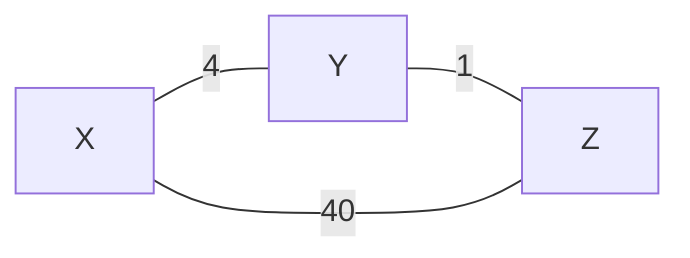

那麽 $D_x(Z)=5$, 經過$Y$點
若此刻, 改成

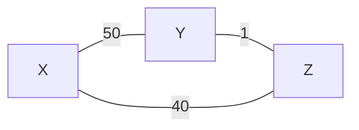

那麽$Z$被告之，$D_X(Z)=5$, 計算

$$\begin{align}D_X(Y)=\min\{50,D_X(Z)+1 \}=6\label{1}\end{align}$$


如此類推，

$$\begin{align}D_X(Z)=\min\{40,D_X(Y)+1 \}=7 \label{2}\end{align}$$

重覆$\eqref{1},\eqref{2}$,直至發現

$$
D_X(Z)=40
$$

- 這個情形是**距離向量算法無窮計數問題**, 解決這問題是若$D_X(Z)=5$是經過$Y$點而計算出來時
- 那麽交換$X,Y$的距離向量，需要假定$D_X(Z)=\infty$, 這個解決方案叫**毒性逆轉技術**


## BGP
- BGP 封裝到TCP數據
- IGP:內部網關協議,RIP,OSPF是內部網關協議
- EGP:外部網關協議,BGP是外部網關協議

# 數據鏈路層

- [課後答案(計算題)](https://blog.csdn.net/qq_37015327/article/details/114635932?utm_medium=distribute.pc_relevant.none-task-blog-2%7Edefault%7EBlogCommendFromMachineLearnPai2%7Edefault-8.control&depth_1-utm_source=distribute.pc_relevant.none-task-blog-2%7Edefault%7EBlogCommendFromMachineLearnPai2%7Edefault-8.control)  

- [總結挺好的BLOG](https://www.bilibili.com/read/cv13326408?spm_id_from=333.999.0.0)


- 服務
  - 組幀
  - 鏈路接入
  - 可靠交付
  - 差錯控制
    - 檢錯重發
    - 前向糾錯
    - 反饋校驗
    - 檢錯丟棄

## 差錯控制

- 漢明距離$d_s$:集合中最少多少位不同,$d_s=2r+1$,能糾正$r$碼,能檢測$2r$碼
- 奇偶校驗:增加一位使得"1"的數量為奇數或偶數
- 漢明碼:加入$a_0$,使得"1"為偶數個, 並計算$d=a_n\bigoplus\dots a_1\bigoplus a_0$,若 $d=0$則無錯
- 循環CRC
  - 多項式的系數
    
  $$x^4+x+1=10011$$

  - 10011的冗余碼為10011+{0000}(因為是4次多項式),除以10011的餘數, 除時用的時 $\bigoplus$
  
  $$
    R=\text{Remainder of} \quad \frac{100110000}{10011}  
  $$
  
  - 其中除法相減的計算是二進制加法, 因為二進制減法和二進制加法是一樣的(mod 2)

## 多路訪問控制協議

- MAC 協議的根本任務是解決信道的共享問題
- 頻分多路復用
- 時分多路
- 波分多路: 則頻分多路相似, 但是在光纖中使用不同波長
- 碼分多路

### 隨機訪問MAC協議

- ALOHA
  - 純ALOHA:

  ```mermaid
  graph LR
      A[直接發送] -->  B[信道偵聽];
      B-->  C[沖突重發];
  ```

  - 時ALOHA:信道分成離散的時, 若發生沖突,下一個時間,以概率P重發


- 載波監聽多路訪問協議CSAMA
- 帶沖突檢測的載波監聽多路訪問協議CSMA/CD

### 受控接入MAC協議
- 集中式:由一個主機負責調度其他通信站,主要是輪詢技術
- 分散式:令牌技術, 問題是令牌丟失和數據幀無法撤銷

## 局域網
- 網絡拓撲
- 介質訪問控制MAC子層
- 邏輯鏈路控制(LLC)子層
- 地址解析協議(ARP):網絡層地址(IP)與鏈路層地址映射
- MAC: 6字節;00-2A-E1-76-8C-39或00:2A:E1:76:8C:39
  
  
## 以太網
- MAC協議採用CSMA/CD
- IEEE802.3

- 分組交換設備是**交換器材**和**網橋**
- PPP


## HDLC
- **信息幀**、**管理幀**和**無序幀**


# 物理層

- [課後答案](https://www.bilibili.com/read/cv9573313)
- [總結挺好的BLOG](https://www.bilibili.com/read/cv13409005?spm_id_from=333.999.0.0)
- 物理層的主要功能是實現比特流的透明傳輸,為數據鏈路層提供數據傳輸服務
- 物理層協議規定的特性包括機械特性、電氣特性、功能特性和規程特性

- 四大特性
  - 機械：物理-接口形狀
  - 電氣：電平-電平高低
  - 功能：信號線用途
  - 規程：事件順序

$$
C=2B\log_2 M
$$

$C$是信道容量，$B$是信帶帶寬和$M$是進位數

$$
C=B\log_2\Big(1+\frac{S}{N} \Big)
$$

$\frac{S}{N}$是信噪比，無單位的。

$$\Big(\frac{S}{N}\Big)_{db}=10 \log_{10} \Big(\frac{S}{N}\Big)$$


## 基帶傳輸
- [圖](https://blog.csdn.net/weixin_40629244/article/details/110917947)
- 以下(X,Y)為數字區間分開兩份
- 差分:
  - 范圍:[0,1]
  - 0:與前位相對沒有變化；即(1,1)維持(1,1)，(0,0)維持(0,0)
  - 1:與前位相對有變化；即(1,1)變(0,0)，(0,0)變(1,1)
- AMI
  - 范圍:[-1,1]
  - 0:值一定為(0,0)
  - 1:(1,0)或(-1,0),分別取決於上次的1是(-1,0)或(1,0), 與上次相反。
- 雙相(曼徹斯特)
  - 范圍:[-1,1]
  - 0:(-1,1)
  - 1:(1,-1)
- 差分雙相
  - 范圍:[-1,1]
  - 0:與前位是連住;即前者為(-1,1),則(1,-1)，若前者為(1,-1),則(-1,1)
  - 1:與前位是跳動;即前者為(-1,1),則(-1,1)，若前者為(1,-1),則(1,-1)
- 米勒碼
  - 范圍:[-1,1]
  - 1 
    - (-1,1)或(1,-1)
    - 若前位為1,(1,-1)續(-1,1),(-1,1)續(1,-1)
    - 若前位為0,(-1,-1)續(-1,1),(1,1)續(1,-1)
  - 0
    - (-1,-1)或(1,1)
    - 若前位為1,(1,-1)續(-1,-1),(-1,1)續(1,1)
    - 若前位為0,(-1,-1)續(1,1),(1,1)續(-1,-1)
- CMI碼
  - 范圍:[-1,1]
  - 1 
    - (1,1)或(-1,-1)交替
  - 0:(-1,1)


# 無線網絡

- [課後答案](https://www.bilibili.com/read/cv9573319)
- [總結挺好的BLOG](https://www.bilibili.com/read/cv13430531?spm_id_from=333.999.0.0)


## 移動網絡
- 轉交地址(COA):外部代理創建的一個轉交地址

### 間接路由選擇
- P.248


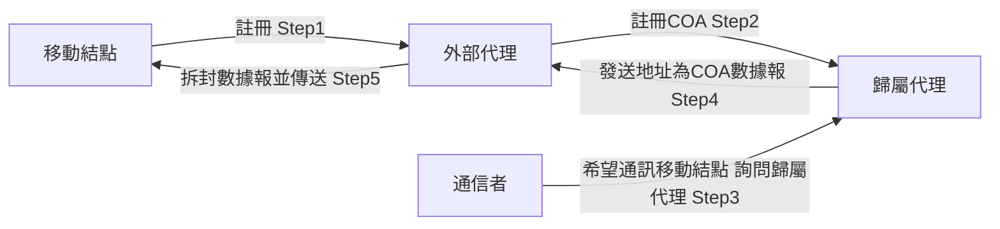

## 直接路由選擇
- P.249
- 移動用戶定位協議:以便通信者代理向歸屬代理查詢獲得移動結點的COA

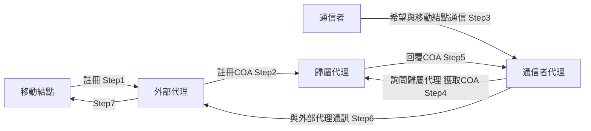


## MAC 協議-CSMA/CA
- DIFS: 分佈式幀間間隔
- RTS:請求發送
- SIFS:短幀間間隔
- CTS:允許發送
- NAV: 網絡分配向量
  

## IEEE 802.11
- P.253
- IEEE 802.11:**數據幀、控制幀和管理幀**
- MAC首部30字節
- 主體不超過2312字節,通常不超1500字節
- 尾部是幀檢列FCS,共4字節 


## 蜂窩(移動網絡)

### 蜂窩體系
- 收發基站BTS
- 基站控制器BSC
- 移動交換中心MSC
- 移動用戶

### 蜂窩移動性管理
- P.257
- 歸屬位置註冊器HLR
- 訪問者位置註冊器VLR

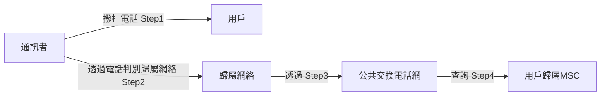


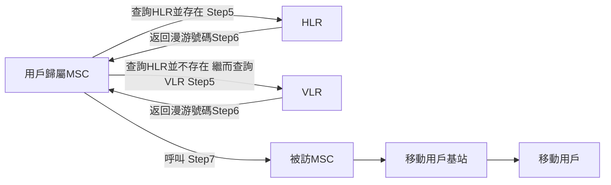


- 1G:FDMA
- 2G:FDMA/TDMA
- 3G:CDMA,TD-SCDMA,能處理圖像
- 4G/LTE:OFDMA
- 5G

## 移動IP

- P.264
- 移動IP允許計算機移動到外地時，仍保留其原來的IP地址
- 移動IP定義了一個歸屬代理或外部代理來向移動結點通告其服務的協議，以及移動結點請求一個外部代理或歸屬代理的服務所使用的協議
- 代理通告(下圖的Step2):類型字段為9,周期性或接收到代理請求而回覆
- 代理請求(下圖的Step2):類型字段為10


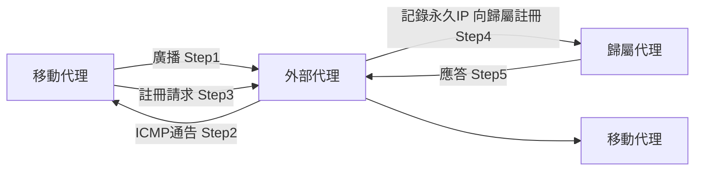
##  其他典型⽆線網絡簡介
1. WiMax
   1. WiMax即全球微波互聯接入，其⽬的是在更⼤範圍內未⽤戶提供可媲美有限網絡的⽆線通信解決⽅案。
   2. WiMax是⼀種城域網技術
   3. 優點：更遠的傳輸距離，更⾼速的寬帶接入
   4. 缺點：不能⽀持⽆縫切換
   5. 標準，802.16
2. 藍牙
   1. 網絡範圍⼩，低功率和低成本，⾃組織
   2. 藍牙是⾃組織網絡，不需要網絡基礎設施來互連網絡設備。
   3. 藍牙網絡的標準802.15.1
3. ZigBee
   1. 第⼆個個⼈區域網絡標準，功率低，數據速率低，⼯作週期低
   2.  標準 802.15.4
   3.  應⽤場景 物聯網


# 網絡安全

- [課後答案](https://www.bilibili.com/read/cv9573325)


## 威脅
- P.271
- 竊聽
- 插入
- 假冒
- 劫持
- 拒絕服務DoS和分布式拒絕服務DDoS

## 對稱加密
- DES
- 三重DES
- AES
- IDEA

- 對稱加密問題
  - 密鑰分發問題

- 非對稱密鑰過程
  - $K_B^-$:收件者私鑰;$K_B^+$:收件者公鑰

$$K_B^-K_B^+(m)=m$$

- 非對稱密鑰特點
  - 不用分發密鑰
  - 確保密文安全性和正確性
  - 確保密鑰安全性和可用性

# 公開密鑰
- P.276
- Diffie-Hellman
- RSA

## HASH
- p.277
- 一般的散列函數具有算法公開
- 對任意長度報行多對一映射均能產出定長輸出
- 對於任意報文無法預知其散列值
- 不同報文不能產生相同的散列值難
- MD5:512bit
- SHA-1:160bit

## 報文認證
- 簡單報文驗證
  
    $$(m,H(m))$$

- 報文驗證碼MAC,$s$是認證密鑰
  
  $$(m,H(m+s))$$

## 數字簽名
- P.279
- 消息認證:驗證發送方以及所發消息內容是否被修改
- 但當有利害沖突時，消息認識不夠，所以有數字驗證
- 數字簽名
  - 接收方能夠確認發送方的簽名，但不能偽造
  - 給接收方後，就不能再否認他所簽發的消息
  - 已收到的簽名消息不能否認,即有收報認證
  - 第三者可以確認收發雙方之間的消息傳送，但不能偽造這一過程
  - 將以下的送出去給收件者
  

$$(m,K_B^+H(m))$$


## 身份認證
- P.283
- 被脅持, 分公鑰時可能不是原傳送者的公鑰,而是脅持者的公鑰,所以需要**密鑰分發中心(KDC)**


或者


- $K_s$是會話密鑰,$K_{A-KDC}$是$A,KDC$共享的密鑰
  
  $$\text{Step1: } \quad K_{A-KDC}(K_s,B)$$

- $K_s$是會話密鑰,$K_{B-KDC}$是$B,KDC$共享的密鑰

  $$\text{Step2: } \quad  K_{B-KDC}(K_s,A)$$

## 認書認證機構

- 認證中心(CA): 證實一個實體的真實身份
- CA 認證了實體身份，會將公鑰和認證實體身份綁定，並由CA進行數字簽名，這就是叫CA簽發的某實體的公鑰證書
- 得到bob的公鑰
  - 先得到Bob的公鑰證書
  - 得到CA公鑰,解Bob的公鑰證書
  - 得到Bob的公鑰

## 防火牆

- 無狀態分組過濾器:內網與網絡邊緣路由器
- 有狀態分組過濾器:根據狀態再分組控制
- 應用網關 :人員識別


## 網絡安全協議


-- to be continuous