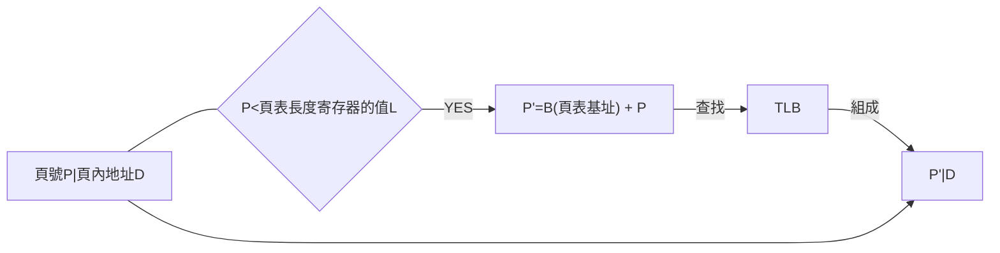
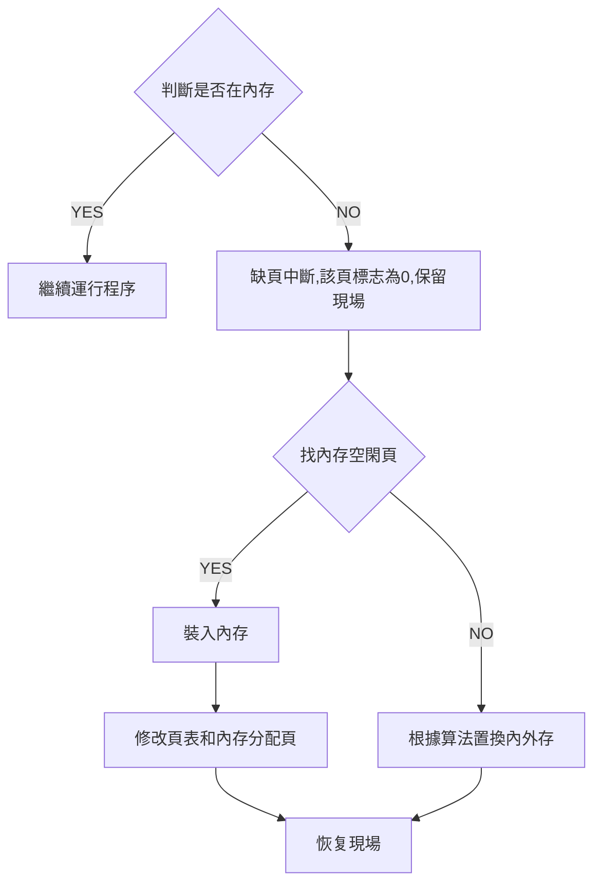

# 簡介
- 這是我[自考](http://eea.gd.gov.cn/zxks/index.html)計算機科學與應用中操作系統(02326)的複習要點
- 開始學習是使用[網上教學視頻](https://www.bilibili.com/video/BV1P4411z7cH?from=search&seid=3564874264541170958)
- [複習視頻](https://www.bilibili.com/video/BV1ty4y177wU?p=1)                                       
- [完成真題](https://drive.google.com/drive/folders/11Q28HN94vHKmIWU3VQynMXRGqgtvuueW?usp=sharing)
  

# 操作系統概論
- 操作系統是一種複雜的系統軟件，是不同程序代碼、數據結構、數據初始化文件的集合，可執行
- 操作系統屏


# 進程與線程

## 程序
- 順序性
- 封閉性:計算結果只取決於程序自身
- 確定性:與運行速度無
- 可再現性:與不同時間執行無關
  
## 並發與並行
- 並行:微觀與宏觀都是同時
- 並發:微觀是順序執行, 宏觀是同時

## 多道程序
- P.80
- 獨立性:與其他程多無閞
- 隨機性:執行開始時間和數據輸入時間都是隨機
- 資源共享性


- 缺點
  - 時間延長:對實時要求的程序不合適
  - 系統效率提高有一定限度
  

## 進程
- P.81
- 進程:<span style="color:red">系統進行資源分配和調度的一個獨立單位</span>
- 進程是由<span style="color:red">程序、數據和進程控制塊</span>組成
- 進程和程序分別:程序是靜態,進程是動態
- 特徵:
  - 井發性
  - 動態性
  - 獨立性
  - 交往性
  - 異步性
  - 結構性

### 可再入程序
- 可再入程序:被多個用戶同時調用的程序,與數據區分離

### 進程控制塊(PCB)
- PCB 組織
  - 線性
  - 索引
  - 鏈接

- 進程的隊列
  - 就緒
  - 等待
  - 運行

- 進程控制
  - P.90
  - 創建原語
    
    ```mermaid
    graph LR
    A[申請PCB區域]-->B[有關信息填入PCB]
    B-->C[設進程狀態為就緒]
    C-->D[把進程放進就緒隊列]
    ```

  - 撤銷原語

    ```mermaid
    graph LR
    A[找撤銷進程的PCB]-->B[進程所在隊列消去]
    B-->C[撤銷它的子進程]
    C-->D[釋放占用的資源]
    D-->E[消去PCB]
    ```

  - 阻塞原語

    ```mermaid
    graph LR
    A[中斷處理器運作]-->B[保存現場信息去PCB]
    B-->C[進程狀態設為等待]
    C-->D[將它放進等待隊列]
    ```
  
  - 喚醒原語

    ```mermaid
    graph LR
    A[將PCB狀態設為就緒]-->B[在等待隊列消去]
    B-->C[放進就緒隊列]
    ```

## 線程
- <span style="color:red">可以調度和分派的基本單位</span>
- 屬性
  - P.95
  - 唯一標識符和一張綫程描述表
  - 不同線程可執行相同程序
  - 同一進程中的線程共享進程的內存地址空間
  - 多個線程可以井發
  - 創建後開始它的生命周期
- 設立線程好處
  - 花費少
  - 切換線程速度快
  - 同一進程的不同線程通訊方便
  - 獨立執行:增強井行能力


## 內核
- 系統運行的各種基本操作和基礎功能的一組程序模塊集中安排, 形成操作系統的核心
- 內核是線程和進程賴以活動的基礎
- 功能
  - 中斷處理程序
  - 進程互斥和同步
  - 進程調度、控制和通信
  - 存儲管理基本操作
  - 時鐘管理


# 存儲管理

- 由快到慢
  - 寄存器
  - 高速緩存
  - 內存
  - 本地外存
  - 遠程存儲
  
- 內存分配方式
  - 靜態:目標模塊裝入內存時確定井分配的，並在程序運行中不允許再申請或移動,即分配工作在程運行一次性完成
  - 動態:目標模塊裝入內存時確定井分配的，並在程序運行中允許再申請空間或移動,即分配工作可以在程序運行前及運行時過程中逐步完成
- 存儲共享:提高內存利用率。包括代碼共享和數據共享, 代碼共享必𥳗是純代碼
- 存儲保護
  - 地址越界保護
  - 權限保護
- 內存擴充容量

- 地址轉換
  - 存儲器以字節為單位,每個字節都有地止一一對應
  - 以絕對地址對應的內存空間稱為物理地址空間
  - 用戶可以存儲地址為"0"的內存空間,稱為邏輯地址空間
- 地址重定位:內存裝入程序時,程序中的指令和數據地址轉換成絕對地址
  - 靜態重定位:程序開始執行前集中完成轉換，在程序執行時無須進行地址轉換工作
  - 動態重定位:內存在裝入程序時,不進行地址轉換,執行每一條指令時,才轉換
    - 基址寄存器和地址轉換綫路

##  分區管理
- 固定分區:一旦劃分了,系統運行期間不再重新劃分
- 可變分區:裝入程序時劃分內存分區,使好等於需求量
  - 實現需要基址寄存器和限長寄存器
- 緊縮技術:不足連續整塊分配要求，但空閑的碎塊加起來可以,采用緊縮技術
  - 增加系統的開銷:修改內存分配表和進程控制塊
  - 移動是有條件的:某個進程與外部交換信息,就不能移動
- 可變分區分配策略 
  - 最優適應算法:順序查找,第一個合適的內存長度就分配
  - 最壞適應算法:查找合適的內存長度並且最少空閑區就分配

- 可變分區的優點
  - 分區存儲算法簡單,實現起來相對容易,內存額外開銷少,存儲保護措施簡單
- 缺點
  - 內存使用仍不充份,碎片問題嚴重
  - 不能提供虛存或擴充
  - 要求程序一次全部裝入內存

## 覆蓋與交換技術
- 覆蓋
  - 覆蓋是由一個程序的若干程序段,共幾個程序的某些部分共享某一存儲空間
  - 是由編譯程序支持
- 交換 
  - 進程從內存移到磁盤,再移回內存作為交換
  - 多用於分時系統
  - 打破了一個程序一旦進入內存便一直運行到結束的限制
  - 對用戶是透明的


## 虛擬頁式存儲管理
- 硬件支持
  - 系統有容量足夠大的外存
  - 系統有一定容量的內㠻
  - 虛-實地址映射機制
  - 支持頁式管理部件:存儲管理部件
  - 邏輯地址:虛擬頁號和頁內地址

  
- 位示圖
  - 一列有32位
  - 0為可分配
  - 1為已占用
  
$$
\text{物理頁面號}=\text{字長}\times\text{字號}+\text{位號}
$$

- 轉換過程
  - 始址寄存器和頁表長度寄存器
  
$$
\text{物理地址}=\text{物理頁面號}\times\text{塊長}+\text{頁內地址}
$$

### 頁表項
  - 物理頁面號:頁面在內存時所對應的物理頁面號
  - 有效位:在內存還是在磁盤
  - 訪問位:有否訪問過
  - 修改位:內存是否修改
  - 保護位:是否能讀寫

- 頁表種類
  - 多級頁表
  - 散列頁表
  - 反置頁表

### TLB





### 缺頁過程
- 查頁表的有效位, 看是否在內存
- 若為0,保留現場,中斷裝置通過交換PSW讓中斷系統占用處理器
- 操作系統處理缺頁異常,尋找一個空閑的頁面
- 若有空閑,把磁盤讀入,修改頁表及存分配表,表示該頁已在內存
- 若無空閑,某種算法將內存某頁調出,把內存空間用來儲存現在需要的頁面
- 恢復現場,重新執行被中斷的指令




### 頁面調度策略
- 調入策略 
  - 請求調頁:只調入需要
  - 預調頁:一次調入相鄰的頁面
- 置頁策略:找物理位置的最佳策略
- 置換策略
  - 固定分配局部置換
  - 可變分配全局置換
  - 可變分配局部置換
  - 固定:分配固定的頁數的內存空間,運行期間不再改變
  - 局部:是一次分配一個進程
  - 全局:一次分配全部進程
  
### 頁面置換算法
- 抖動/顛簸:剛被調出的頁面又立即要用, 因而又把它裝入,裝入不久又要被調出,反反复复
  - 由缺頁率高而引起,
- OPT理想頁面置換算法:淘汰最晚才用到的頁面
- FIFO先進先出置換算法:用指針,先進先淘汰,不理會先進的頁面是否常用
- 第二次機會置換算法:FIFO且多加一位1或0,並將時間定義為變0的時間,放在鏈表最後(即最近發生),1的話變0,0就直接置換
- Clock時鐘頁面置換算法:第二次一樣, 只是將鏈表變成環形鏈表,指針指向最先進的頁面
- LRU最近最少使用頁面置換算法:淘汰最久沒有使用過的頁面

- 缺頁率: $A$訪問頁面總次數;$F$缺頁次數

$$
f=\frac{F}{A}
$$

- 影響缺頁因素
  - 分配給程序的物理頁數
    - 頁數越多,缺頁率越低
    - 若需共$n$頁的程序,分配$\frac{n}{2}$頁是最高效。
  - 頁面大小:
    - 頁越大,缺頁率越低
  - 程序編制方法:
    - P.197例子熟用
    - 若將每一行的元素進同一頁,以下的需要$(128\times128-1)$次換頁
    ```
    VAR A:ARRAY[1..128,1..128] OF integer;
    FOR j:=1 TO 128 DO
      FOR i:=1 TO 128 DO
          A[i,j]=0
    ```
    - 若將每一行的元素進同一頁,以下的需要$(128-1)$次換頁
    ```
    VAR A:ARRAY[1..128,1..128] OF integer;
    FOR i:=1 TO 128 DO
      FOR j:=1 TO 128 DO
          A[i,j]=0
    ```
    - 頁面調度算法
      - FIFO是OPT的3倍,但OPT是理想算法


### 虛擬頁式管理的優缺點
- 優:
  - 不需連續存放,解決碎片問題,提高內存利用率
- 缺:
  - 頁面浪費,程序代碼不同, 但頁面相同,總有一些空間得不到利用
- 引入虛擬頁式管理的目的
  - 內存和外存統一管理,把訪問率非常高的頁面放入內存.減少內外存交換的次數
- 抖動/顛簸
  - 由缺頁率高而引起
  - 采用工作集模型,可解決: $t-\delta$到$t$所訪問頁面的集合
  - 統計工作集大小一般由硬件完成,開銷較大


-- to be continuous