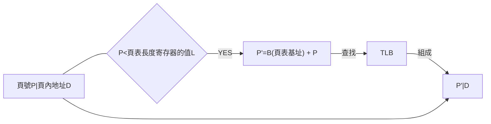
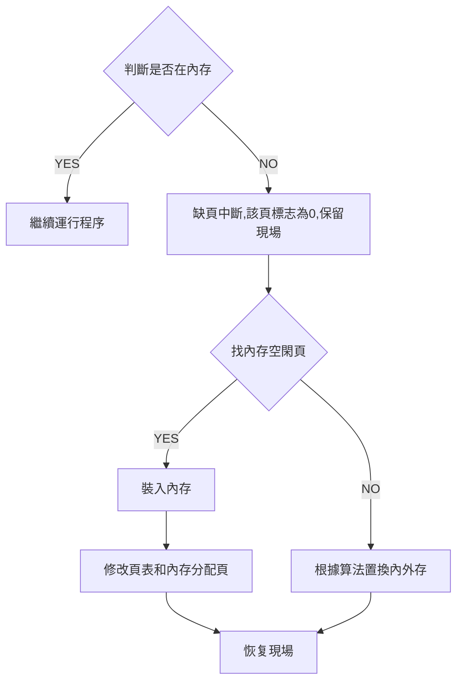

- [簡介](#簡介)
- [第一章 操作系統概論](#第一章-操作系統概論)
  - [操作系統分類](#操作系統分類)
  - [操作系統設計](#操作系統設計)
  - [操作系統的結構](#操作系統的結構)
- [第二章 操作系統運行環境](#第二章-操作系統運行環境)
  - [處理器](#處理器)
  - [中斷機制](#中斷機制)
  - [系統調用](#系統調用)
- [第三章 進程與線程](#第三章-進程與線程)
  - [程序](#程序)
  - [並發與並行](#並發與並行)
  - [多道程序](#多道程序)
  - [進程](#進程)
    - [可再入程序](#可再入程序)
    - [進程控制塊(PCB)](#進程控制塊pcb)
  - [線程](#線程)
  - [內核](#內核)
- [進程同步與互斥](#進程同步與互斥)
  - [管程](#管程)
  - [進程通訊](#進程通訊)
- [第五章 死鎖](#第五章-死鎖)
  - [死鎖的檢測與解除](#死鎖的檢測與解除)
  - [資源分配圖](#資源分配圖)
- [第六章 存儲管理](#第六章-存儲管理)
  - [分區管理](#分區管理)
  - [覆蓋與交換技術](#覆蓋與交換技術)
  - [虛擬頁式存儲管理](#虛擬頁式存儲管理)
    - [頁表項](#頁表項)
    - [TLB](#tlb)
    - [缺頁過程](#缺頁過程)
    - [頁面調度策略](#頁面調度策略)
    - [頁面置換算法](#頁面置換算法)
    - [虛擬頁式管理的優缺點](#虛擬頁式管理的優缺點)
- [第七章 文件管理](#第七章-文件管理)
  - [邏輯結構和物理結構](#邏輯結構和物理結構)
  - [文件目錄](#文件目錄)
  - [目錄項和目錄文件](#目錄項和目錄文件)
  - [文件存儲空間管理](#文件存儲空間管理)
  - [文件共享、保護和保密](#文件共享保護和保密)
- [第八章 I/O設備管理](#第八章-io設備管理)
  - [I/O硬件和軟件組成](#io硬件和軟件組成)
  - [I/O設備控制方式](#io設備控制方式)
  - [設備分配與回收](#設備分配與回收)
  - [磁盤調度策略](#磁盤調度策略)
  - [緩沖技術](#緩沖技術)
  - [虛擬設備技術-SPOOLing](#虛擬設備技術-spooling)

# 簡介
- 這是我[自考](http://eea.gd.gov.cn/zxks/index.html)計算機科學與應用中操作系統(02326)的複習要點
- 開始學習是使用[網上教學視頻](https://www.bilibili.com/video/BV1P4411z7cH?from=search&seid=3564874264541170958)
- [複習視頻](https://www.bilibili.com/video/BV1ty4y177wU?p=1)                                       
- [完成真題](https://drive.google.com/drive/folders/11Q28HN94vHKmIWU3VQynMXRGqgtvuueW?usp=sharing)
  

# 第一章 操作系統概論
- 操作系統是一種複雜的系統軟件，是不同程序代碼、數據結構、數據初始化文件的集合，可執行
- 操作系統

- window:
  - 內核、硬件抽象層、執行體、系統進程和系統綫程
- Unix
  - 內核、硬件、系統調用接口和UNIX命令和庫
- Linux
  - 系統資源、內核、Shell、用戶應用程序和文件系統
- Android
  - Android應用程序
  - Android應用框架
  - C,C++本地庫和Android運行時環境
  - Lunix內核 

## 操作系統分類

- 批处理操作系统:
  - 優點:成批處理、資源利用率高和作業吞吐率高
  - 缺點：不能直接與計算機無交互，不適合調試程序
- 分時系统
  - 多路性、交互性、獨佔性和及時性
  - 硬實時系統和軟實時系統
- 实時操作系统
  - 實時時鐘管理，高可靠性和過載防護
- 嵌入式操作系统
  - 高可靠性、實時性、占有資源少、智能化能源管理、易於連接和低成本。
- 網络操作系统
  - 為計算機網絡的操作系統
  - 集中式和分佈式
- 分布式操作系统
  - 大量計算機通過網絡連結在一起，可以獲得極高的運算能力和廣泛的數據分享
  - 特點:
    - 同一個操作系統
    - 實現資源的深度共享
    - 透明性
    - 自治性
    - 助記:(同身共投資)
  - 優點：
    - 較低成本獲得較高的運算性能
    - 可靠性
    - 機群是分布式系統的一種


## 操作系統設計
- 設計複雜度高
- 正確性難以保證
- 研制周期長

- 操作系統設計過程
  - 功能設計
  - 算法設計
  - 結構設計
  - 助記(能結算)

- 操作系統的設計目標
  - 可靠性
  - 高效性
  - 易維護性
  - 可移植性
  - 安全性
  - 簡明性
  - 易記(靠高位已安檢)

## 操作系統的結構
- 整體式結構
  - 優點:結構緊密、接口簡單直接和系統效率高
  - 缺點:
    - 獨立性差,系統結構不清晰
    - 數據基本上為全程量處理,相當複雜的事
    - 可適應性比較差
- 層次式結構
  - 優點:
    - 結構清晰
    - 不構成循環
    - 操作增加一層不影響其他層次
    - 易於調試、易於修改、擴充、維護和保證正確性
- 微內核結構:
  - 優點:可靠、靈活和適宜分布式處理的計算環境
  - 缺點:效率考慮, 用戶只能通過微內核𡧟互通信, 不能提供好的效率
- 助記: 曾為整體


# 第二章 操作系統運行環境
## 處理器

- 處理器一般由<span style="color:red">運算器</span>、<span style="color:red">控制器</span>、一系列的<span style="color:red">寄存器</span>和<span style="color:red">高速緩存</span>
- 運算器實現指令的<span style="color:red">算術</span>和<span style="color:red">邏輯</span>
- 寄存器的類型
  - 程序計數器: 取出的指令地址
  - 指令寄存器: 包含了最近取出的指令
  - 程序狀態字: 記錄了處理器的運模式信息
    - CPU的工作狀態代碼
    - 條件碼: 反映指令執行后的結果特徵
    - 中斷屏蔽:指出是否允許中斷
    - 助記: C跳斷

- 特權指令: 只能由操作系統使用
- 非特權指令: 操作系統和普通用戶都能使用
- 管態: 操作系統管理程序運行的狀態, 具有較高的特權級別, 又稱內核態、特權態
- 目態: 用戶程序運行時的狀態, 具有較低的特權級別, 又稱為用戶態和普通態
- 目態到管態: 通過<span style="color:red">中斷</span>,程序狀態字標志為管態
- 管態: 修改<span style="color:red">程序狀態字(PSW)</span>實現


## 中斷機制
- <span style="color:red">硬件中斷裝置</span>和<span style="color:red">中斷處理程序</span>
- <span style="color:red">中斷是由外部事件引發的</span>
  - 時鐘中斷
  - 輸入輸出中斷
  - 控制台中斷
  - 硬件固障中斷

- <span style="color:red">異常是由正在執行的指令引發的</span>
  - 程序性中斷:
    - 多數是程指令出錯、指令越權或者指令尋址越界而引發的系統保護。
  - 訪管指令異常
  

- 中斷請求和接收:觸發器的值為1時, 表示收到中斷信號
- 中斷響應:
  - 保存中斷點的程序執行上文下文環境: 程序狀態字PSW, 程序計數器PC的下一條指令位置和一些寄存器的值
  - 查詢中斷向量表和中斷處理程序的入口地址
- 中斷處理
  - 結束後處理器檢測到中處返回指令, 上下文環境從系統堆棧中恢復,處理器由管態恢復到目態

- 多級中斷
  - 對中斷信號依據其緊程度和重要性劃分級別
  - 掉電有非常高的級別
  - PSW有中斷屏蔽字, 主機是否允許響應或禁止某些中斷
  - 中斷嵌套

## 系統調用
- 用戶在程序中調用操作系統所提供的一些子功能, 
- 系統轉入特權方式(管態)
- 系統調用和函數調用分別
  - 運行在不同的系統狀態
  - 狀態的轉換
  - 返回問題
  - 嵌套調用
- 系統調用分類
  - 進程控制類系統調用
  - 文件操作類
  - 進程通訊
  - 設備管理
  - 信息維護
- 系統調用的處理過程
  - p.72
  - 操作系統內必須有事先編制好的、實現這些功能的子程序或過程
  - 硬件中斷理的中斷處理機構
  - 陷入(TRAP)或訪管指令
  - 每個系統調用都對應一個事先給定的功能號
  - 系統調用功能的子程序編造入口地址表
  - 二種
    - 陷入指令自帶參數
    - 有關寄存器來傳遞參數<span style="color:red">(UNIX)</span>
    - 內存開辟堆棧區傳遞參數

# 第三章 進程與線程

## 程序
- 順序性
- 封閉性:計算結果只取決於程序自身
- 確定性:與運行速度無
- 可再現性:與不同時間執行無關
  
## 並發與並行
- 並行執行:兩個或以上程在計算機系統中，同時處於已開始執行且尚未結束的狀態。
- 並行:微觀與宏觀都是同時
- 並發:微觀是順序執行, 宏觀是同時

## 多道程序
- P.80
- 吞吐量:單位時間內系統所處理的進程的道數
- 獨立性:與其他程序多無關
- 隨機性:執行開始時間和數據輸入時間都是隨機
- 資源共享性


- 缺點
  - 時間延長:對實時要求的程序不合適
  - 系統效率提高有一定限度
  

## 進程
- P.81
- 進程:<span style="color:red">系統進行資源分配和調度的一個獨立單位</span>
- 進程是由<span style="color:red">程序、數據和進程控制塊</span>組成
- 進程和程序分別:程序是靜態,進程是動態
- 特徵:
  - 並發性
  - 動態性
  - 獨立性
  - 交往性
  - 異步性
  - 結構性

### 可再入程序
- 可再入程序:被多個用戶同時調用的程序,與數據區分離

### 進程控制塊(PCB)
- PCB 組織
  - 線性
  - 索引
  - 鏈接

- 進程的隊列
  - 就緒
  - 等待
  - 運行

- 進程控制
  - P.90
  - 創建原語
    
    ```mermaid
    graph LR
    A[申請PCB區域]-->B[有關信息填入PCB]
    B-->C[設進程狀態為就緒]
    C-->D[把進程放進就緒隊列]
    ```

  - 撤銷原語

    ```mermaid
    graph LR
    A[找撤銷進程的PCB]-->B[進程所在隊列消去]
    B-->C[撤銷它的子進程]
    C-->D[釋放占用的資源]
    D-->E[消去PCB]
    ```

  - 阻塞原語

    ```mermaid
    graph LR
    A[中斷處理器運作]-->B[保存現場信息去PCB]
    B-->C[進程狀態設為等待]
    C-->D[將它放進等待隊列]
    ```
  
  - 喚醒原語

    ```mermaid
    graph LR
    A[將PCB狀態設為就緒]-->B[在等待隊列消去]
    B-->C[放進就緒隊列]
    ```

## 線程
- <span style="color:red">可以調度和分派的基本單位</span>
- 用戶級線程:在用戶空間管理綫程,每個線程有其專用的線程表
- 內核級線程:沒有線程表,內核中有用來紀錄系統中所有綫程的綫程表,保存了每個線程寄存器、狀態和其他信息
- 屬性
  - P.95
  - 唯一標識符和一張綫程描述表
  - 不同線程可執行相同程序
  - 同一進程中的線程共享進程的內存地址空間
  - 多個線程可以井發
  - 創建後開始它的生命周期
- 設立線程好處
  - 花費少
  - 切換線程速度快
  - 同一進程的不同線程通訊方便
  - 獨立執行:增強井行能力


## 內核
- 系統運行的各種基本操作和基礎功能的一組程序模塊集中安排, 形成操作系統的核心
- 內核是線程和進程賴以活動的基礎
- 功能
  - 中斷處理程序
  - 進程互斥和同步
  - 進程調度、控制和通信
  - 存儲管理基本操作
  - 時鐘管理


# 進程同步與互斥

- P.117
- 有空讓進
- 無空等待
- 有限等待
- 讓權等待

## 管程
- 因p,v有以下缺點，所以有管程
  - 程序易讀性差
  - 不利於修改和維護，局部性差
  - 正確性難以保證
- 管程由管程名稱、共享數據的說明、對數據進行操作的一組過程和對共享數據賦初值
- 管程三個主要特性
  - 模塊化
  - 抽象數據類型
  - 信息隱藏
- 任一時刻管程只能有一個活躍進程
- 解決緩沖區阻塞
  - 引入條件變量
  - wait 
  - signal

## 進程通訊
- 共享內存
- 消息機制
- 管道通信
  - 信箱說明：可存信件數，已有信件數
  - 信箱體
- 所謂管道， 就是連接兩個進程之間的一個打開共享文件
- 管道通訊的同步和互斥都由操作系統自動進行，對用戶是透明
- 傳送數據量大的優點，但通信速度較慢

# 第五章 死鎖


- 死鎖產生的原因
  - 競爭資源
  - 多道程序運行時, 進程推進順序不合理
- 死鎖產生的必要條件
  - 互斥條件
  - 不可剝奪條件:破壞-阻塞前釋放資源
  - 請求和保持條件:破壞-每個進程執行申請全部資源
  - 循環等待條件:破壞-進程沒有占用資源時才允許它去申請資源
- 解決死鎖
  - P.140
  - 預防死鎖:嚴格防止死鎖產生的必要條件
  - 避免死鎖:資源分配時,采用某種方法防止系統進入不安全狀態,<span style="color:red">銀行家算法</span>
  - 檢測與解除死鎖
  - 忽略死鎖
  
## 死鎖的檢測與解除
- 檢測死鎖的特質是確定是否存在循環等待條件
- 檢測算法
  - 每個進程和資源指定唯一編號
  - 設置一張資源分配狀態表
  - 進程等待分配表
- 解除有兩大類
  - 剝奪資源
    - 使用掛起/激活機制挂起一些進程, 剝奪他們占有的資源給死鎖進程
  - 撤銷進程
    - 撤銷死銷進程, 將它們占有的資源分配給另一些死鎖進程

## 資源分配圖
- 死鎖定理
  - 沒有環路, 表示沒有死鎖
  - 有環路, 可能存在死鎖
  - 環路中資源類中只包括一個資源, 則死鎖


# 第六章 存儲管理

- 由快到慢
  - 寄存器
  - 高速緩存
  - 內存
  - 本地外存
  - 遠程存儲
  
- 內存分配方式
  - 靜態:目標模塊裝入內存時確定井分配的，並在程序運行中不允許再申請或移動,即分配工作在程運行一次性完成
  - 動態:目標模塊裝入內存時確定井分配的，並在程序運行中允許再申請空間或移動,即分配工作可以在程序運行前及運行時過程中逐步完成
- 存儲共享:提高內存利用率。包括代碼共享和數據共享, 代碼共享必須是純代碼
- 存儲保護
  - 地址越界保護
  - 權限保護
- 內存擴充容量

- 地址轉換
  - 存儲器以字節為單位,每個字節都有地址一一對應
  - 以絕對地址對應的內存空間稱為物理地址空間
  - 用戶可以存儲地址為"0"的內存空間,稱為邏輯地址空間
- 地址重定位:內存裝入程序時,程序中的指令和數據地址轉換成絕對地址
  - 靜態重定位:程序開始執行前集中完成轉換，在程序執行時無須進行地址轉換工作
  - 動態重定位:內存在裝入程序時,不進行地址轉換,執行每一條指令時,才轉換
    - 基址寄存器和地址轉換綫路

##  分區管理
- 固定分區:一旦劃分了,系統運行期間不再重新劃分
- 可變分區:裝入程序時劃分內存分區,使好等於需求量
  - 實現需要基址寄存器和限長寄存器
- 緊縮技術:不足連續整塊分配要求，但空閑的碎塊加起來可以,采用緊縮技術
  - 增加系統的開銷:修改內存分配表和進程控制塊
  - 移動是有條件的:某個進程與外部交換信息,就不能移動
- 可變分區分配策略 
  - 最優適應算法:順序查找,第一個合適的內存長度就分配
  - 最壞適應算法:查找合適的內存長度並且最少空閑區就分配

- 可變分區的優點
  - 分區存儲算法簡單,實現起來相對容易,內存額外開銷少,存儲保護措施簡單
- 缺點
  - 內存使用仍不充份,碎片問題嚴重
  - 不能提供虛存或擴充
  - 要求程序一次全部裝入內存

## 覆蓋與交換技術
- 覆蓋
  - 覆蓋是由一個程序的若干程序段,共幾個程序的某些部分共享某一存儲空間
  - 是由編譯程序支持
- 交換 
  - 進程從內存移到磁盤,再移回內存作為交換
  - 多用於分時系統
  - 打破了一個程序一旦進入內存便一直運行到結束的限制
  - 對用戶是透明的


## 虛擬頁式存儲管理
- 硬件支持
  - 系統有容量足夠大的外存
  - 系統有一定容量的內存
  - 虛-實地址映射機制
  - 支持頁式管理部件:存儲管理部件
  - 邏輯地址:虛擬頁號和頁內地址

  
- 位示圖
  - 一列有32位
  - 0為可分配
  - 1為已占用
  - 位示圖是將"物理頁面號"分成二維矩陣,若$\text{字長}$是每一列的長度,$\text{字號}$是第幾列,則

$$
\text{物理頁面號}=\text{字長}\times\text{字號}+\text{位號}
$$

- 轉換過程
  - 始址寄存器和頁表長度寄存器
  
$$
\text{物理地址}=\text{物理頁面號}\times\text{塊長}+\text{頁內地址}
$$

### 頁表項
  - 物理頁面號:頁面在內存時所對應的物理頁面號
  - 有效位:在內存還是在磁盤
  - 訪問位:有否訪問過
  - 修改位:內存是否修改
  - 保護位:是否能讀寫

- 頁表種類
  - 多級頁表
  - 散列頁表
  - 反置頁表

### TLB





### 缺頁過程
- 查頁表的有效位, 看是否在內存
- 若為0,保留現場,中斷裝置通過交換PSW讓中斷系統占用處理器
- 操作系統處理缺頁異常,尋找一個空閑的頁面
- 若有空閑,把磁盤讀入,修改頁表及存分配表,表示該頁已在內存
- 若無空閑,某種算法將內存某頁調出,把內存空間用來儲存現在需要的頁面
- 恢復現場,重新執行被中斷的指令




### 頁面調度策略
- 調入策略 
  - 請求調頁:只調入需要
  - 預調頁:一次調入相鄰的頁面
- 置頁策略:找物理位置的最佳策略
- 置換策略
  - 固定分配局部置換
  - 可變分配全局置換
  - 可變分配局部置換
  - 固定:分配固定的頁數的內存空間,運行期間不再改變
  - 局部:是一次分配一個進程
  - 全局:一次分配全部進程
  
### 頁面置換算法
- 抖動/顛簸:剛被調出的頁面又立即要用, 因而又把它裝入,裝入不久又要被調出,反反复复
  - 由缺頁率高而引起,
- OPT理想頁面置換算法:淘汰最晚才用到的頁面
- FIFO先進先出置換算法:用指針,先進先淘汰,不理會先進的頁面是否常用
- 第二次機會置換算法:FIFO且多加一位1或0,並將時間定義為變0的時間,放在鏈表最後(即最近發生),1的話變0,0就直接置換
- Clock時鐘頁面置換算法:第二次一樣, 只是將鏈表變成環形鏈表,指針指向最先進的頁面
- LRU最近最少使用頁面置換算法:淘汰最久沒有使用過的頁面

- 缺頁率: $A$訪問頁面總次數;$F$缺頁次數

$$
f=\frac{F}{A}
$$

- 影響缺頁因素
  - 分配給程序的物理頁數
    - 頁數越多,缺頁率越低
    - 若需共$n$頁的程序,分配$\frac{n}{2}$頁是最高效。
  - 頁面大小:
    - 頁越大,缺頁率越低
  - 程序編制方法:
    - P.197例子熟用
    - 若將每一行的元素進同一頁,以下的需要$(128\times128-1)$次換頁
    ```
    VAR A:ARRAY[1..128,1..128] OF integer;
    FOR j:=1 TO 128 DO
      FOR i:=1 TO 128 DO
          A[i,j]=0
    ```
    - 若將每一行的元素進同一頁,以下的需要$(128-1)$次換頁
    ```
    VAR A:ARRAY[1..128,1..128] OF integer;
    FOR i:=1 TO 128 DO
      FOR j:=1 TO 128 DO
          A[i,j]=0
    ```
    - 頁面調度算法
      - FIFO是OPT的3倍,但OPT是理想算法


### 虛擬頁式管理的優缺點
- 優:
  - 不需連續存放,解決碎片問題,提高內存利用率
- 缺:
  - 頁面浪費,程序代碼不同, 但頁面相同,總有一些空間得不到利用
- 引入虛擬頁式管理的目的
  - 內存和外存統一管理,把訪問率非常高的頁面放入內存.減少內外存交換的次數
- 抖動/顛簸
  - 由缺頁率高而引起
  - 采用工作集模型,可解決: $t-\Delta$到$t$所訪問頁面的集合
  - 統計工作集大小一般由硬件完成,開銷較大


# 第七章 文件管理
- 存儲介質
  - 磁帶:順序
  - 磁盤: 想像成三維(柱面號(磁道號),磁頭號(盤面號),扇區號)
    - 尋道時間:找磁道
    - 旋轉時間:找扇區
    - 信息傳輸時間
  - 光盤
  - 閃存

- 文件存取方法:**順序存取和隨機存取**
- 文件的分類 
  - 用途分類:系統文件、庫函數文件和用戶文件
  - 組織形式分類:普通文件、目錄文件和特殊文件
  - UNIX:普通文件、目錄文件和特殊文件

## 邏輯結構和物理結構
- P.202
- 邏輯結構
  - 流式文件:有序字符的集合,基本單位是字符
  - 記錄文件:有序記錄的集合,基本單位是記錄
    - 分定長和不定長
- 物理結構
  - 順序
  - 鏈接:FAT
    - 優:存儲碎片解決,有利文件插入和刪除,提高利用率
    - 缺:存取慢,不適隨機存取文件,對指針依靠性強
  - 索引
    - 索引表鏈接
    - 多級索引:UNIX
    - 優:鏈的優點,適合順序和隨機存儲
    - 缺:多次尋道次數和時間,增加存儲空間的開銷
  

## 文件目錄
- 文件控制塊(PCB)

- 文件物理結構
  - 鏈接
  - 索引
- 文件邏輯結構
  - 流式
  - 記錄式
- 物理位置
  - 記錄了與文件在存儲介質中的物理位置有關的信息

- 一級目錄結構
- 二級目錄結構
  - 第一級為主文件目錄, 第二級為用戶文件目錄
  - 解決了文件重名問題, 可以實現用戶間的文件分享, 查找時間也降低了
  - 增加了系統的開銷
  - 解決同用戶間的文件共享問題
- 多級目錄
  - 層次清楚
  - 解決了文件重名問題
  - 查找搜索快
  - Unix是三級

## 目錄項和目錄文件
- 文件控制塊做成定長數據結構的一個紀錄,存儲在目錄文件中, 稱目錄項
- FAT目錄項就是文件控制塊
- 目錄項:文件名,文件號,其他信息
  - 符號目錄項:文件名,文件號
  - 基本目錄項:文件號, 其他信息

## 文件存儲空間管理
- 位示圖
- 空閑塊表
- 空閑塊鏈表
- 空閑塊成組鏈接法


## 文件共享、保護和保密
- 文件存取控制
  - 建立副本
  - 定時轉儲
  - 規定文件的存取權限

- 存取控制矩陣
- 二級存取控制

- 文件保密
  - 隱蔽文件目錄
  - 設置口令
  - 使用密碼
  - 病毒防范


# 第八章 I/O設備管理
- I/O 管理任務:
  - CPU 與I/O設備性能不匹配的反差
  - 主要通過緩沖技術、中斷技術和虛擬技術
- I/O設備分類
  - 按使用特性分類
    - 輸入設備
    - 輸出設備
    - 交互設備
    - 存儲設備
  - 信息組織方式分類
    - 塊設備
    - 字符設備
  - 按共享性分類
    - 獨占:打印機、磁帶驅動
    - 共享:磁盤
    - 虛擬設備
      - 一類設備模擬另一類設備, 被模擬的稱虛擬設備
      - 共享模擬獨占
      - 高速模擬低速
  
## I/O硬件和軟件組成
- 硬件組成(由里到外)
  - 處理器和內存
  - 總線
  - 接口(適配器)
  - 外圍設備控制器
    - 控制寄存器
    - 狀態
    - 數據
    - 為一個寄存器分配唯一地址
      - 內存映射編址
      - I/O獨立編址
    - 操作系統並不直接與設備本身打交道,而是與設備控器打交道
  - 外圍設備
  
- 軟件組成
  1. 用戶層軟件
  2. 設備獨立層軟件:承上啟下作用
  3. 設備驅動層軟件
  4. 中斷處理層軟件
  5. 硬件
   
- 設備的獨立性
  - 除了直接與設備打交道的底層軟件外, 其他部份的軟件並不依賴硬件。I/O軟件獨立於設備﹐就可以提高設備管理軟件的設計效率，當I/O更新時, 沒有必要重新編寫全部I/O軟件。

## I/O設備控制方式
- 程序控制方式:
  - 忙-等方式
  - 輪詢方式
  - 循環測試
- 中斷控制方式
- DMA控制方式
  - 直接內存訪問, 由硬件執行I/O數據交換的工作方式
  - 三個階段
    - 傳送前預處理、數據傳送、傳送後處理
  - 高速傳送成組的數據,優點是操作由硬件電路實現,傳輸速度快,處理器在初始化和結束時參數,對數據傳送基本上不干預
- 通道
  - P.250
  - 是一個特殊功能的處理器,有自己的指令和程序,可以實現對外圍設備的統一管理和外圍設備與內存之間的數據傳送
  - 引入通道的目的是為了進一步減少數據輸入輸出對整個系統運行效率的影響
  - 增加了處理器與通道操作的並行能力
  - 選擇通道:獨占,高速
  - 數組多路通道:
    - 只為該設備服務,當設備在執行尋址等控制性動作時,暫時斷開與這個設備的連接, 掛起通道程序, 去為其他設備服務
    - 以數據塊為單位,通道利制率高, 但控制複雜
  - 字節多路通道:
    - 簡單共享通道, 分時基礎上多台低速和中速設備服務
    - 各設備與通道之間的數據傳送是以字節為單位交替進行, 各設備輪流占用一個很短時間片
- 通道具有如下功能
  - 接受處理器的指令
  - 從內存讀取屬於該通道的指令
  - 組織外圍設備和內存之間的數據傳送
  - 從外圍設備得到設備的狀態信息
  - 將外圍設備的中斷請求和通道本身的中斷請求

## 設備分配與回收
- 數據結構
  - 系統設備表
  - 設備控制表
  - 控制控制表
  - 通道控制表
- 分配原則
  - 靜態
  - 動態
- 獨占備的分備
  - 設備的絕對號:"絕對號"
  - 設備的相對號:"設備類、相對號"

## 磁盤調度策略
- <span style="color:red">尋找時間</span>:磁頭在移動臂帶動下移動到指定柱面所花的時間
- <span style="color:red">延遲時間</span>:指定扇區旋轉到磁頭下所花的時間
- <span style="color:red">傳送時間</span>:由磁頭進行讀寫完成信息傳送所花的時間
- $t$每個柱面上的磁道數、$s$每個盤面上的扇區數;第$i$柱面、第$j$磁頭和$k$扇區所對應的塊$b$

$$
b=k+s\times(j+i\times t)
$$

## 緩沖技術
- I/O設備和處理器之間可以並行工作
- 緩沖池

## 虛擬設備技術-SPOOLing
- 系統包括
  - 程序模塊
  - 輸出模塊
  - 作業調度程序