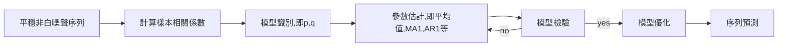

# 時間序列
- [vedio 1](https://www.bilibili.com/video/BV11y4y1G7vi?spm_id_from=333.999.0.0)
- 橫截面數據：橫截面數據是在同一時間，不同統計單位相同統計指標組成的數據列。橫截面數據是按照統計單位排列的。因此，橫截面數據不要求統計對象及其範圍相同，但要求統計的時間相同。也就是說必須是同一時間截面上的數據。
- 橫截面數據要注意異方差問題
- 時間序列數據：在不同時間點上收集到的數據，這類數據反映了某一事物、現象等
- 隨時間的變化狀態或程度。
- 面板數據：是截面數據與時間序列數據綜合起來的一種數據類型。其有時間序列和截面兩個維度，當這類數據按兩個維度排列時，是排在一個平面上，與只有一個維度的數據排在一條線上有著明顯的不同，整個表格像是一個面板,所以把panel data譯作“面板數據”。
- 可以用於分析時間序列數據：差分法、移動平均值法(MA)和自迴歸法(AR)

- 序列本身是非平穩的，通常我們有兩種處理方式，一是進行差分，二是進行對數變換。
- **長期趨勢、循環變動、周期變動和不規則變動**

## 季節指數提取
- 季節指數法是一種通過計算各月的季節指數,來反映季節變動的一種分析方法
- 若長期趨勢明顯,該方法的准確性會大打折扣
- 應消除長期趨勢,常用消除方法是回歸方程法消除,$\hat Y_t$是回歸預測值
  
  $$
  I_t=\frac{Y_t}{\hat Y_t}
  $$

- 計算$I_t$的季節比率(季節指數)

- 用回歸方程得到未來預測值再乘以$I_t$便得到相對的季節的預測值

  $$
  A_t=\frac{Y_t}{\hat I_t} 
  $$

- 加法: $\bar y$全部平均, $\bar y_s$季節平均

$$
I=\bar y_s - \bar y
$$

- 乘法: $\bar y$全部平均, $\bar y_s$季節平均

$$
I=\frac{ \bar y_s} {\bar y}
$$

## 移動平均
- 時間序列中短期偶然性因素的影響被削弱或消除,從而顯示出現象在較長時間的基本發展趨勢
- 移動平均法一般用來消除**不規則變動**的影響
- 向後移動平均k步

$$
\hat x_t=\frac{1}{k}\sum_{i=0}^{k-1} x_{t-i}
$$

- 中心移動平均k步
  - k是奇數

$$
\hat x_t=\frac{1}{k} \{ \sum_{i=1}^{ \frac{k-1}{2}} x_{t-i} \sum_{i=-\frac{k-1}{2}}^{-1 } x_{t-i} +x_t\}
$$

  - k是偶數,例如k=4

$$
\hat x_t=\frac{1}{2}\frac{x_t+x_{t+1}+x_{t-1}+x_{t-2}}{4}+\frac{1}{2}\frac{x_t+x_{t+1}+x_{t+2}+x_{t-1}}{4}
$$

## 指數

|       |  大趨勢     | 季節效應      |
| :---: | :---: | :---: |
|    1參數   |  無     |  無     |
|    2參數  |   有    |  無     |
|    3參數   |    有   |   有    |

- 1參數:$x_t$實測, $\hat x_t$預測
  
$$
\hat x_{t+1}=\alpha  x_{t}+(1-\alpha) \hat x_{t}
$$

# ARMA
- [vedio link 1](https://www.bilibili.com/video/BV1Ev411h7nT/?spm_id_from=333.788.recommend_more_video.-1)
- [vedio link 2](https://www.bilibili.com/video/BV18g411u7ms/?spm_id_from=333.788.recommend_more_video.-1)

  |       |  自相關系數ACF     | 偏相關系數PACF      |
| :---: | :---: | :---: |
|    AR(p)   |  拖尾    |  截尾     |
|    MA(q)|   截尾    |  拖尾     |

- 有空再補(應該不會考)

## 時間序列預測步驟
- [REF 1](https://www.zhihu.com/question/52866306)
- [vedio 2](https://www.youtube.com/watch?v=wF42Z3R2Bz8)

- 序列判斷
  - 是否為平穩:不是就差分, 差分到平穩
  - 是否為白噪聲序列:不是才能做,是白噪聲不能構成ARMA
- 模型識別
  - 判斷$p$和$q$的值,上述的自相關系數或偏相關系數截尾和拖尾性質判斷$p$和$q$
  - 若自相關系數或偏相關系數截尾不明顯,使用AIC,或AIC的改進BIC
- 參數估計
  - 計算模型平均值$\mu$,moving average factors $H(B)$
- 模型檢驗
  - 殘差是否白噪聲,$p>\alpha$,不能回絕$H_0:\epsilon$ 是白噪聲
    - [REF](https://bbs.pinggu.org/forum.php?mod=viewthread&action=printable&tid=445325)Q統計量主要是檢驗序列是否爲白噪聲過程，由殘差序列的自相關係數計算而得，服從卡方分佈。如果Q統計量小於臨界值，則接受原假設，認爲序列不存在自相關,即為白噪聲
  - 參數$\mu,ma_1, ar_1$是否等於0, 即要顯著,$p<\alpha$
- 模型優化
  - 有很多模型(p,q)都符合, 找最小誤差
- 預測
  - 利用參數估計計算後的公式, 預測之後的數值