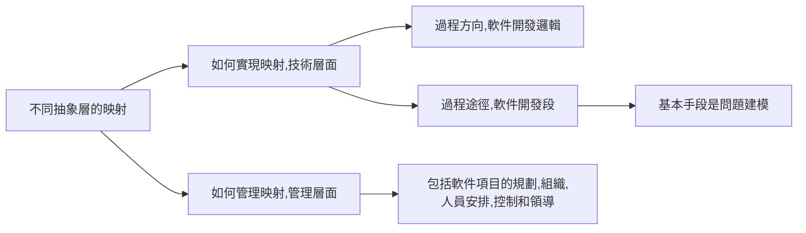
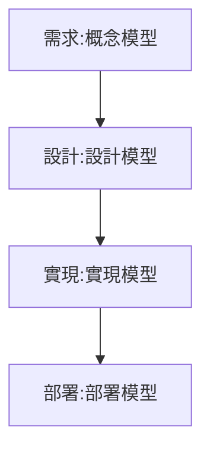
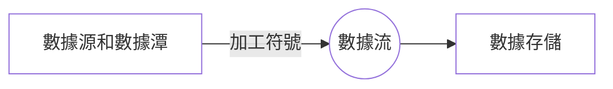
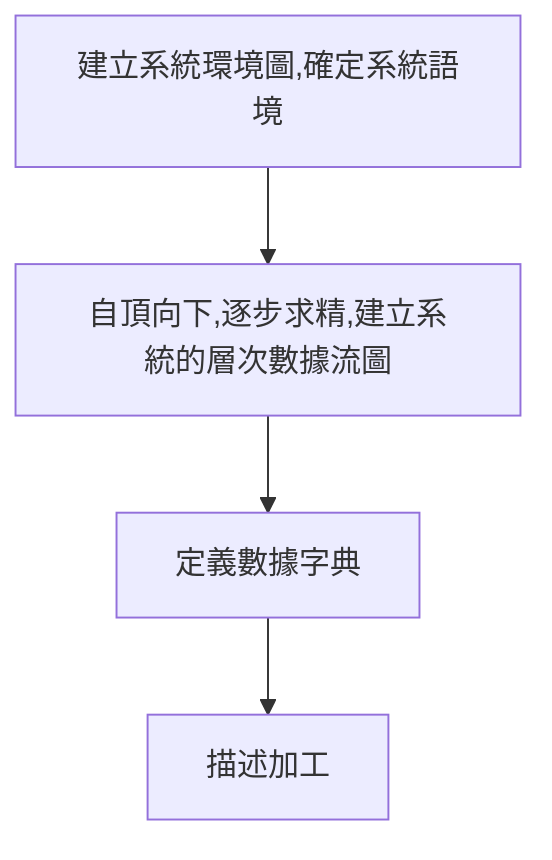
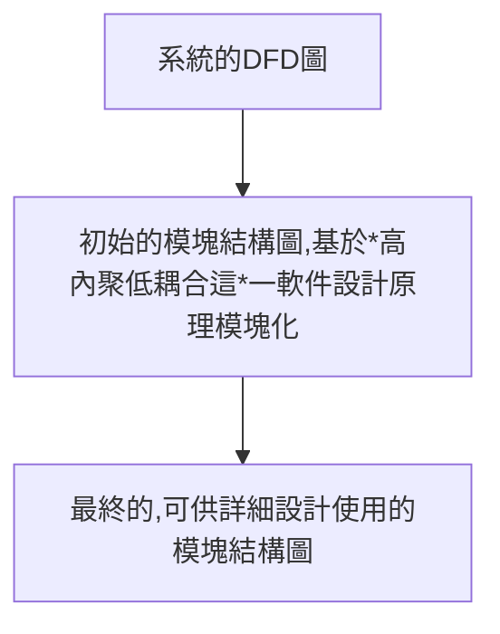
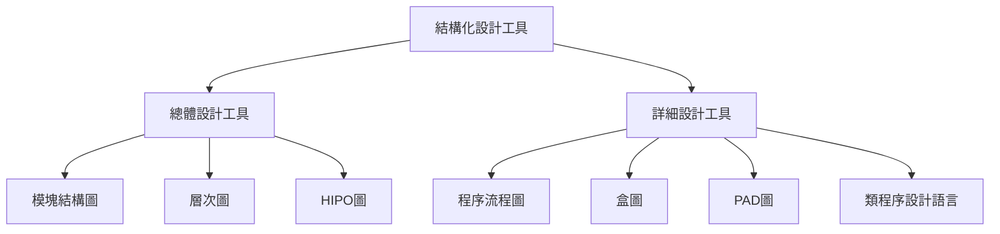
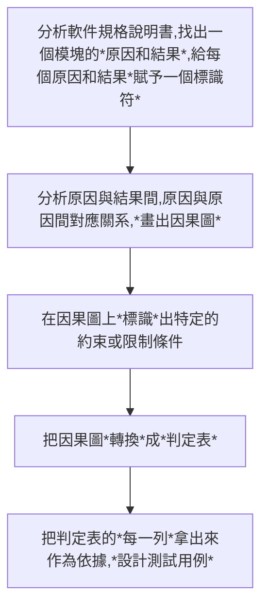
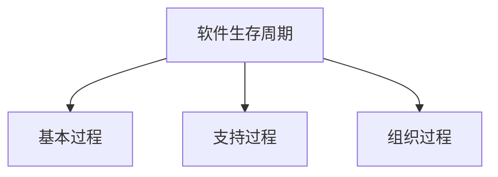
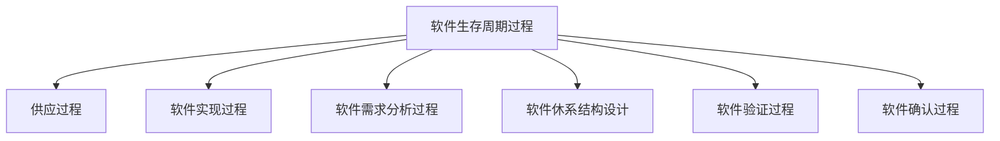

<style>
em { font-style: normal; font-weight: bold;text-decoration:underline; }
em { color: #002Fa7 }
.center{
  margin:auto;
  display:inline-block;
}
</style>


- [第一章](#第一章)
  - [軟件危機](#軟件危機)
  - [軟件工程概念的提出](#軟件工程概念的提出)
  - [軟件工程的定義](#軟件工程的定義)
  - [軟件工程的發展](#軟件工程的發展)
  - [計算機軟件](#計算機軟件)
  - [軟件開發的本質](#軟件開發的本質)
  - [模型](#模型)
- [第二章](#第二章)
  - [需求定義](#需求定義)
  - [需求分類](#需求分類)
  - [需求發現技術](#需求發現技術)
  - [需求規約定義](#需求規約定義)
  - [需求規約的表達](#需求規約的表達)
- [第三章](#第三章)
  - [結構化需求分析](#結構化需求分析)
  - [系統功能模型表示](#系統功能模型表示)
  - [建模過程](#建模過程)
  - [結構化需求分析](#結構化需求分析-1)
  - [結構化設計](#結構化設計)
    - [總體設計步驟](#總體設計步驟)
    - [模塊化及啟發式規則](#模塊化及啟發式規則)
    - [詳細設計](#詳細設計)
- [第四章 面向對象方法-UML](#第四章-面向對象方法-uml)
  - [類和對象](#類和對象)
    - [類的屬性（Attribute）](#類的屬性attribute)
    - [類的操作](#類的操作)
    - [接口](#接口)
    - [協作](#協作)
  - [表達](#表達)
    - [聚合](#聚合)
    - [組合](#組合)
    - [泛化](#泛化)
    - [細化](#細化)
    - [依賴](#依賴)
    - [包](#包)
  - [4.2 UML的模型表達格式](#42-uml的模型表達格式)
    - [類圖](#類圖)
    - [用況圖](#用況圖)
    - [狀態圖：](#狀態圖)
    - [順序圖](#順序圖)
- [第五章 RUP](#第五章-rup)
    - [需求獲取](#需求獲取)
    - [需求分析](#需求分析)
    - [設計](#設計)
    - [實現和測試](#實現和測試)
- [第六章 軟件測試](#第六章-軟件測試)
  - [軟件測試的目標](#軟件測試的目標)
  - [軟件測試技術](#軟件測試技術)
- [第七章](#第七章)
    - [瀑布模型](#瀑布模型)
    - [增量模型](#增量模型)
    - [演化模型](#演化模型)
    - [螺旋模型](#螺旋模型)
    - [喷泉模型](#喷泉模型)


# 第一章

## 軟件危機
- 20世紀60年代以來，隨著計算機的廣泛應用，軟件生產率、軟件質量滿足不了社會發展的需求，成為社會、經濟發展的*制約因素*，人們通常把這些現象稱為*軟件危機*。

## 軟件工程概念的提出
- 軟件工程概念的提出，其目的是倡導*以工程的原理原則和方法進行軟件開發*， 以期解決出現的*"軟件危機"*
- 軟件工程這一術語首次出現在*1968*年的*NATO（北大西洋公約組織）*會議上！

## 軟件工程的定義
軟件工程是應用*計算機科學理論和技術*以及*工程管理原則和方法*，按預算和進度實現滿足用戶要求的軟件產品的*工程*，或以此為研究對象的*學科*。

## 軟件工程的發展

- 20世紀60年代末到80年代初
    - 主要成果：提出*瀑布模型*、開發了諸多*過程式語言*（如C語言、Pascal語言）和*開發方法*（如Jackson方法、結構化方法）、開發了一些*支持工具*（調試工具、測試工具）。
    - 特征：前期主要研究*系統實現技術*，後期開始關注*軟件質量*和*軟件工程管理*。

- 20世紀80年代以來

    - 主要成果：提出《軟件生存周期過程》、開展*計算機輔助工程（CASE）*、面向對象語言（如Smalltalk、C++）、提出面向對象軟件開發方法等。
    - 特征：開展了一系列有關軟件生產技術，特別是*軟件復用技術*和*軟件生產管理*的研究和實踐。

- 簡述軟件工程與軟件危機的概念以及提出軟件工程概念的目的。
  - *軟件工程是應用計算機科學理論和技術以及工程管理原則和方法，按預算和進度實現滿足用戶要求的軟件產品的工程，或以此為研究對象的學科；（2分）* 
  - *軟件生產率、軟件質量遠遠滿足不了社會發展的需求，成為社會、經濟發展的制約因素，把這一現象稱為軟件危機；（2分）*
  - *軟件工程概念的提出，其目的是倡導以工程的原理、原則和方法進行軟件開發，以期解決出現的"軟件危機”。（1分）*

## 計算機軟件

*計算機軟件*一般是指計算機系統中的*程序及其文檔*。*程序*是對計算機任務的*處理對象和處理規則*的描述；*文檔*是為了理解程序所需的*闡述性資料*。

## 軟件開發的本質

- 軟件開發的目標是將*問題域*中的概念映射為*運行平台*層面上的概念，把問題域中的處理邏輯映射為運行平台層面上的處理邏輯；

- 軟件開發就是要彌補問題域與運行平台之間的*距離*，從而在二者之間直接進行映射。



- 概念：不同抽象層術語之間的*"映射"*，以及不同抽象層處理邏輯之間的*"映射"*，實現這一映射的基本途徑：系統建模。

- 內容：

  - 一是如何*實現*這樣的映射，這是技術層面的問題。

  - 二是如何*管理*這樣的映射，以保障映射的有效性和正確性，這是管理層面的問題。

- 簡述軟件開發的本質及其涉及到的問題。
  - *軟件開發的本質概括為：不同抽象層術語之間的"映射”，以及不同抽象層處理邏輯之間的"映射”。（2分)*
  - *它涉及到兩方面的問題：*
    - *一是如何實現這樣的映射，這是技術層面上的問題；（1分）*
    - *二是如何管理這樣的映射，以保障映射的有效性和正確性。這是管理層面上的問題。（2分）*

## 模型

- 模型，簡單地說，是*待建系統的任意抽象*，其中包括所有的基本能力、特性或其他一些方面，而沒有任何元余的細節。
- 進一步說，模型是在特定意圖下所確定的角度和抽象層次上對*物理系統的描述*，通常包含對該系統邊界的描述、對系統內各模型元素以及它們之間關系的語義描述。
- 在軟件開發中，軟件系統模型大體上可分為兩類：*概念模型*和*軟件模型*。(在軟件開發領域，分層的*基本動機*是為了控制開發的復雜性。)
  - 概念模型:在需求層上創建的系統*概念模型*是對客觀事物系統的抽象，即標識要解決的問題，或稱問題定義。
  - 軟件模型:設計模型、部署模型、實現模型


- 簡述何謂系統模型以及軟件開發中所涉及的系統模型分類。
  - *模型是待建系統的任意抽象；（1分）*
  - *該抽象是在特定意圖下所確定的角度和抽象層次對物理系統的一個描述。（1分）*
  - *描述其中的成分和成分之間所具有的特定語義的關系，還包括對該系統邊界的描述；（1分）*
  - *兩類：概念模型和軟件模型。軟件模型又可進一步分為設計模型、實現模型和部署模型等。（2分）*


# 第二章

## 需求定義

- *—個需求*描述了待開發產品 /系統*功能上的能力*、*性能參數*或*其他性質*。
- 對於單一一個需求，必須具有5個基本性質(NUTTM)：
  - *必要的(Necessary*：該需求是用戶所要求的；
  - *無歧義的（Unambiguous）*：該需求只能用一種方式解釋；
  - *可測的（Testable）*：該需求是可進行測試的；
  - *可跟蹤的(Traceable）*：該需求可從一個開發階段跟蹤到另一個階段；
  - *可測量的（Measurable）*：該需求是可測量的。

## 需求分類


|需求分類| 描述|
|---|---|
|功能需求|規約了系統或系統構件必須執行的能力，是整個需求的*主體*。|
|非功能需求| *性能需求*:規約了一個系統或構件在*性能*方面心須具有的一些特性。|
|非功能需求| *外部接口需求*:規約了系統或構件*必須與之交互*的用戶、硬件、軟件或數據庫元素，其中也可能規約交互格式、時間或其他因素。|
|非功能需求| *設計約束*：限制了軟件系統或構件的設計方案的*范圍*。需考慮*法規*政策、硬件限制等。|
|非功能需求| *質量屬性*:規約了軟件產品所具有的一個性質（包括功能和其他需求）必須達到其*質量方面*一個所*期望*的水平。|

- 質量屬性
  - *可靠性*：軟件系統在指定環境中沒有失敗而正常運行的概率。
  - *存活性*：當系統的某一部分不能運行時，該軟件繼續運行。
  - *可維護性*：發現並改正一個軟件故障或對特定的范圍進行修改所要求的平均工作。
  - *用戶友好性*：學習和使用一個軟件系統的容易程度。

## 需求發現技術

- 初始發現需求的常用技術包括以下幾個：
  - *自悟(Introspection）*：需求人員*把自己作為系統的最終用戶*，審視該系統並提出問題
  - *交談(Individual Interview）*：為確定系統應該提供的功能，需求人員通過*提出問題/用戶回答*這一方式，直接詢問用戶需要的是一個什麼樣的系統。
  - *觀察(Observation）*：通過*觀察用戶*執行其現行的任務和過程，或通過觀察他們如何操作與所期望的新系統有關的現有系統，了解系統運行的環境，特別是了解要建立的新系統與現存系統、過程以及工作方法間必須進行的交互。
  - *小組會(Group Session ）*：舉行客戶和開發人員的*聯席會議*，與客戶組織的一些代表共同開發需求。
  - *提煉(Extraction）* 復審技術文檔，並提取相關信息。
  
## 需求規約定義




- 需求規約是一個軟件產項/產品 /系統*所有需求陳述的正式文檔*，它表達了一個軟件產/系統的*概念模型*。
  - ISNCC
  - *重要性和穩定性程度(Ranked for Imortance and Stability）*：按需求的重要性和穩定性對需求進行分級，如基本需求、可選需求和期望需求；
  - *可修改的(Modifiable）*：在不過多地影響其他需求的前提下，可以容易地修改一個單一需求；
  - *完整的(Complete）*：沒有被遺漏的需求；
  - *一致的（Consistent）*：不存在互斥的需求。

## 需求規約的表達

- 非形式化的需求規約：
  - 以一種*自然語言*來表達需求規約，如同使用一種自然語言寫了一篇文章。
  - 適用於規模比較小的、復雜程度不大高的小型軟件項目，或在獲取SRS （草案）時使用的。
- 形式化的需求規約：
  - 以一種基於良構數學概念的符號體系來編制需求規約，一般常伴有解釋性注釋的支持。
  - 主要針對質量（特別是安全性）要求比較高的軟件產品/系統或其中某一部分。
- 半形式化的需求規約：
  - 以*半形式化符號體系*（包括術語表、標准化的表達格式等）來表達需求規約；
  - 一些有能力的組織針對大型復雜項目，在開發需求文檔時往往使用系統化的需求獲取、分析技術和工具。
- 需求規約的作用可概括為以下4點：
  - 需求規約是軟件開發組織和用戶之間一份事實上的*技術合同書*，是*產品功能*及其*環境的體現*。
  - 對於項目的其余大多數工作，需求規約是一個*管理控制點*。
  - 對於產品 / 系統的設計，需求規約是一個*正式的、受控的起始點*。
  - 需求規約是創建產品驗收測試計劃和用戶指南的基礎，即基於需求規約一般還會產生另外兩個文檔—*初始測試計劃*和*用戶系統操作描述*。


# 第三章

## 結構化需求分析

- 在進行軟件系統 產品的需求工作中，通常面臨三大挑戰：
  - 問題空間*理解*；
  - 人與人之間的*通信*；
  - 需求的*變化性*。

- 應對三大挑戰的軟件開發方法：
  - 結構化方法、
  - 面向數據結構方法、
  - 面向對象方法等。

- 結構化需求分析基本術語
  - 數據流：在結構化分析方法中，*數據流*是*數據*的*流動*。
  - 加工：*加工*是*數據*的*變換單元*，即它接受輸入的數據，對其進行處理，並產生輸出；在使用中，一般給出標識，且標識為*動賓結構*。
  - 數據存儲：在結構化分析方法中，*數據存儲*是*數據*的*靜態結構*。
  - 數據源：數據源是*數據流*的*起點*
  - 數據潭：數據潭是*數據流*的*歸宿地*。
  - 數據流和數據潭是系統之外的*實體*，可以是*人*、*物*或者*其他軟件系統*。



## 系統功能模型表示
- 需求分析的首要任務是建立系統*功能模型*
- 結構化分析方法給出一種能*表達功能模型的工具*，即*數據流圖*( Dataflow Diagram），簡稱*DFD圖*。
- DFD圖是一種*描述數據變換*的圖形化工具， 是一種表達*待建系統功能模型*的工具。

|圖|工具|階段|
|---|---|---|
|HIPO圖|總體設計的工具|設計|
|N-S圖|詳細設計工具|設計|
|PAD圖|詳細設計工具|設計|
|DFD圖|結構化分析方法的表達功能模型的工具|*分析*|


##  建模過程
- 自頂向下，功能分解





- 1 建立系統環境圖，確定系統語境
  - 結構化方法通過*系統頂層數據流圖*來定義系統語境
    - 數據源和數據潭以及與之相關的數據流較易確定；
    - 對於最頂層的 "大加工"，其標識一般采用代建系統名字。
- 2 自頂向下，逐步求精，建立系統的層次數據流圖
  - 這些圖互為 "父子"關系：
  - 從0層開始就對其中的"加工"進行編號：子圖號。加工順序號。
- 3 定義數據字典
  - 目標：*定義*數據流圖包含的*所有數據流*和*數據存儲*的*數據結構*，直到給出構成以上數據的各數據項的基本數據類型。
  - +：數據A是由數據B和數據C順序構成的，並記為"+
    - 例：學生成績=姓名+性別+學號+科目+成績
  - \|:數據A是由數據Bo或是由數據Co定義的， 即數據不可能同時是Bo或Co，並記為"！
    - 例：性別=男女
  - {}:數據A是由多個重復的數據B構成的，並記為"{} 
    - 例：學生成績表=（學生成績}
  
|符號|描述|
|---|---|
|=|定義為|
|+|順序|
|\||選擇|
|{}|重復|
|m..n|子界|


- 4 描述加工
  - 目標：給出每一加工的*小說明*；對DFD圖中每一加工給出加工的*輸入數據*和*輸出數據*間的關系,即從外部來視察一個加工的邏輯。
  - 結構化自然語言:
    - 適用於輸入數據和輸出數據之間的邏輯關系*比較簡單*的情況。
    - 結構化自然語言的語法有內、外兩層：
    - 外層語法描述操作的控制結構，如順序、選擇、循環等：
    - 內層語法沒有什麼限制，一般使用自然語言描述。
    - 特點
      - 沒有形式語言那樣嚴格：
      - 簡單易懂，又避免了自然語言結構松散的缺點。
  - 判定表
    - 適用於輸入數據和輸出數據之間的邏輯關系*比較復雜*的情況。
    - 通常用於描述不易用*自然語言*表達清楚或需要大篇幅才能表達清楚的加工。
    - 適用於當描述的加工由*一組操作*組成，且是否執行某些操作或操作的執行情況取決於一組條件時。
  - 判定樹
    - 適用於輸入數據和輸出數據之間的邏輯關系*比較復雜*的情況。

- 簡述結構化分析建模的基本步驟。
  - *建立系統環境圖，確定系統語境*；（1分）
  - *自頂向下，逐步求精，建立系統的層次數據流圖*；（2分） 
  - *定義數據字典*（1分）
  - *過結構化自然語言、判定樹判定表等工具，來描述加工*。（1分）
  - 助記：建圖、求精、字典、加工。


## 結構化需求分析
- *抽象*和*分解*是結構化分析方法采用的兩個基本手段：
- 抽象：從上往下，逐步概括，關注問題的主要方面，忽略細節。
- 逐步求精：自頂向下，把要解決的問題分解為多個步驟或階段，每一步是對上一步結果的細化，直到底層的加工足夠簡單。
- 需求階段的主要任務：需求*發現*、需求*分析*和需求*驗證*，最終形成系統的*軟件需求規格說明書*。


## 結構化設計

- 結構化設計的主要任務：在*需求分析*的基礎上，定義滿足需求所需要的結構，即針對給定的問題，給出該問題的軟件解決方案，確定"*怎麼做*"的問題。
- 為控制軟件設計的復雜性，結構化設計進一步分為*總體設計*和*詳細設計*！
- 總體設計將系統分解成一個個"黑盒子"，詳細設計描述其細節。
- 模塊軟件中具有特定標識的獨立成分；是執行一個特殊任務的一個過程以及相關的數據結構。
- 模塊調用模塊之間的一種使用關系。
- 總體設計基本任務：
  - 把系統的*功能*需求*分配*到一個特定*軟件體系結構*中，建立系統的模塊結構，只聲明其作用或功能。
- 模塊結構圖是一種描述軟件 "宏觀"結構的圖形化工具
  - 較高層級：控制（或管理）模塊
  - 較低層級：從屬模塊
- HIPO圖 ”層次圖+輸入/處理/輸出”
  - h:層次
  - IPO：輸入處理輸出

### 總體設計步驟



- 為了控制軟件設計的復雜性，結構化設計進一步分為*總體設計*和*詳細設計*，前者將系統分解成一個個"黑盒子"，其細節描述是後者的任務。
- 結構化設計分為*總體設計*和*詳細設計*，而詳細設計要提供實現該模塊功能的*具體算法*
- 變換型數據流圖
  - 具有較明顯的*輸入*部分和*變換*（或稱主加工）部分之間的界面 、變換部分和*輸出*部分之間界面的DFD圖

  ```mermaid
  graph TB
  id1[設計准備,復審並精化系統模型]
  id2[確定輸入,變換,輸出這三部分之間的邊界]
  id3[第一級分解:系統模塊結構圖頂層和第一層的設計]
  id4[第二級分解:自頂向下,逐步求精]
  id1-->id2
  id2-->id3
  id3-->id4

  ```


- 事務型數據流圖
  - 數據到達—個加工T，該加工T根據輸入數據的值，在其後的*若干動作序列*（或稱一個事務）中*選出一個*來執行。
  - 處理T稱為事務中心，完成以下任務：
  - 接收輸入數據；
  - 分析並確定對應的事務：
  - 選取與該事務對應的一條活動路徑。

  ```mermaid
  graph TB
  id1[設計准備,復審並精化系統模型]
  id2[確定事務處理中心]
  id3[第一級分解:系統模塊結構圖頂層和第一層的設計]
  id4[第二級分解:自頂向下,逐步求精]
  id1-->id2
  id2-->id3
  id3-->id4

  ```

- 結構化設計方法基於"*自頂向下，功能分解*"的基本原則，針對兩種不同類型的數據流圖，分別提出*變換設計*和*事務設計*。
  - 變換設計目標：將*變換型*數據流圖映射為模*塊結構圖*
  - 事務設計目標：將*事務型*數據流圖映射為*模塊結構圖*
- 變換設計與事務設計的區別及聯系
  - 區別：分別從兩者的*目的、組成、任務*來看。
  - 變換設計：
    - 將變換型數據流圖映射為模塊結構圖；
    - 組成：獲取數據、變換數據（*核心*）和輸出數據；
    - 設計一個主控模塊來協調和控制其他模塊，比較機械。
  - 事務設計
    - 將事務型數據流圖映射為模塊結構圖；
    - 事務中心需完成3個任務：接收數據、分析並確定事務和選取活動路徑。
  - 聯系：以變換設計為主，事務設計為輔。
- 總體設計分為3階段：
  - 第一階段：*初始*設計（將給定的*數據流圖*轉換為初始的*模塊結構圖*：
  - 第二階段：*精化*設計（”*高內聚低耦合*”，*精化*模塊結構圖，設計*數據結構*和*接口*）
  - 第三階段：*復審*階段（對高層軟件結構進行復審，精化）

### 模塊化及啟發式規則

- 如何將系統分解成*軟件模塊*："分而治之”和"抽象”
- 如何*設計模塊*：偽碼、問題分析圖PAD、N-S圖
- *模塊化*：即把一個待開發的軟件分解成若干簡單的、具有高內聚低耦合的模塊的過程。【模塊=接口+模塊體】
- *結構化軟件設計*是一種典型的模塊化方法，而模塊化是系統設計基本原理/原則之一！
- 耦合:*不同模塊之間*相互依賴程度的度量
- 內聚:一個*模塊內部各成分之間*相互關聯程度的度量
- 衡量模塊獨立性的*指標*：耦合和內聚：
- 模塊化的*目標*：基於模塊 "高內聚低耦合”的原則，提高模塊*獨立性*。
- 耦合:(從高到低，低為好）
  -  記：內功控記數
  - *內容耦合*(Content),一個模塊*直接修改*或*操作*另一個模塊的數據。*耦合程度最高，盡量避免使用*
  - *公共耦合*(Common),兩個或兩個以上的模塊共同引用一個*全局數據項*。
  - *控制耦合*(Control),一個模塊通過*接口*向另一個模塊傳遞*一個控制信號*（如開關量、標志），接收信號的模塊根據信號值進行適當的動作。
  - *標記耦合*(Stamp),模塊A通過*接口*向兩個模塊B和C傳遞一個*公共參數*，稱模塊B和C間存在一個標記耦合。
  - *數據耦合*(Data),模塊之間通過參數來傳遞數據。 耦合程度最低，存在普遍
  - 模塊之間通過參數來傳遞數據。耦合程度最低，存在普遍
- 設計原則：
  - 盡量使用數據耦合少用控制耦合
  - 少用控制耦合
  - 限制公共耦合的范圍
  - 盡量避免使用內容耦合
- 內聚(從低到高，高為好)
  - 記：偶然排便通順，腸功能良好
  - *偶然內聚*(Coincidental Cohesion)，各模塊間沒有關聯
  - *通信內聚*(Communication Cohesion),模塊各成分都操作或生成同一數據集
  - *順序內聚*(Sequential Cohesion),一個成分的輸出作為另一成分的輸入
  - *功能內聚*(Functional Cohesion),模塊對完成功能充分必要

-  啟發式規則
   - 實現高內聚低耦合的啟發式規則：
   - 改進軟件結構，提高模塊獨立性；
   - 力求*深度、完度、扇出和扇入*適中。（扇出3或4)
   - 盡力使模塊的作用域在其控制域之內盡力降低模塊接口的復雜度；
   - 力求模塊功能可以預測。
 - 名詞解釋
   - 控制域：模塊本身以及所有直接或間接從屬於它的模塊集合。
   - 作用域：受該模塊內一個判定所影響的所有模塊的集合。
   - 深度：控制的層數，粗略標志一個系統的規模和復雜程度。
   - 寬度：同一個層次上模塊總數的最大值（*受扇出影響*）。
   - 扇入：表明有多少個上級模塊直接調用它。
   - 扇出：一個模塊直接調用的下級模塊數目。
 - 設計得很好的軟件結構：
   - 頂層模塊：扇出較大；
   - 中間層模塊：扇出較小；
   - 底層模塊：扇入較大：
   - 注意：模塊的扇入大，即共享該模塊的上級模塊數目越多，可*提高軟件的復用性*！
- 往往能粗略地標志一個系統的規模和復雜程度是模塊的*深度*
- 在一個軟件結構中，寬度是指同一個層次上模塊總數的*最大值*，而對寬度影響最大的因素是模塊的*扇出*
- "指受該模塊內一個判定所影響的所有模塊的集合" 稱為模塊的*作用域*
- —個模塊通過傳遞開關、標志對某一模塊的多種功能進行選擇，則這兩個模塊之間的耦合方式是*控制耦合*
- 兩個模塊之間把簡單的數值作為參數傳遞，這種耦合方式為*數據耦合*。
- 如果一個模塊的各個成分和同一個功能密切相關，而且一個成分的輸出作為另一個成分的輸入，則該模塊的內聚是*順序內聚*
- 所謂模塊化是指按照的*高內聚低耦合*設計原則，形成一個相互獨立但又有較少聯系的模塊結構的過程。而模塊通常由*接口*和模塊體組成。
- 耦合和內聚是衡量模塊*獨立性*的兩個定性指標。
- 指受模塊內一個判定所影響的所有模塊的集合，稱為模塊的*作用域*
- 模塊本身以及所有直接或間接從屬於它的模塊的集合，稱為該模塊的*控制域*
  
### 詳細設計

- 目標：將總體設計階段產生的系統*高層結構*映射為以這些術語所表達的*低層結構*，即系統的最終結構。
- 任務：具體描述模塊結構圖中的每一個模塊，即給出*實現模塊功能的實施機制*，包括一組例程和數據結構，從而精確地定義了滿足需求規約的結構。
- 結構化程序設計
  - 結構化程序設計方法是一種基於結構的編程方法，采用*順序結構、選擇結構以及重復結構*進行編程， 每一結構只允許一個*入口*和一個*出口*。
  - 實際上，用順序結構和循環結構完全可以實現選擇結構；
  - 理論上最基本的控制結構只有兩種：*順序結構*、*循環結構*。
  - 詳細設計工具
    - 圖形、表格、語言
    - 程序流程圖（程序框圖）
      - 優點：對控制流程的描繪很直觀，便於初學者掌握。
      - 缺點：不是一種逐步求精的工具、影響甚至破壞好的系統結構設計、不宜表示數據結構。
    - 盒圖（N-S圖）
      - 支持"自頂向下逐步求精"
        - 順序
        - IF-THEN-ELSE型
        - CASE型
        - 循環
        - 調用子程序P
      - PAD圖（問題分析圖）
        - 二維樹形結構圖；*自上而下、從左向右*
        - 順序
        - 選擇
        - CASE型多分支 
        - WHILE型循環 
        - UNIIL型循環語句標號
        - 定義
    - 類程序設計語言PDL
      - "混合” 語言
      - 借用某種結構化程序設計語言的關鍵字作為語法框架；
      - 使用某種自然語言的詞匯。
  



# 第四章 面向對象方法-UML

- 面向對象技術的發展中的一個重要*裡程碑*：*UML ( Unified Modeling Language)*
- UML:一種圖形化建模語言，給出表達客體、客體關系的術語以及表達模型的工具。
- UML把客觀世界的一切事物分為8大范疇，引入8個術語，表達客觀事物：
- *類與對象、接口、協作、用況、主動類、構件、制品、節點*

## 類和對象
- 類：*一組*具有相同屬性、操作、關系和語義的*對象的描述*。
- 對象：*類*的一個*實例*。
- *類*用於*抽象*客觀世界中的事物，有一組*屬性*和*操作*。
 
### 類的屬性（Attribute）

```
[可見性]屬性名[':'類型][[‘多重性’]] ]  
['='初始值][{','性質串}]
```
  - 例1：```+ origin:Point =(0.0) ```
  - 例2: ```#visibility:Boolean```
- 可見性
  - \+ :公有的(public) 
  - \# :受保護的(protecte)
  - \-:私有的( private）
  - ~ :包內的
- *類型*是對屬性實現類型的規約， 與具體實現語言有關。
- *多重性*用於表達屬性值的數目，即該類實例的這一特性可以具有的值的范圍。
  - 例1:colors[3]]:Color , $3$種顏色
  - 例2:points[2..*]]:Point. $2- \infty$
- 性質串：表達該性具有的性質
- 屬性的作用范圍：
  - *類范圍*的屬性：該屬性被該類對象所共享，屬性名和類型表達式*下畫線段*
  - *實例范圍*的屬性：*無線段*。

### 類的操作

```
[可見性]操作名['('參數表')'['：'返回類型']
[性質串{','性質串}]
```

- 操作名：操作名是該操作的標識，通常是以小寫字母開頭的*動詞或動詞短語*。
- 操作的作用范圍：
  - *類范圍*的屬性：該屬性被該類對象所共享，屬性名和類型表達式*下畫線段*
  - *實例范圍*的屬性：*無線段*。

### 接口

- 接口是*操作的一個集合*，其中每個操作描述了類、構件或子系統的一個服務。
- 接口表示通常有兩種形式：
  - 采用具有分欄和關鍵字 《interface》的矩形符號來表示：
  - 采用小圓圈和半圓圈來表示。

### 協作
- 協作是一個*交互*，涉及交互的三要素：交互*各方*、交互*方式*以及交互*內容*；交互各方之間的相互作用，提供了某種協作性行為。
  - 圖： 虛線的橢圓
- 用況是對一組動作序列的描述，系統執行這些動作應產生對特定參與者有值的、可觀察到的結果。
  - 圖： 實線的橢圓
- 主動類是一種*至少具有一個進程或線程*的類。
- 構件是系統設計中的一種*模塊化部件*， 通過外部接口隱藏了它的內部實現。


## 表達
- 表達關系的術語：*關聯、泛化、細化、依賴*
- *關聯*是*類目之間的一種結構關系*，是對一組*具有相同結構、相同鏈的描述*。
- *鏈*是對象之間具有特定語義關系的抽象，實現之後的鏈通常稱為*對象之間的連接*。
  - name
  - name direction
  - association
  - 例： {<張三，聯想＞，＜李四，尚德＞，＜王五，百度>}
- *關聯名(Name)* 用於描述關聯的一定*內涵*。
- *導航*對於—個給定的類目，可以找到與之關聯的另一個類目，這稱為導航。
-  角色(Role） 角色是關聯一端的類目對另一端的類目的一種呈現。
- 可見性
  - \+ :公有的(public) :公共可見
  - \# :受保護的(protecte)：該端的對象只有另一端的 “子孫”是可訪問的
  - \-:私有的(private）：對該關聯之外的任何對象而言，該端的對象是不可見的
  - ~ :包內的:在同一包中聲明的類是可訪問的
- 多重性:Multiplicity:類中對象參與一個關聯的數目，稱為該關聯的多重性。
- 限定符:限定符是一個關聯的屬性或屬性表,這些屬性的值將與該關聯相關類的對象集做了一個劃分。
  
### 聚合
- 聚合（Aggregation）:通過“一個類是另一類的一部分〞這一性質，對關聯集進行分類， 凡滿足這一性質的關聯，都稱為一個聚合。
  - 例 Compary  聚合  <-- 部門

### 組合
- 組合(Composition）:*組合是聚合的一種特殊形式*。如果在一個時間段內，整體類的實例中至少包含一個部分類的實例，並且該整體類的實例負責創建和消除部分類的實例，那麼這樣的聚合稱為組合。
- 關聯類:關聯類是一種具有關聯和類特性的模型元素。一個關聯類，可以被看做一個關聯，但還有類的特性；或被看做一個類，但有關聯的特性。
  - 約束為了進一步描述關聯一端類的性質，UML還給出了*6個約束*。
    - 有序(ordered)：表明類中實例是有序的。
    - 無重復對象(set)：表明類中對象是沒有重復的。
    - 又重復對象(bag)：表明類中對象是有重復的。
    - 有序集合(order)：表明類中對象有序且重復。
    - 列表(ist)或序列(sequence)：表明類中對象有序但可重復。
  - 只讀(readonly)：表明一縣一個鏈由於對象而被填加到所參與的關聯味，即作為該關聯的一個實例時，該鏈不能修改和刪除。


### 泛化
- 泛化:泛化是*一般性類目*（稱為超類或父類） 和它的較*為特殊性類目*（稱為子類）之間的*一種關系*，有時稱為 *"is-a-kind-of"關系*。
  - 如果兩個類具有泛化關系，那麼子類可繼承父類的屬性和操作，並可有更多的屬性和操作；
  - 子類可以替換父類的聲明
  - 若子類一個操作的實現覆蓋了父類同一個操作的實現，這種情況被稱為*操作多態性*，但兩個操作必須具有相同的*名字和參數*；
  - 可以在其他類目之間創建泛化，例如在*節點之間、類和接口之間*等。
  - 泛化,UML給出了4個約束
    - 完整(Complete)：表明己經在模型中給出了泛化中的所有子類，盡管在表達的圖形中有所省略，但也不允許增加新的子類。
    - 不完整(Incomplete)：表明在模型中沒有給出泛化中的所有子類，因此可以增加新的子類。
    - 互斥(Disjoint)：表明父類的對象最多允許該泛化中的一個子芙作為飛的類型。
    - 重疊(Overlapping)：表明父類的對象可能具有該泛化中的多個子類作為它的類型
  
### 細化
- 細化：細化是*類目之間的語義關系*，其中*一個類目規約了保證另一個類目執行的契約*。

### 依賴
- 依賴是一種使用關系，用於*描述一個類目使用另一類目的信息和服務*。
  - 例如，一個類使用另一個類的操作，顯然在這種情/況下，如果被使用的類發生變化，那麼另一個類的操作也會受到一定影響。
- 按照UML的觀點，客觀世界一切事物之間的關系都可以用*依賴*來規約。

- 簡述關聯、泛化、細化和依賴的概念以及前三者與依賴的關系。
  - 關聯是*類目之間的一種結構關系*，是對一組具有相同結構、相同鏈的描述。
  - 泛化是*一般性類目（父類）和它的較為特殊性類目（子類）*之間的*一種關系*，有時稱為 “is-akind-of" 關系。
  - 細化是類目之間的語義關系，其中*一個類目規約了保證另一個類目執行的契約*。
  - 依賴是一種使用關系，用於*描述一個類目使用另一類目的信息和服務*。


### 包
- *包*：*為控制信息組織的復雜性*，UML提供了組織信息的一種通用機制一包，支持形成一些可管理的部分。換言之，包可以作為“模塊化〞和"構件化〞的一種機制。
  - +表示對其他包而言都是可見的 
  - #表示對子孫包而言是可見的 
  - \-表示對其他包而言都是不可見的


## 4.2 UML的模型表達格式
- 常用4種建模工具：*類圖(結構圖)、用況圖（行為圖）、狀態圖（行為圖）、順序圖（行為圖）*

### 類圖

- 類圖是可視化地表達系統*靜態結構模型*的工具，通常包含類、* 接口、關聯、泛化和依賴關系*等。
- 創建類圖的步驟：
  - 模型化待建系統的概念，形成類圖中的基本元素；
  - 模型化待建系統的各種關系，形成該系統的初始類圖；
  - 模型化系統的協作，給出該系統的最終類圖：
  - 模型化邏輯數據庫模式。

### 用況圖
- 用況圖是一種表達*系統功能模型*的圖形化工具。
- 一個用況圖通常包含6個模型元素：*主題（Subject ）、用況(Use cases ) 參與者（Actor)、關聯、泛化、依賴*。
  - 主題(Subject）由一組用況所描述的一個類，通常是一個系統或子系統。
  - 參與者（Actor）表達了一組高內聚的角色，當用戶與用況交互時，該用戶扮演這組角色。
  - 關聯：一種參與關系，即參與者參與一個用況。
  - 用況之間的3種關系：泛化、擴展、包含。
  - 泛化：用況A和用況B之間具有*一般/特殊*關系。
  - 依賴的變體：包含(<<include>>）、擴展(<<extend >>）
  - 包含：用況A的一個實例*包含*用況B所規約的行為。
  - 擴展：一個用況A的實例在特定的條件下可以由另一用況B所規約的行為予以擴展，並依據定義的擴展點位置，B的行為被插入到A的實例中。
- 用況圖的作用：
  - 為系統建模，描述軟件系統行為的功能結構；
  - 對業務建模，描述企業或組織的業務過程結構。
  - 業務模型和系統模型之間是“*整體/部分*”關系， 
  - 業務模型是整體，而系統模型是業務模型的一個組成部分。
- 簡用況圖及其通常包含的模型元素。
  - 用況圖是一種表達*系統功能模型*的圖形化工具。一個用況圖通常包含6個模型元素：
    - *主題（Subject）、用況(Use cases ）、參與者（Actor）、關聯、泛化、依賴*。
  
### 狀態圖：

- 狀態圖是顯示一個*狀態機*的圖，強調了*從一個狀態到另一狀態*的控制流。
- 狀態機：一種行為，規約了一個對象在其生存期間因響應事件並作出響應而經歷的狀態。
- 狀態：類目的一個實例在其生存中的一種條件(condition)或情況(situation)，期間該實例滿足這一條件，執行某一活動或等待某一消息。
  - UML把狀態分為3類：初態（•）、終態（◎）和正常狀態（圓角矩形）
- 事件：對確定的時空內一個有意義發生的規約。在狀態機的語境下，一個事件意味著有一個會引發狀態轉移的激勵。
  - 內部事件： 指系統內對象之間傳送的事件，例如溢出異常
  - 外部事生指系統和它的參與者之間所傳送的事件，如按一下按鈕，或傳感器的一個中斷。
  - 信號 Signal ) 事件
    - 信號：消息的一個類目，是一個消息類型。像類一樣，信號可以有屬性（以參數形式出現）、操作和泛化。
  - 調用（Call)事件：
    - 調用表示對象接受到一個操作的請求。
  - 時間事件
    - 表示推移一段時間的事件。
    - 通過時間表達式來規約的，例如after 2 seconds, at (1 jan 2007, 12.00).
  - 變化事件
    - 表示狀態的一個變化，或表示某一條件得到滿足。
  - 狀態轉移（一>）
    - 兩個狀態間的一種關系，指一個對象在一個狀態中將執行一些確定的動作，當規約的事件發生和規約的條件滿足時，進入第二個狀態。

### 順序圖
- 順序圖:是一種*交互*圖，由一組對象及按時序組織的對象間關系組成， 包含對象間發送的消息。


# 第五章 RUP
- RUP ( Rational Unified Process） 的突出特點：以一種*用況（Use Case） 為驅動*的、以*體系結構為中心的迭代增量式開發*。
- RUP的特點
  - 用況為驅動:
    - 指在系統的生存周期中，*以用況作為基礎*，驅動系統有關人員對要建立系統的功能需求進行交流，*驅動系統分析、設計、實現和測試*等活動。
    - 用況是分析、設計、實現和測試的基本輸入，分析、 設計、實現和測試的結果都可以跟蹤到相應的情況。
  - 以體系結構為中心
    - 指在系統的生存周期中，開發的任何階段都要*給出相關模型視角下有關體系結構的描述*，作為構思、 構造、管理和改善系統的主要制品。
  - 迭代、增量式開發
    - 指通過開發活動的迭代，*不斷地產生相應的增量*；
    - 在RUP中，規定了4個開發階段：*初始階段、精化階段、構造階段和移交階段*。
  - 四個工作流：*需求、分析，設計和實現和測試*


### 需求獲取
  - 工具：采用*Use Case技術*獲取需求。
  - 目標：使用UML中的用況、參與者及依賴等術語*抽象客觀實際問題*，形成系統*的需求獲職植型*一 -種特定的*系統/產品模型*，並產生該模型視角下的體系結構描述。

- RUP開展的工作

  |要做的工作| 產生的制品|描述|
  |----|----|----|
  |NO.1 列出候選需求|特征（Feature)列表|先從客戶、用戶、計劃者、開發者的想*法和意願*中搜取特征，形成特征表。<br>*特征*是一個*新的項*（Item）及其*簡要描述*。|
  |NO.2 理解系統語境|領域模型|一般用類圖表達，用於捕獲系統語境中的一些重要領域對象類。<br>*業務對象*：表示那些由業務操縱的事物，如訂單、賬目和合同等。<br>實在對象(Real-world Objects)：如教室、運動場地等。<br>事件（Events)：如上課鈴響、討論開始等。|
  |NO.2 理解系統語境|業務模型|一般用用況圖表達,為捕獲業務處理和其中的業務對象，通過以下2個層次來抽象一個業務。<br>為精化業務用況模型中的每一個業務用況表達業務對象的3個術語：*工作人員、業務實體、工作單元*。|  
  |NO.3 捕獲功能需求|用況模型|目標：*創建系統的用況模型*，以表達客戶認可的需求一系統必須滿足的條件和能力，作為客戶和開發人員間的一種共識 <br>用況模型：是系統的一種*概念模型*，是對系統*功能的抽象*，包括*系統參與者系統用況以及它們之間的關系*。
  |NO.4 捕獲非功能需求|補充需求/針對一些特定需求的用況|| 

- 在RUP的每次迭代中都要經歷一個*核心工作流*，即*需求獲取、分析、設計、實現和測試*。
  
### 需求分析
- 目標：在系統*用況模型的基礎上*，創建*系統分析模型*及在該分析模型視角下的*體系結構描述*。
- 分析模型：是系統的一種*概念模型*，解決系統用況模型中,存在的*二義性*和*不一致*性等問題，以一種系統化的形式准確表達用戶需求。
- 基本術語
  - *分析類*：類的一種衍型，很少有操作和特征標記，*用責任定義其行為*，其*屬性和關系也是概念性*的。
    - 分析類的三類
      - 邊界類：封裝一些重要的通信接口和用戶界面機制
      - 實體類：封裝問題域中的一個重要現象
      - 控制類：封裝一些重要的定序
  - *用況細化*：一個*協作*。針對一個用況，其行為用*多個分析類間相互作用來細化*，記為用況細[分析」
  - *分析包*：一種*控制信息組織復雜性的機制*，提供分析制品的一種組織手段，形成可管理的部分
    - 分析包特徵
      - 體現問題分離；
      - 高內聚、低耦合：
      - 盡可能體現一個系統的完整頂層設計
- 分析模型的表達
  - 分析模型由“*分析系統*”定義，該分析系統包含*一組具有層次結構的包*，每個包中可包含一*些分析類和用況細化[分析]*；
  - 分析類和用況細化[分析]可單獨出現在分析模型中，以凸顯其在系統體系結構方面的作用。
- 分析的主要活動
  - 創建系統的分析模型，一般應進行4項活動：*體系結構分析、用況分析、類的分析、包的分析*。
  - 體系結構分析
    - 目標：
      - 通過標識分析包和分析類，建立分析模型和體系結構“骨架” 標識有關分析包和分析類的特定需求。
  - 用況分析
    - 目標：
    - 標識那些在用況事件執行流中所需要的分析類和對象；
    - 將用況的行為，分布到參與交互的各個分析對象：
    - 捕獲用況細化上的特定需求。
  - 類的分析
    - 目標：
      - 標識並維護分析類的責任；
      - 基於它們在用況細化中的角色，標識並維護分析類的屬性和關系；
      - 捕獲分析類細化中的特殊需求。
  - 包的分析
    - 目標：
      - 確保分析包含盡可能與其他包相對獨立；
      - 確保分析包實現了它的目標，即細化了某些領域類或用況；
      - 描述依賴，以利於可以估計未來的變化。

|用況模型|分析模型|
|----|----|
|客戶語言|開發者語言|
|給出系統對外視圖|給出系統對內視圖|
|用用況結構化，給出外部視角下的系統結構|用衍型類結構化，給出內部視角下的系統結構|


|用況模型|分析模型|
|----|----|
|客戶和開發者間關於 “系統應做什麼、不應做甚麼"的現約|開發者理解系統如何勾固、如何設計、如何實現的基礎|
|需求間*存在*冗余、不一致、沖突等|需求間*不應存在*冗余、不一致、沖突等|
|*捕獲*系統功能，包括在體系結構方面有意義的功能|給出細化的系統功能，包括在體系結構萬面有意義的功能|
|定義了進一步需在分析模型中予以分析的用況|定義了用況模型中每一個用況的細化|


### 設計

- 目標：定義滿足系統/產品分析模型所規約需求的*軟件結構*。
- 設計層的4個術語：
  - *設計類*
  - *用況細化(設計]*
  - *設計子系統和接口*
  - *用於表達軟件結構中的基本元素*
- 設計模型、部署模型及相關視角下的體系結構描述
  - 設計模型及其視角下的體系結構描述
    - RUP設計主要結果是系統設計模型，它盡量保持該系統具有分析模型結構，並作為系統實現的輸入。設計模型包括以下元素：
      - *沒計子系統和服務子系統*，及其依賴、接口和內容， 
      - *設計類*，及其具有的操作、屬性、關系、實現需求.
      - *用況細化[設計]*，描述了用況的設計。
      - *體系結構描述。*
  - 部署模型及其模型視角下的體系結構描述
- 設計的主要活動
  - 活動1：本系結構設計
    - 創建設計模型和部署模型，及其視角下的體系結構描述。
  - 活動2：用況的設計
    - 分析模型的用況細化[分析]是該活動的輸入，對應輸出用況細化[設計]。
  - 活動3：類的設計
    - 完成用況細化[設計]中每一類的角色設計， 完成有關每一類的非功能需求設計。
  - 活動4：子系統設計
    - 確保子系統盡可能獨立於其他子系統或其接口
    - 確保子系統提供正確接口：
    - 確保子系統實現了目標入即給出該子系統提供的接口定義的操作的細化

| 分析模型|設計模型|
|----|----|
|概念模型，對系統的抽象，無實現細節|軟件模型，對系統的抽象，無實現細節|
|可用於不同設計|特定於一個實現|
|用3個衍型類：控制類、實體類、邊界類|用多個行型類，依賴於實現語言|
|幾乎非形式化|較形式化|
|開發費用少（相對於設計是1:5)|開發費用高（相對於分析是5:1)|

| 分析模型|設計模型|
|----|----|
|結構層次少|結構層沙多|
|動態的，很少關注定序|動態的，更多關注定序|
|概括地給出了系統設計，包括系統的體系結構|表明了系統設計，包括設計視角下的系統(體系結構|
|軟件生存周期中不能修改、增加等|軟件生存周期中應維護|
|為構建系統包括創建設計模型，定義一個結構，是一個基本輸入|構建系統時，盡可能保留分析模型所定義結構|


### 實現和測試
- RUP實現活動RUP實現的目標：
  - 基於設計類和子系統生成構件；
  - 對構件進行單元測試、集成、連接；
  - 把可執行的構件映射到部署模型。


|輸入|活動|執行者|翰出|
|----|----|----|----|
|設計模型、部署模型、體系結構描述 [設計模型、部署模型角度]|實現體系結構|體系結構設計者|構件概述]、體系結構、 描述[實現模型、部署模型角度]|
|補充需求、用況模型、設計模型、 實現模型[當前建造]|集成系統|系統集成者|集成建造計劃、實現模型「連續的建造]|
|集成建造計劃、體系結構描述[實現模型角度1、設計子系統[已設計]、接口[ 已設計]|實現子系統|構件工程師|實現子系統[建造完成]， 接口[建造完成]|
|設計類[已設計]、接口(由設計類提供〕|實現類|構件工程師|構件[完成]|
|構件[完成]、接口|完成單元測試|構件工程師|構件[已完成單元測試]|


- 簡述RUP設計模型以及包含的元素。
  - 主要結果是系統設計模型，它盡量*保持該系統具有分析模型結構*，並作為系統實現的輸入。
  - 設計模型包括以下元素：設計子系統和服務子系統，以及它們的依賴、接口和內容。
  - 設計類，以及它們具有的操作屈性、關系及其實現需求。
  - 用況細化[設計]。
  - 體系結構抽達。

# 第六章 軟件測試

## 軟件測試的目標
- 軟件評估：*靜態評估*（評審、走查和形式化證明）、*動態評估*（軟件測試）
- 對軟件測試目的的認識所經歷的階段
  - NO.1:軟件測試和軟件調試*無區別*。
  - NO.2：測試為表明軟件*能正當工作*。
  - NO.3：測試為表明軟件*不能正當工作*。
  - NO.4:測試僅為了將已察覺的*錯誤風險減少*到可接受的程度。
  - NO.5:測試不僅是一種行為，而是*一種理念*，即測試是產生低風險軟件的一種訓練。
- 軟件測試的概念
  - 標准概念：使用人工或自動*手段*，運行或測定某個系統中*過程*，*目的*是檢驗它是否滿足規定的需求，清楚了解預期結果與實際結果間的差異。
- 好的測試方案：極盡可能去*發現迄今為止尚未發現的錯誤*的測試方案。
- 成功的測試：*發現工至今為上尚未發現的錯誤*的測試。

- 軟件測試與軟件調試的區別

|測試(TEST),找錯誤|調試(DEBUG)，看程序能不能跑得通|
|從側面*證明程序員的“失敗”*|為*證明程序員的正確*。|
|從已知條件開始，使用預先定義的程序且*有預知結果*，不可預見的僅是程序是否通過測試。|以不可知的內部條件開始，除統計性調試外，*結果不可預見*。|
|有計劃、要進行測試設計。|*不受時間約束*|
|發現錯誤、改正錯誤、重折調試的過程。|推理過程。|
|執行有規程。|推理過程。|
|由獨立的組在不了解軟件設計條件下完成。|必須由了解詳細設計的程序員完成。|
|多數測試的執行和設計可由工具支持。|程序員能利用的工具主要是調試器| 

- 軟件測試過程模型 
  - 件測試是一個有程序的過程，包括測試*設計*．測試*執行*、測試*結果比較*等。
- 軟件測試的首要目標是*預防錯誤*
- 一個成功的測試可以*發現尚未發現的錯誤*

## 軟件測試技術

- 路徑測試技術
- 控制流程圖
  - 路徑測試技術：
    - 用*控制流程圖*表達被測程序模型，揭示程序的*控制結構*。
    - 合理選擇一組學過程序的路徑，達到某種測試度量。
  - 與程序流程圖的*差異*：
    - 過程塊的差異，在控制流程圖中不顯示細節，在程序流程圖中著重於過程屬性的描述。
- 控制流程圖
  - 元素：
    - 過程塊：沒被判定和（或）被節點分開的*一組程序語句*， 
    - 判定：一個程序點，此處控制流出現*分叉*
    - 節點：一個程序點，此處控制流進行*匯合*。
    - 鏈：判定、節點、過程塊之間一種具有特定語義的*關系*，
    - 路徑：一個有程序入口和出口的鏈的*集合*。
- 測試策略
  - 路徑覆蓋
    - 概念：執行所有可能穿過程序控制流程的路徑.
    - 特點：度量最強，不可實現。
  - 語句覆蓋
    - 概念：至少執行程序中所有語句次。
    - 特點：度量最低。
  - 分支覆蓋
    - 概念：至少將程序中的每一分支執行一次。
    - 特點：度品強於語句覆蓋：不能李出全部錯誤。 
  - 條件覆蓋的概念：
    - 一條路徑中，每個判定中為真的條件取值至少執行一次。
  - 條件組合覆蓋的概念：
    - 每個判定中所有可能的條件取值組合至少執行一次。
  - 四種測試策略存在以下基本關系：
    - 語句覆蓋<=分支覆蓋<=條件組合覆蓋<=路徑覆蓋
  - 在路徑測試技術中（*路徑選取*是測試用例設計的基礎，*好的用例設*計是發現程序錯誤的關鍵。

- 白盒測試技術
  - 別稱:結構測試技術
  - 依據:程序的邏輯結構
  - 建模工具:控制流程圖
  - 典型技術:路徑測試技術
- 基於事務流的測試技術
  - 事務：指從系統用戶角度出發所見到的一個工作單元，由*一系列操作*組成。
  - 事務流程圖：一種表達被測軟件模型的工具。
- 其他功能測試技術簡述
  - 等價類：把軟件所有可能輸入數據劃分成若干部分，一個部分中各數據發現軟件錯誤的概率一樣。
  - 有效等價類：合理、有意義的輸入數據集合。
  - 無效等價類：不合理、無意義的輸入數據集合。

    | 情況|劃分原則|
    |----|----|
    |輸入條件規定了輸入數據*取值范圍*|1個有效等價類、2個無效等價類|
    |輸入條件規定了輸入數據的*個數*|1個有效等價類、2個無效等價類|
    |輸入條件規定了輸入數據的*一組可能取值*|每一個輸入值確定1個有效等價類， 針對這組值確定1個無效等價類|
    |輸入條件是一個*布爾量*|1個有效等價類，1個無效等價類|
    |輸入條件規定了*必須符合的條件*|1個有效等價賣 1個無效等價類|
    |已劃分的某一等價類中各元素在程序中的*處理方式不同*|將此等價類進一步劃分為更小的等價類|


- 邊界值分析
  - 概念：使用等干、小於或大干邊界值的數據對軟件進行測試，*發現錯誤的概率較大*。故在設計測試用例時應選擇一些邊界值。
  - 使用原則
  
    |情況|測試數據|
    |----|----|
    |輸入條件規定了輸入值的范圍|等於邊界值的數據，剛剛超過邊界值的數據|
    |輸入條件規定了值的個數|最大個數、最小個數、比最大個數多1、比最小個數少1的數|
    |輸入域或輸出域是有序集合|選取集合的第1個元素、典型元素、最後1個元素|
  
  - 邊界值分析與等價類分析的區別
    - 邊界值分析：著重邊界的測試，測試數據：等於、剛剛大於或剛剛小於邊界的值
    - 等價類劃方：選取測試數據：等價類中的典型值或任意值。
- 因果圖
  - *重檢查各種輸入條件的組合！*




- *黑盒測試技術*
  - 概念：將被測軟件看作盒子，只通過外部輸入、輸出發現軟件錯誤，完全不考慮程序內部結構。
  - 別稱：功能測試技術
  - 典型：*事務處理流程技術*狀態測試技術、定義域測試技術
  - 包括：*事務流測試、等價類劃分、邊界值分析*等
  - 依據：軟件行為的描述

- 在路徑測試技術中，*路徑選取*是測試用例設計的基礎，好的用例設計是發現程序錯誤的關鍵。
- 白盒測試技術，又稱為*結構測試技術，*典型的是*路徑測試技術*。

|分类|典型|依据|
|白盒测试技术<br>（又称结构测试技术）|路径测试技术|程序的逻辑结构|
|黑盒测试技术<br>（又称功能测试技术）|事务处理流程技术<br>状态测试技术<br>定义域测试技术|软件行为的描述|


- 單元測試
  - 關注：每個獨立的模塊。
  - 任務：檢驗軟件設計的最小單元—模塊。
  - 指導：詳細設計文檔。
  - 技術：白盒測試技術。
- 考慮的*模塊特征*：*模塊接口；局部數據結構；重要的執行路徑；錯誤的執行路徑*。
- 測試設備：
  - 測試中，模塊不是獨立程序，須為每個模塊單元測試開發*驅動*模塊和*承接*模塊。
  - 驅動模塊：模擬“主程序〞接受測試用例的數據，將這些數據傳送給要測試的模塊並打印結果。
  - 承接模塊：代替被測模塊的下屬模塊，打印入口檢查信息，並將控制返回到它的上級模塊。
  - 注意：被測模塊的內聚程度高/呈功能性，可簡化單元測試
- 集成測試
  - 任務,關注接口有關錯誤，發現與接口有關的錯誤，將經過單元測試的模塊構成一個滿足設計要求的軟件結構。
  - 驅動模塊:主控模塊，設計承接模塊替代其直接的下屬模塊，按選取的測試方式（先深度/先寬度），在組合模塊時進行測試。
- 有效性測試
  - 技術：黑盒測試技術。
  - 驗證：軟件需求的可追潮性。
  - 任務：關注檢驗是否符合用戶的文檔。
  - 目標：發現軟件實現的功能與需求規格說明書不一致的錯誤。


- 單元測試以*詳細設計*文檔為指導。一般來說，它往往采用*白盒*測試技術。
- 軟件產品在交付使用前一般要經過*單元測試*，、集成測試、確認測試和系統測試。
- 在單元測試中，由於模塊不是一個獨立的程序，必須為每個模塊單元測試開發*驅動模塊*和*承接模塊*，後者代替被測模塊的下屬模塊，打印入口檢查信息，並將控制返回到它的上級模塊。
- 單元測試期間，通常考慮模塊的*錯誤執行路徑*

# 第七章 



- *基本过程*
  - *获取过程*
  - *供应过程*
  - *开发过程*
  - *运行过程*
  - *维护过程*
- *支持过程*
  - 文档过程
  - 配置管理过程
  - 质量保证过程
  - 验证过桎
  - 确认过程
  - 联合评审过程宙计讨程
  - 问题解决过程
- *组织过程*
  - *管理过程*
  - 基础设施过程
  - 培训过程
  - 改进过程


| |验证|确认|
|定义|证实产品是否正确反映规约的需求|证实*使用的软件*是否满足需求|
|作用|证实是否正确的反映了所规约的需求|证实所期望使用的软件工作产品是否满足其需求|
|区别|与该产品所要求的*特征*进行比较|反映特定期望使用的*特殊需求*|

- 简述验证和确认的定义、作用和区别。
  - 验证是通过提供的客观证据，证实规约的需求是否得以满足。（1分）
  - 确认是通过提供的客观证据，证实有关特定期望的使用或应用需求是否得以满足。（1分）
  - 确认是通过提供的客观证据，证实有关特定期望的使用或应用需求是否得以满足。（1分）
  - 确认的作用是证实所期望使用的软件工作产品是否满足其需求。（1分）
  - 验正是把在生存期上下文中的一个产品与该产品所要求的特征进行比较的活动。（0.5分）
  - 确认是反映特定期望使用的特殊需求，是否满足其期望的使用。（0.5分）


### 瀑布模型
- 概念：将软件生存周期的各项活动规定为按*固定顺序*而连接的若干阶段工作，形如瀑布流水，最终得到软件产品：
- 作用：*支持*结构化软件开发、*控制*软件开发的复杂性、*促进*软件开发工程化。
  
```mermaid
graph TB
id1[系统需求]
id2[软件需求]
id3[需求分析]
id4[设计]
id5[编码]
id6[测试]
id7[运行]
id1-->id2
id2-->id3
id3-->id4
id4-->id5
id5-->id6
id6-->id7
````

### 增量模型
- 概念：指*需求*可以分组，形成一个个的*增量*，并可形成一个*结构*，即该模型有一个前提，需求可结构化，在此条件下，对每一增量实施*瀑布式开发*。
- 适用："技术驱动"的软件产品开发，常被工业界所采用
- 優點
  - 第一个可交付版本需时间和成本较少
  - 减少用户需求的变更
  - 增虽投资
- 缺点
  - 初始增量可能会造成后来增量的不稳定
  - 一些增量就可能需要重新开发：
  - 增大管理成本

### 演化模型
- 类型：迭代、增量式开发模型
- 概念
  - 基础：用户提出待开发系统的核心需求
  - 过程
    - 根据需求，开发一个核心系统并投入运行，以便用户能够有效提出反馈
    - 软件开发人员根据用户反馈；
    - 实施开友时送代过程。
- 迭代：由需求、设计、编码、测试、集成组成。
- 适用：事先不能完整定Y需求的软件

### 螺旋模型
- 概念：
  - 在瀑布模型和演化模型的基础上，加入两者忽略的风险分析；
  - 沿看螺旋线，经历制定计划，风险分析，实施工程客户评估这4个方面的活动；
  - 自内向外每旋转一圈便产生一个更为完善的新版本。
- 适用：项目的*开发风险很大*或客户不能确定系统需求。

### 喷泉模型
- 特征：迭代、*无间隙*
- 意义：说明了软件活动需要多次重复；活动之问没有明显的间隙。
- 适用：面向*对象技术*的软件开发。


- 瀑布模型规定了各开发阶段的活动，并且自上而下具有相互街接的*固定*顺序，还规定了每一阶段的*输人*作为输出传送到下一阶段。
- 瀑布模型规定了各开发阶段的活动：*系统需求*、*软件需求*、*需求分析*、*设计*、 *编码*，*测试*和*运行*。
- 