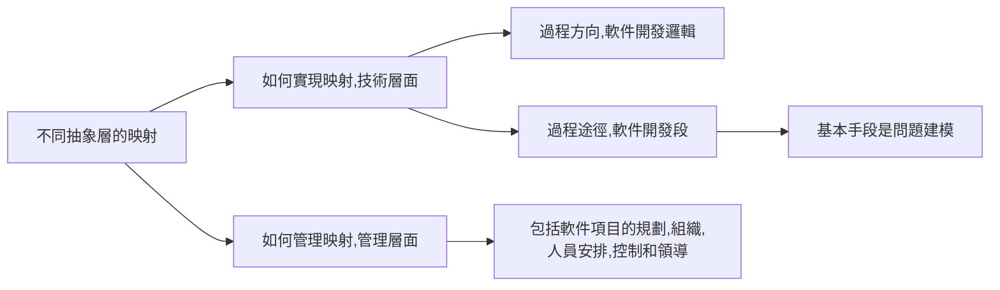
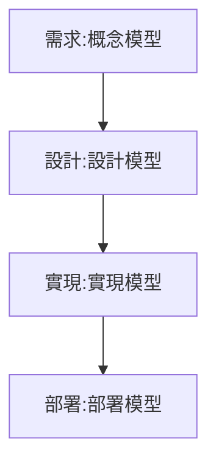
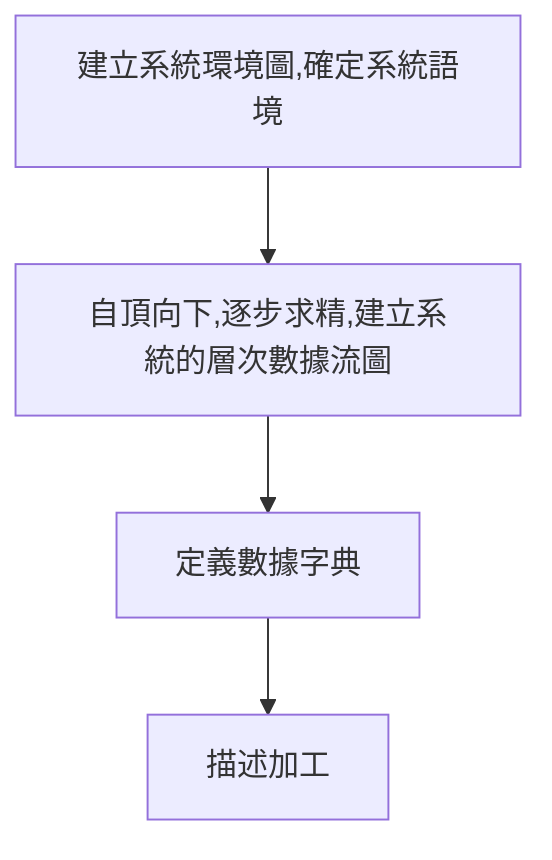
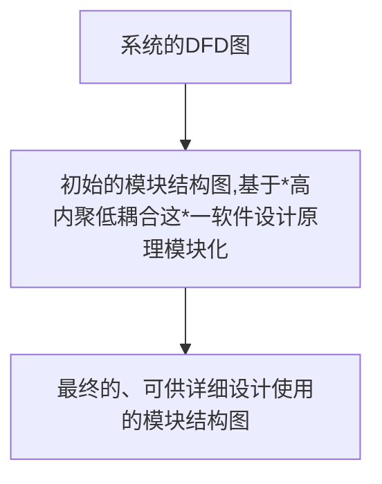

<style>
em { font-style: normal; font-weight: bold;text-decoration:underline; }
em { color: #002Fa7 }
.center{
  margin:auto;
  display:inline-block;
}
</style>


- [第一章](#第一章)
  - [軟件危機](#軟件危機)
  - [軟件工程概念的提出](#軟件工程概念的提出)
  - [軟件工程的定義](#軟件工程的定義)
  - [軟件工程的發展](#軟件工程的發展)
  - [計算機軟件](#計算機軟件)
  - [軟件開發的本質](#軟件開發的本質)
  - [模型](#模型)
- [第二章](#第二章)
  - [需求定義](#需求定義)
  - [需求分類](#需求分類)
  - [需求發現技術](#需求發現技術)
  - [需求規約定義](#需求規約定義)
  - [需求規約的表達](#需求規約的表達)
- [第三章](#第三章)
  - [結構化需求分析](#結構化需求分析)
  - [系統功能模型表示](#系統功能模型表示)
  - [建模過程](#建模過程)
  - [結構化需求分析](#結構化需求分析-1)
  - [結構化設計](#結構化設計)


# 第一章

## 軟件危機
- 20世紀60年代以來，隨著計算機的廣泛應用，軟件生產率、軟件質量滿足不了社會發展的需求，成為社會、經濟發展的*制約因素*，人們通常把這些現象稱為*軟件危機*。

## 軟件工程概念的提出
- 軟件工程概念的提出，其目的是倡導*以工程的原理原則和方法進行軟件開發*， 以期解決出現的*"軟件危機"*
- 軟件工程這一術語首次出現在*1968*年的*NATO（北大西洋公約組織）*會議上！

## 軟件工程的定義
軟件工程是應用*計算機科學理論和技術*以及*工程管理原則和方法*，按預算和進度實現滿足用戶要求的軟件產品的*工程*，或以此為研究對象的*學科*。

## 軟件工程的發展

- 20世紀60年代末到80年代初
    - 主要成果：提出*瀑布模型*、開發了諸多*過程式語言*（如C語言、Pascal語言）和*開發方法*（如Jackson方法、結構化方法）、開發了一些*支持工具*（調試工具、測試工具）。
    - 特征：前期主要研究*系統實現技術*，後期開始關注*軟件質量*和*軟件工程管理*。

- 20世紀80年代以來

    - 主要成果：提出《軟件生存周期過程》、開展*計算機輔助工程（CASE）*、面向對象語言（如Smalltalk、C++）、提出面向對象軟件開發方法等。
    - 特征：開展了一系列有關軟件生產技術，特別是*軟件復用技術*和*軟件生產管理*的研究和實踐。

- 簡述軟件工程與軟件危機的概念以及提出軟件工程概念的目的。
  - *軟件工程是應用計算機科學理論和技術以及工程管理原則和方法，按預算和進度實現滿足用戶要求的軟件產品的工程，或以此為研究對象的學科；（2分）* 
  - *軟件生產率、軟件質量遠遠滿足不了社會發展的需求，成為社會、經濟發展的制約因素，把這一現象稱為軟件危機；（2分）*
  - *軟件工程概念的提出，其目的是倡導以工程的原理、原則和方法進行軟件開發，以期解決出現的“軟件危機”。（1分）*

## 計算機軟件

*計算機軟件*一般是指計算機系統中的*程序及其文檔*。*程序*是對計算機任務的*處理對象和處理規則*的描述；*文檔*是為了理解程序所需的*闡述性資料*。

## 軟件開發的本質

- 軟件開發的目標是將*問題域*中的概念映射為*運行平台*層面上的概念，把問題域中的處理邏輯映射為運行平台層面上的處理邏輯；

- 軟件開發就是要彌補問題域與運行平台之間的*距離*，從而在二者之間直接進行映射。



- 概念：不同抽象層術語之間的*"映射"*，以及不同抽象層處理邏輯之間的*"映射"*，實現這一映射的基本途徑：系統建模。

- 內容：

  - 一是如何*實現*這樣的映射，這是技術層面的問題。

  - 二是如何*管理*這樣的映射，以保障映射的有效性和正確性，這是管理層面的問題。

- 簡述軟件開發的本質及其涉及到的問題。
  - *軟件開發的本質概括為：不同抽象層術語之間的“映射”，以及不同抽象層處理邏輯之間的“映射”。（2分)*
  - *它涉及到兩方面的問題：*
    - *一是如何實現這樣的映射，這是技術層面上的問題；（1分）*
    - *二是如何管理這樣的映射，以保障映射的有效性和正確性。這是管理層面上的問題。（2分）*

## 模型

- 模型，簡單地說，是*待建系統的任意抽象*，其中包括所有的基本能力、特性或其他一些方面，而沒有任何元余的細節。
- 進一步說，模型是在特定意圖下所確定的角度和抽象層次上對*物理系統的描述*，通常包含對該系統邊界的描述、對系統內各模型元素以及它們之間關系的語義描述。
- 在軟件開發中，軟件系統模型大體上可分為兩類：*概念模型*和*軟件模型*。(在軟件開發領域，分層的*基本動機*是為了控制開發的復雜性。)
  - 概念模型:在需求層上創建的系統*概念模型*是對客觀事物系統的抽象，即標識要解決的問題，或稱問題定義。
  - 軟件模型:設計模型、部署模型、實現模型


- 簡述何謂系統模型以及軟件開發中所涉及的系統模型分類。
  - *模型是待建系統的任意抽象；（1分）*
  - *該抽象是在特定意圖下所確定的角度和抽象層次對物理系統的一個描述。（1分）*
  - *描述其中的成分和成分之間所具有的特定語義的關系，還包括對該系統邊界的描述；（1分）*
  - *兩類：概念模型和軟件模型。軟件模型又可進一步分為設計模型、實現模型和部署模型等。（2分）*


# 第二章

## 需求定義

- *—個需求*描述了待開發產品 /系統*功能上的能力*、*性能參數*或*其他性質*。
- 對於單一一個需求，必須具有5個基本性質(NUTTM)：
  - *必要的(Necessary*：該需求是用戶所要求的；
  - *無歧義的（Unambiguous）*：該需求只能用一種方式解釋；
  - *可測的（Testable）*：該需求是可進行測試的；
  - *可跟蹤的(Traceable）*：該需求可從一個開發階段跟蹤到另一個階段；
  - *可測量的（Measurable）*：該需求是可測量的。

## 需求分類


|需求分類| 描述|
|---|---|
|功能需求|規約了系統或系統構件必須執行的能力，是整個需求的*主體*。|
|非功能需求| *性能需求*:規約了一個系統或構件在*性能*方面心須具有的一些特性。|
|非功能需求| *外部接口需求*:規約了系統或構件*必須與之交互*的用戶、硬件、軟件或數據庫元素，其中也可能規約交互格式、時間或其他因素。|
|非功能需求| *設計約束*：限制了軟件系統或構件的設計方案的*范圍*。需考慮*法規*政策、硬件限制等。|
|非功能需求| *質量屬性*:規約了軟件產品所具有的一個性質（包括功能和其他需求）必須達到其*質量方面*一個所*期望*的水平。|

- 質量屬性
  - *可靠性*：軟件系統在指定環境中沒有失敗而正常運行的概率。
  - *存活性*：當系統的某一部分不能運行時，該軟件繼續運行。
  - *可維護性*：發現並改正一個軟件故障或對特定的范圍進行修改所要求的平均工作。
  - *用戶友好性*：學習和使用一個軟件系統的容易程度。

## 需求發現技術

- 初始發現需求的常用技術包括以下幾個：
  - *自悟(Introspection）*：需求人員*把自己作為系統的最終用戶*，審視該系統並提出問題
  - *交談(Individual Interview）*：為確定系統應該提供的功能，需求人員通過*提出問題/用戶回答*這一方式，直接詢問用戶需要的是一個什麼樣的系統。
  - *觀察(Observation）*：通過*觀察用戶*執行其現行的任務和過程，或通過觀察他們如何操作與所期望的新系統有關的現有系統，了解系統運行的環境，特別是了解要建立的新系統與現存系統、過程以及工作方法間必須進行的交互。
  - *小組會(Group Session ）*：舉行客戶和開發人員的*聯席會議*，與客戶組織的一些代表共同開發需求。
  - *提煉(Extraction）* 復審技術文檔，並提取相關信息。
  
## 需求規約定義




- 需求規約是一個軟件產項/產品 /系統*所有需求陳述的正式文檔*，它表達了一個軟件產/系統的*概念模型*。
  - ISNCC
  - *重要性和穩定性程度(Ranked for Imortance and Stability）*：按需求的重要性和穩定性對需求進行分級，如基本需求、可選需求和期望需求；
  - *可修改的(Modifiable）*：在不過多地影響其他需求的前提下，可以容易地修改一個單一需求；
  - *完整的(Complete）*：沒有被遺漏的需求；
  - *一致的（Consistent）*：不存在互斥的需求。

## 需求規約的表達

- 非形式化的需求規約：
  - 以一種*自然語言*來表達需求規約，如同使用一種自然語言寫了一篇文章。
  - 適用於規模比較小的、復雜程度不大高的小型軟件項目，或在獲取SRS （草案）時使用的。
- 形式化的需求規約：
  - 以一種基於良構數學概念的符號體系來編制需求規約，一般常伴有解釋性注釋的支持。
  - 主要針對質量（特別是安全性）要求比較高的軟件產品/系統或其中某一部分。
- 半形式化的需求規約：
  - 以*半形式化符號體系*（包括術語表、標准化的表達格式等）來表達需求規約；
  - 一些有能力的組織針對大型復雜項目，在開發需求文檔時往往使用系統化的需求獲取、分析技術和工具。
- 需求規約的作用可概括為以下4點：
  - 需求規約是軟件開發組織和用戶之間一份事實上的*技術合同書*，是*產品功能*及其*環境的體現*。
  - 對於項目的其余大多數工作，需求規約是一個*管理控制點*。
  - 對於產品 / 系統的設計，需求規約是一個*正式的、受控的起始點*。
  - 需求規約是創建產品驗收測試計劃和用戶指南的基礎，即基於需求規約一般還會產生另外兩個文檔—*初始測試計劃*和*用戶系統操作描述*。


# 第三章

## 結構化需求分析

- 在進行軟件系統 產品的需求工作中，通常面臨三大挑戰：
  - 問題空間*理解*；
  - 人與人之間的*通信*；
  - 需求的*變化性*。

- 應對三大挑戰的軟件開發方法：
  - 結構化方法、
  - 面向數據結構方法、
  - 面向對象方法等。

- 結構化需求分析基本術語
  - 數據流：在結構化分析方法中，*數據流*是*數據*的*流動*。
  - 加工：*加工*是*數據*的*變換單元*，即它接受輸入的數據，對其進行處理，並產生輸出；在使用中，一般給出標識，且標識為*動賓結構*。
  - 數據存儲：在結構化分析方法中，*數據存儲*是*數據*的*靜態結構*。
  - 數據源：數據源是*數據流*的*起點*
  - 數據潭：數據潭是*數據流*的*歸宿地*。
  - 數據流和數據潭是系統之外的*實體*，可以是*人*、*物*或者*其他軟件系統*。


## 系統功能模型表示
- 需求分析的首要任務是建立系統*功能模型*
- 結構化分析方法給出一種能*表達功能模型的工具*，即*數據流圖*( Dataflow Diagram），簡稱*DFD圖*。
- DFD圖是一種*描述數據變換*的圖形化工具， 是一種表達*待建系統功能模型*的工具。

|圖|工具|階段|
|---|---|---|
|HIPO圖|總體設計的工具|設計|
|N-S圖|詳細設計工具|設計|
|PAD圖|詳細設計工具|設計|
|DFD圖|結構化分析方法的表達功能模型的工具|*分析*|


##  建模過程
- 自頂向下，功能分解





- 1 建立系統環境圖，確定系統語境
  - 結構化方法通過*系統頂層數據流圖*來定義系統語境
    - 數據源和數據潭以及與之相關的數據流較易確定；
    - 對於最頂層的 “大加工〞，其標識一般采用代建系統名字。
- 2 自頂向下，逐步求精，建立系統的層次數據流圖
  - 這些圖互為 “父子“關系：
  - 從0層開始就對其中的“加工〞進行編號：子圖號。加工順序號。
- 3 定義數據字典
  - 目標：*定義*數據流圖包含的*所有數據流*和*數據存儲*的*數據結構*，直到給出構成以上數據的各數據項的基本數據類型。
  - +：數據A是由數據B和數據C順序構成的，並記為“+
    - 例：學生成績=姓名+性別+學號+科目+成績
  - \|:數據A是由數據Bo或是由數據Co定義的， 即數據不可能同時是Bo或Co，並記為“！
    - 例：性別=男女
  - {}:數據A是由多個重復的數據B構成的，並記為“{} 
    - 例：學生成績表=（學生成績}
  
|符號|描述|
|---|---|
|=|定義為|
|+|順序|
|\||選擇|
|{}|重復|
|m..n|子界|


- 4 描述加工
  - 目標：給出每一加工的*小說明*；對DFD圖中每一加工給出加工的*輸入數據*和*輸出數據*間的關系,即從外部來視察一個加工的邏輯。
  - 結構化自然語言:
    - 適用於輸入數據和輸出數據之間的邏輯關系*比較簡單*的情況。
    - 結構化自然語言的語法有內、外兩層：
    - 外層語法描述操作的控制結構，如順序、選擇、循環等：
    - 內層語法沒有什麼限制，一般使用自然語言描述。
    - 特點
      - 沒有形式語言那樣嚴格：
      - 簡單易懂，又避免了自然語言結構松散的缺點。
  - 判定表
    - 適用於輸入數據和輸出數據之間的邏輯關系*比較復雜*的情況。
    - 通常用於描述不易用*自然語言*表達清楚或需要大篇幅才能表達清楚的加工。
    - 適用於當描述的加工由*一組操作*組成，且是否執行某些操作或操作的執行情況取決於一組條件時。
  - 判定樹
    - 適用於輸入數據和輸出數據之間的邏輯關系*比較復雜*的情況。

- 簡述結構化分析建模的基本步驟。
  - *建立系統環境圖，確定系統語境*；（1分）
  - *自頂向下，逐步求精，建立系統的層次數據流圖*；（2分） 
  - *定義數據字典*（1分）
  - *過結構化自然語言、判定樹判定表等工具，來描述加工*。（1分）
  - 助記：建圖、求精、字典、加工。


## 結構化需求分析
- *抽象*和*分解*是結構化分析方法采用的兩個基本手段：
- 抽象：從上往下，逐步概括，關注問題的主要方面，忽略細節。
- 逐步求精：自頂向下，把要解決的問題分解為多個步驟或階段，每一步是對上一步結果的細化，直到底層的加工足夠簡單。
- 需求階段的主要任務：需求*發現*、需求*分析*和需求*驗證*，最終形成系統的*軟件需求規格說明書*。


## 結構化設計

- 结构化设计的主要任务：在*需求分析*的基础上，定义满足需求所需要的结构，即针对给定的问题，给出该问题的软件解决方案，确定“*怎么做*〞的问题。
- 为控制软件设计的复杂性，结构化设计进一步分为*总体设计*和*详细设计*！
- 总体设计将系统分解成一个个“黑盒子〞，详细设计描述其细节。
- 模块软件中具有特定标识的独立成分；是执行一个特殊任务的一个过程以及相关的数据结构。
- 模块调用模块之间的一种使用关系。
- 總體設計基本任务：
  - 把系统的*功能*需求*分配*到一个特定*软件体系结构*中，建立系统的模块结构，只声明其作用或功能。
- 模块结构图是一种描述软件 “宏观〞结构的图形化工具
  - 较高层级：控制（或管理）模块
  - 较低层级：从属模块
- HIPO图 ”层次图+输入/处理/输出”
  - h:層次
  - IPO：輸入處理輸出

- 总体设计步骤



- 为了控制软件设计的复杂性，结构化设计进一步分为*总体设计*和*详细设计*，前者将系统分解成一个个“黑盒子〞，其细节描述是后者的任务。
- 结构化设计分为*總體設計*和*详细设计*，而详细设计要提供实现该模块功能的*具体算法*
- 变换型数据流图
  - 具有较明显的*输入*部分和*变换*（或称主加工）部分之间的界面 、变换部分和*输出*部分之间界面的DFD图

  ```mermaid
  id1[设计准备,复审并精化系统模型]
  id2[确定输入、变换、输出这三部分之间的边界]
  id3[第一级分解—系统模块结构图顶层和第一层的设计]
  id4[第二级分解—自顶向下，逐步求精]
  id1-->id2
  id2-->id3
  id3-->id4

  ```


- 事务型数据流图
  - 数据到达—个加工T，该加工T根据输入数据的值，在其后的*若干动作序列*（或称一个事务）中*选出一个*来执行。
  - 处理T称为事务中心，完成以下任务：
  - 接收输入数据；
  - 分析并确定对应的事务：
  - 选取与该事务对应的一条活动路径。

  ```mermaid
  id1[设计准备,复审并精化系统模型]
  id2[确定事务处理中心]
  id3[第一级分解—系统模块结构图顶层和第一层的设计]
  id4[第二级分解—自顶向下，逐步求精]
  id1-->id2
  id2-->id3
  id3-->id4

  ```

- 结构化设计方法基于“*自顶向下，功能分解*〞的基本原则，针对两种不同类型的数据流图，分别提出*变换设计*和*事务设计*。
  - 变换设计目标：将*变换型*数据流图映射为模*块结构图*
  - 事务设计目标：将*事务型*数据流图映射为*模块结构图*
- 变换设计与事务设计的区别及联系
  - 区别：分别从两者的*目的、组成、任务*来看。
  - 变换设计：
    - 将变换型数据流图映射为模块结构图；
    - 组成：获取数据、变换数据（*核心*）和输出数据；
    - 设计一个主控模块来协调和控制其他模块，比较机械。
  - 事务设计
    - 将事务型数据流图映射为模块结构图；
    - 事务中心需完成3个任务：接收数据、分析并确定事务和选取活动路径。
  - 联系：以变换设计为主，事务设计为辅。
- 总体设计分为3阶段：
  - 第一阶段：*初始*设计（将给定的*数据流图*转换为初始的*模块结构图*：
  - 第二阶段：*精化*设计（”*高内聚低耦合*”，*精化*模块结构图，设计*数据结构*和*接口*）
  - 第三阶段：*复审*阶段（对高层软件结构进行复审，精化）


